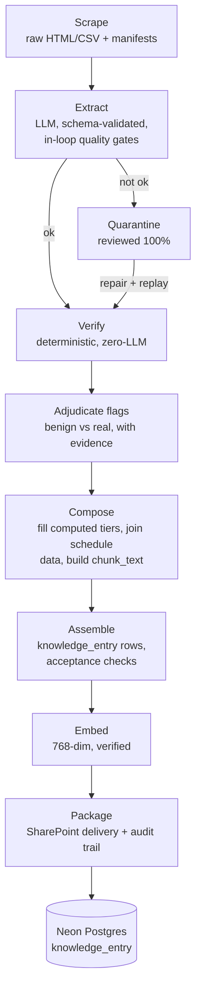

# The Master Pipeline Manual — from raw scrape to Neon

One document, the whole pipeline: **catalog courses, degree plans, class
schedules, professor CVs, syllabi (when their round runs)**. Written for
someone who has never touched the process. Each stage gives: why it exists,
the exact command, what it reads/writes and in what format, and what to
watch out for.

The one rule above all others: **nothing loads into the database that a
student could be misled by.** Every stage exists to enforce that.

**Contents:** §0 diagram · §1 setup · §2 file formats · §3 scrape ·
§4 extract · §5 verify + adjudicate · §6 compose · §7 assemble/embed/package ·
§8 load to Neon + per-doc_type status · §9 error catalog · §10 decisions ·
§11 $0 local-model path · §12 what "done" means

---

## Quick start — refreshing an existing doc_type for a new term (CVs shown)

Do §1 once, then these six steps in order (each is detailed in its section):

```powershell
# 0. put the new term's schedule CSV in $env:RAW_ROOT\schedule\   (§3)
# 1. scrape new pages
python -m dallasai.pipeline.archive_syllabi_cv --kind cv --worklist "$env:RAW_ROOT\schedule\dallas_classes_2026_Spring.csv" --out "$env:RAW_ROOT"
# 1b. build the work list step 2 consumes (nothing earlier creates it)      (§4)
New-Item -ItemType Directory -Force out | Out-Null
#     see the one-liner in §4 for the full command
# 2. extract (PILOT ~20 docs first — iron rule; then the full work list)     (§4)
python -m dallasai.pipeline.extract_batch --raw-root "$env:RAW_ROOT" --doc-type cv --paths-file out\worklist.txt --out out\facts-cv --quarantine-dir out\facts-cv-quarantine
# 3. verify, then adjudicate every flag + review 100% of quarantine          (§5)
python -m dallasai.pipeline.verify_cv --facts out/facts-cv/cv --as-of 2026 --raw-root "$env:RAW_ROOT"
# 4. compose (fills computed numbers, teaching records, chunk_text)          (§6)
python -m dallasai.pipeline.compose_cv --facts out/facts-cv/cv --out out/facts-cv-composed --raw-root "$env:RAW_ROOT" --as-of 2026
# 5. assemble rows + embed                                                    (§7)
python -m dallasai.pipeline.assemble_cv_delivery --composed out/facts-cv-composed --out out/delivery-cv --fail-on-acceptance
python -m dallasai.pipeline.carry_embeddings out/delivery-cv/rows-cv.json <previous>.embedded.json out/delivery-cv/rows-cv.carried.json
python -m dallasai.pipeline.embed_rows --rows out/delivery-cv/rows-cv.carried.json --out out/delivery-cv/rows-cv.embedded.json
# 6. package to SharePoint etl\neon-delivery\ with the audit trail           (§7)
```

Stop and read the full section whenever a step surprises you — the
surprises are documented.

---

## 0. The pipeline at a glance



Every arrow is a file on disk, and any stage can be re-run without re-running the
ones before it. **Scrape and extract are resumable** — a killed run continues where it
stopped. Compose, assemble and embed are atomic full re-runs: `embed_rows` writes its
output only after the whole loop finishes, so a killed embed run loses every vector
and re-bills from zero. Shard large embed runs.

---

## 1. Setup (once per machine / per person)

**Where things live**

| thing | location | in git? |
|---|---|---|
| Repo | `github.com/Dallas-College-AI-Club/success-coach-chatbot`; pipeline code in `apps/data/` | yes |
| Raw corpus (scraped HTML/CSV + manifests) | a folder OUTSIDE the repo, e.g. `..\_project\raw` — set as `RAW_ROOT` | no (too big) |
| Working outputs | `apps/data/out/` (envelopes, composed files, delivery staging) | no (gitignored) |
| Deliverables for the team | SharePoint `Project - Success Coach Chatbot\etl\` — data handoffs in `neon-delivery\`, review sheets, examples | no |
| Secrets | `apps/data/.env` | **NEVER** — see below |

**Install** (from `apps/data/`; Python ≥ 3.13):

```powershell
pip install requests beautifulsoup4 lxml pypdf playwright anthropic jsonschema pytest
playwright install chromium
```

(All commands below run from `apps/data/` so `python -m dallasai.pipeline.*`
resolves; `pip install -e .` from `apps/data/` makes it work from anywhere.)

(`pyproject.toml` carries the same list for `uv` users — `anthropic` and
`jsonschema` were added to it 2026-07-27; if `uv sync` predates that, add
them. Playwright + Chromium is only needed for catalog scraping.)

**Create `apps/data/.env`** — copy `apps/data/.env.example` (it mirrors
this shape) and fill your own values:

```
# Comments MUST be on their own line — the loader below does not strip a
# trailing "# ...", so an inline comment becomes part of the value.

# your own key — keys are per person, never shared
ANTHROPIC_API_KEY=sk-ant-...
# for embeddings
OPENROUTER_API_KEY=sk-or-...
# provider:model for extraction
EXTRACTOR=anthropic:claude-sonnet-5
# your raw-corpus folder
RAW_ROOT=D:\RaOn\OneDrive - RaOn\-\_project\raw
# used only by run_catalog.ps1; python CLIs take --out
FACTS_OUT=out\facts
```

> ⚠️ **`.env` is gitignored and must stay that way. Never commit or share an
> API key — each club member uses their own.**

**Shell convention used by this manual: PowerShell** (the club machines are
Windows). The `run_*.ps1` runners load `.env` automatically. For ad-hoc
`python` commands, load it into your session first — paste this once:

```powershell
Get-Content .\.env | Where-Object { $_ -match "^\s*[^#].*=" } | ForEach-Object {
    $k, $v = $_ -split "=", 2
    if ($v.Trim()) { Set-Item -Path "env:$($k.Trim())" -Value $v.Trim() }
}
```

After that, `$env:RAW_ROOT` (used in commands below) expands correctly.
Always QUOTE paths — they contain spaces (and the SharePoint path an emoji).

**Sanity check the install:**

```powershell
python -m pytest tests/test_extract.py tests/test_compute_cv.py -q
```

All tests green = the engine, schemas, and verifiers agree with each other.

---

## 2. What the files are (formats and why)

| artifact | format | produced by | why this format |
|---|---|---|---|
| `manifests/archive_*.jsonl` | JSONL — one JSON object per fetched page: kind, professor/course identity, `raw_path`, `source_url`, sha256, `fetched_at` | scrapers | append-only crawl ledger; **identity always comes from here, never from a document body** |
| `raw/**/*.html`, `raw/schedule/*.csv` | raw bytes exactly as fetched | scrapers | every later stage re-runs offline; disputes settle against the original |
| extraction **envelope** `out/facts-*/…/<doc_id>.json` | JSON: `facts` + context + provenance (source_url, sha256, extractor, prompt_version, attempts) | `extract_batch` | one self-describing file per document; resumability = "does the file exist" |
| **composed** envelope | envelope + filled `computed`/`teaching_record`, `chunk_text`, `verify_flags`, `delivery` status | `compose_cv` | keeps the load/no-load decision ON the artifact, auditable |
| `rows*.json` / `rows*.embedded.json` | JSON array in the exact `knowledge_entry` shape | assemble / embed | the load contract; the data engineer converts to TypeScript inserts without reshaping |
| prompts `reference/prompts/extract_v*.md` | Markdown template with `{{PLACEHOLDERS}}` | humans | versioned, never edited in place (see §4) |
| exemplars `reference/prompts/examples/<doc_type>/*.md` | Markdown: context + correct JSON + why | humans + ratification | spliced into prompts as few-shot examples; `counterexamples/` subfolders are never spliced |
| schemas `<repo-root>/src/config/facts-schemas/*.schema.json` | JSON Schema draft-07, `$comment`-annotated | humans | machine-enforced output shape; comments carry the rules' rationale |
| runners `*.ps1` | PowerShell 5.1 | humans | load `.env`, launch resumable/detached runs on the club's Windows machines. `run_catalog.ps1` (catalog stages) and `run_cv_extract.ps1` (one work-list extraction pass; `-Retry` keeps relaunching until a clean exit) |
| `<repo-root>/src/config/metadata-registry.json` | JSON | team decision | the doc_type/stamp contract shared with the app; envelope stamps are validated against it (`validate_registry_stamp`) |

---

## 3. Stage 0 — Scrape (acquire raw pages + manifests)

*Why:* everything downstream must be re-runnable offline and provable against
an original. Scrapers save raw bytes + a manifest line per page; they are
idempotent (existing files skip).

**Schedule CSVs — the input everything keys on.** The eConnect class
schedule exports live at `$env:RAW_ROOT\schedule\dallas_classes_<YYYY>_<Term>.csv`
(16 columns incl. class_prefix, class_number, section_number, professor,
syllabus_url, class_name, term_year, meeting_info). They are (a) the
scrapers' work list, (b) the source of the deterministic **section** rows,
and (c) the course-title source for CV teaching records. A new term starts
by producing/obtaining that term's CSV into `schedule\` — without it,
nothing downstream sees the term.

**Concourse syllabi + CVs** (plain HTTP; `--worklist` is required and
repeatable — the term is chosen by WHICH CSV you pass, there is no `--term`
flag; `--sessions`/`--exclude-sessions` filter within it):

```powershell
python -m dallasai.pipeline.archive_syllabi_cv --kind cv --worklist "$env:RAW_ROOT\schedule\dallas_classes_2026_Spring.csv" --out "$env:RAW_ROOT"
python -m dallasai.pipeline.archive_syllabi_cv --kind syllabus --worklist "$env:RAW_ROOT\schedule\dallas_classes_2026_Spring.csv" --out "$env:RAW_ROOT"
```

**Catalog** (needs the Playwright browser — the catalog site blocks plain
HTTP). `--catoid` and `--catalog-year` are required; the catoid for a new
catalog year is visible in the catalog site's URLs (2026-2027 = 5). Two-pass:
programs first, then the courses they reference:

```powershell
python -m dallasai.pipeline.catalog_fetch --catoid 5 --catalog-year 2026-2027 --out "$env:RAW_ROOT"
```

> ⚠️ The by-program index misses the academic-transfer degrees — the section
> indexes (navoid 1262/1307/1261/1224) add ~31 more; backfill with
> `catalog_fetch.py --poids-file`. Poids **3388 (CORE-42)** and **3040** must
> always be fetched and later hand-verified — every degree answer resolves
> against them.

**CV live-profile backfill** (when course-CV pages are empty shells):
course-CV pages sometimes render empty while the instructor's
`view_profile?user_id=N` page has real content (~a third of shells —
discovered 2026-07-26; the backfill report's per-profile records are the
authoritative count). The backfill resolves professor names to user_ids via
the public `search_user` endpoint and re-scrapes politely into
`RAW_ROOT/cv_profiles/` with its own manifest + a report JSON
(`manifests/cv_profiles_backfill_*_report.json` — always use the NEWEST one)
that later stages consume. ⚠️ *No committed tool yet* — the 2026-07-26 run's
method is documented inside its report's `purpose`/`notes` fields; committing
it as `pipeline/backfill_cv_profiles.py` is an open task. What assemble
consumes from the report: `profiles[]` entries with `shell_raw_path`,
`source_url`, `name_match`, `body_chars`, and the `unresolved[]` list (see
`shell_dispositions()` in `dallasai/pipeline/assemble_cv_delivery.py`).
> ⚠️ Only **exact** name matches may auto-load downstream. Fuzzy/nickname
> matches defeat the pipeline's surname identity check and must be held for a
> human (see §8-CV).

---

## 4. Stage 1 — Extract (LLM → schema-validated facts)

*Why:* turns a raw page into structured `facts` — with the model allowed to do
**no arithmetic and no identity guessing**. Identity comes from the manifest;
numbers students see are computed later in Python (§6).

**The iron rules** (these have caught real disasters — do not relax them):

1. **Prompts are versioned per doc_type and never edited in place.**
   `PROMPT_VERSION_BY_DOC_TYPE` in `dallasai/pipeline/extract.py` maps each doc_type to
   its `reference/prompts/extract_v*.md`. Catalog runs v3 (gold-gate-validated); CVs run
   v4. To change a prompt: copy to `extract_v<n+1>.md`, edit, flip only that
   doc_type's entry, then re-run the gate/pilot. *Rationale:* per-type rule
   text is model-visible in a shared prompt — editing one section measurably
   changed OTHER doc_types' output until versions were split per type.
2. **Pilot before bulk. Always.** Extract ~20 stratified documents (largest,
   thinnest, known-tricky, known-ground-truth), verify, review by a human,
   fix systematically, only then run the corpus. The CV pilot caught five
   systematic defects that would otherwise have contaminated 3,116 documents.
3. **Catalog changes must re-pass the golden gate** (§5).
4. **New/changed schema or exemplars ⇒ new pilot.** Exemplar files splice into
   the prompt from `reference/prompts/examples/<doc_type>/` (plain glob — subfolders
   like `counterexamples/` and staging dirs are ignored). A document used as
   an exemplar is *training material*: never re-extract it — pre-place its
   hand-verified facts as an envelope instead.

**Run it** (from `apps/data`, `.env` loaded):

```powershell
.\run_cv_extract.ps1 -PathsFile out\my-worklist.txt   # one work-list pass
```

or directly:

```powershell
python -m dallasai.pipeline.extract_batch --raw-root "$env:RAW_ROOT" --doc-type cv --paths-file out\worklist.txt --out out\facts-cv --quarantine-dir out\facts-cv-quarantine
```

- `extract_batch` nests envelopes under a `<doc_type>/` subfolder of
  `--out` — that is why later stages read `out/facts-cv/cv`. The `doc_id` is
  the raw file's parent folder + stem (`cv/jane-doe.html` → `cv-jane-doe`),
  so backfilled `cv_profiles/` pages land in the SAME folder as
  `cv_profiles-jane-doe.json` and are deduplicated per professor at
  assemble time.
- Work lists are text files of manifest `raw_path`s (one per line). Build
  one like this (filter/dedupe/shard to taste):

```powershell
python -c "import json,glob;seen=set();[seen.add(json.loads(l)['raw_path'].replace('\\','/')) for f in glob.glob(r'$env:RAW_ROOT'+r'\manifests\archive_*.jsonl') for l in open(f,encoding='utf-8') if l.strip() and json.loads(l).get('kind')=='cv' and json.loads(l).get('status')==200];open('out/worklist.txt','w').write('\n'.join(sorted(seen)))"
```

  Omit `--paths-file` to take every manifest entry of that doc_type.
- **Resumable**: an existing envelope skips; delete envelopes (or
  `--refresh`) to redo. Disjoint work lists can run as parallel shards. For
  a large corpus, split the work list round-robin into
  `out\bulk-shard-1..N.txt` and launch each shard DETACHED (survives closed
  terminals; the runner relaunches its python on crashes):

```powershell
1..8 | ForEach-Object { Start-Process powershell -ArgumentList "-NoProfile -ExecutionPolicy Bypass -File `"$pwd\run_cv_extract.ps1`" -PathsFile out\bulk-shard-$_.txt -Retry" -WorkingDirectory "$pwd" -WindowStyle Hidden }
```

  (Running `.\run_cv_extract.ps1` directly also works but dies with the
  terminal.) Track progress by counting envelopes; find/stop runners via
  `Get-CimInstance Win32_Process` filtered on CommandLine.
- **In-loop quality gates (cv)**: after schema validation, every attempt is
  also checked for verbatim-quote fidelity, objectivity (no evaluative
  adjectives / person comparisons / unprinted pronouns / absence
  narration), unsourced figures, and summary length — failures go back to
  the model as retry instructions (`verify_cv.extraction_stage_errors`).
  CVs get 5 attempts (`MAX_RETRIES_BY_DOC_TYPE`); persistent failures
  quarantine with full evidence.
- Anything not cleanly extracted lands in the **quarantine** dir with the
  errors and raw responses. *Quarantine is reviewed 100% or the run doesn't
  ship* — that is where wrong-person pages and source anomalies surface.

> ⚠️ **Model platform gotchas** (all bitten us; all guarded in code):
> - `claude-sonnet-5` runs **adaptive thinking by default and thinking tokens
>   consume `max_tokens`** — one large CV burned 15,645/16,384 tokens thinking
>   and truncated its JSON. Extraction is few-shot mechanical, so
>   `THINKING_DISABLED_DOC_TYPES` sends `thinking: disabled` for cv (2–3×
>   cheaper, no truncation). `stop_reason` is `"max_tokens"` on truncation, but
>   neither it nor `usage` is surfaced today — `_call_anthropic` returns only the
>   concatenated text blocks. To see it, instrument `extract.py:192` to log
>   `msg.stop_reason` and `msg.usage`.
> - Claude 5 rejects `temperature` (the code falls back automatically), so
>   outputs are **sampled** — byte-exact reproducibility across runs is gone
>   (see the gate note in §5).
> - **Prompt caching is enabled for `cv` only** (`CACHED_PROMPT_DOC_TYPES = {"cv"}`,
>   `extract.py:149`). The v3 doc_types keep the per-document context near the top, so
>   their whole template is re-billed on every document — which is the dominant cost on
>   a syllabus round. Where it applies it **pays for itself ~10×** on input cost, but only works
>   because v4 keeps the per-document parts (identity context, retry block,
>   document) at the END of the template — everything above
>   `## Identity context` is a constant prefix marked with `cache_control`.
>   **Keep any per-document content below that heading or caching silently
>   breaks.**
> - Ollama/LM Studio: always set `num_ctx` (the code does) — otherwise the
>   prompt silently truncates and you get plausible-wrong JSON.

---

## 5. Stage 2 — Gate + Verify (deterministic, zero-LLM)

*Why:* the extractor is a model; the checker must not be. Verification is
pure Python over the raw source text, so a pass means something.

**Golden gate (catalog)** — hand-verified fixtures in `pipeline_runs/gate/<case>/`
(`context.json` + `expected.json`; `rel.txt` optionally names the raw file;
`fresh.json` is just the last run's live output — the diff target;
`_`-prefixed folders are retired cases, e.g. fixtures whose documents were
promoted to prompt exemplars and therefore can never be tested again).
Unlike the verifiers, the gate CALLS THE LIVE MODEL — a few cents per run:

```powershell
python -m dallasai.pipeline.golden_gate --raw-root "$env:RAW_ROOT"
```

Run after EVERY prompt/model/schema change that touches catalog. The
comparison is **token-exact**: whitespace-only differences are tolerated
(model sampling stopped being byte-stable when the API alias began thinking
by default — adjudicated 2026-07-26; note the adjudication file itself was never
written, so this precedent survives only here), but
any changed word, case, or ordering fails. A red gate blocks catalog bulk.

**When the gate is red:** (1) diff `pipeline_runs/gate/<case>/fresh.json` against
`expected.json` and read the differing paths; (2) classify — a
prompt/model **regression** (your change caused it: fix the change, re-run),
tolerable **variance** (adjudicate it in a dated `pipeline_runs/gate/ADJUDICATION-*.md`
with evidence, like the whitespace record), or a **stale baseline** (the
model alias changed behavior: re-baseline `expected.json` ONLY after a human
re-verifies the fresh output line-by-line against the source page, and say
so in the adjudication file). Never edit `expected.json` casually — it is
the hand-verified ground truth.

**Catalog verifier** — `verify_catalog.py`: course-code/credit/prereq checks
with all the source-formatting tolerance we learned (prefix-elided code
lists, no-space codes, superscript splits, ranged credits, non-credit pages).
Known college-side typos are accept-listed in
`pipeline_runs/gate/adjudicated_source_anomalies.json` — never "fixed" in data.

**CV verifier** — over every envelope:

```powershell
python -m dallasai.pipeline.verify_cv --facts out/facts-cv/cv --as-of 2026 --raw-root "$env:RAW_ROOT"
```

`--as-of` = the scrape year (resolves "Present" in date math). It is a **fallback**,
used only when an envelope carries no `computed_as_of` stamp; composed envelopes
recompute at their own stamped year, so a mismatched `--as-of` is not caught here, and
on extract-stage facts (the command above) it has no effect at all. The verifier exits nonzero whenever ANY flag fires — that is
expected on a real corpus; what matters is that every flag ends up
adjudicated (§5a). Baseline for the delivered 2026-07-27 CV corpus: ~150
flags, all adjudicated in the delivery's audit trail — NEW flags relative to
that record are what demand attention.

Checks per profile: schema · every quoted `evidence`/`raw_text` is a verbatim
**contiguous** span of the source (whitespace-tolerant; tolerant of pages
that print every text run twice; stitching fails) · computed tier equals a
fresh recompute · objectivity bans · every summary figure traces to the
source or a census · **identity: the manifest professor's surname must appear
in the extracted name** (ASCII-folded — manifests contain mojibake like
`Ortuño`) · empty-shell consistency · census heuristics (§5a) · sentinel
contamination (exemplar-distinctive values may not appear in other CVs'
output — registry: `reference/prompts/examples/_sentinels.json`).

### 5a. Adjudication — every flag gets a verdict

*Why:* verifier flags are evidence, not verdicts. Each one is classified,
with quotes, as **verifier gap** (checker too strict — fix the checker),
**extraction error** (fix the data), or **source anomaly** (the college's
page is wrong — record it, never silently "fix" it).

The `census` flag deserves special mention because it fires often and is
*meant to*: it is a heuristic ("more year-ranges in the source than dated
entries extracted"). Adjudicate by walking the source line by line. Benign
causes seen at scale: exhibition/performance/service/membership lists (no
schema field — by design), pages that print every text run twice, a second
instructor's CV sharing the page, publication-title years. Real misses do
occur (~5% of census flags) — fix by adding the missing printed positions
verbatim and re-validating.

Repairs go through the **replay path**, never hand-edited envelopes:
write the corrected facts payload to a JSON file, validate it
(`extract_manual` inside the replay re-runs full schema validation, and for
cv you should also confirm `verify_cv.extraction_stage_errors(payload,
source_text) == []` before replaying), then

```powershell
python -m dallasai.pipeline.extract_batch --raw-root "$env:RAW_ROOT" --doc-type cv --replay-map out\replay-map.jsonl --out out\facts-cv --quarantine-dir out\facts-cv-quarantine --refresh
```

> ⚠️ **`--refresh` is required.** The replay target already exists, and without it
> `extract_batch` counts the envelope as `skipped_existing` and exits 0 without
> repairing anything — so the operator believes a flagged profile was fixed when it
> was not, and the audit trail still shows the machine envelope.

(`replay-map.jsonl`: one `{"raw_path": ..., "facts_file": ...}` per line.)
Replayed envelopes are stamped `extraction_method: claude_code_session`, so
the audit trail always shows which rows were machine- vs hand-produced.

---

## 6. Stage 3 — Compose (fill the tiers, build the embedded text)

*Why:* **no number a student sees is ever model arithmetic.** The extractor
leaves `computed: null` / `teaching_record: null`; this stage fills them with
pure Python and builds `chunk_text` mechanically.

```powershell
python -m dallasai.pipeline.compose_cv --facts out/facts-cv/cv --out out/facts-cv-composed --raw-root "$env:RAW_ROOT" --as-of 2026
```

What it does, per profile — and why:

- **computed**: durations as *unions of printed year-ranges* (overlaps never
  double-count; a same-year range counts as one year; "Present" resolves to
  the scrape year, stamped `computed_as_of`), countries, organizations.
- **teaching_record**: joined from the **syllabus** manifests (`kind == "syllabus"`,
  `status == 200`) by *normalized*
  professor name (manifests vary case: `GEBHART, KELLY` vs `GEBHART, Kelly`),
  each course carrying its printed class title from `RAW_ROOT/schedule/*.csv`
  — bare codes mean nothing to students.
- **currency** per expertise topic, recomputed mechanically: `current` if the
  supporting role is ongoing or evidence within 3 years; `recent` within 8;
  else `historical`; and an undated topic whose evidence quotes a course the
  professor teaches in the latest term upgrades to `current`.
- **chunk_text** = verified summary (with `{{years_*}}` tokens substituted by
  the computed values — **except when a computed value is `None`**, which leaves the
  literal token in student-facing text and in the vector; 13 of the 2,709 delivered CV
  rows carry `{{years_teaching_industry_overlap}}` for this reason) + "Per published Dallas College class schedules
  (…): currently teaches COSC 1436 (Programming Fundamentals I); …".
  Never narrates absence — a missing section may be a scrape gap.
- **Empty shells** (nothing but a name) get
  `delivery.status = quarantine_rescrape` — **held, not loaded**. Reason: at
  least 171 "empty" course-CV pages turned out to have real content on the
  instructor's live profile page. Holding is honest; publishing "no content"
  is a claim we can't back.
- Re-runs the verifier on the composed result and stores `verify_flags` on
  each envelope.

**Term-start refresh ritual** (why this design pays off): each new term,
re-scrape schedules → re-run compose with the new `--as-of` → durations
advance, teaching records pick up the new term, currency re-grades — with
**zero re-extraction**. Then re-embed only rows whose chunk_text changed
(§7a keeps that cheap).

---

## 7. Stage 4 — Assemble → Embed → Package

**Assemble** — envelopes → `knowledge_entry` rows + the delivery ledger:

```powershell
python -m dallasai.pipeline.assemble_cv_delivery --composed out/facts-cv-composed --out out/delivery-cv --backfill-report "$env:RAW_ROOT\manifests\cv_profiles_backfill_20260726_report.json" --fail-on-acceptance
```

(Use the newest `cv_profiles_backfill_*_report.json` in `manifests\`; omit
the flag entirely if no backfill has run yet.)

- Row shape (identical to the catalog delivery): `source_url`,
  `chunk_index`, `chunk_text`, `facts` (jsonb), `metadata`
  (doc_type/module/`professor` = manifest spelling, the join key section rows
  use/`instructor_slug`/`display_name` + schema/extractor stamps),
  `scraped_at`, `content_hash`. Upsert key: `(source_url, chunk_index)`.
- Decides what loads: shells held (annotated with what the backfill found for
  each), identity-mismatches excluded as source anomalies, and **exactly one
  row per professor** — when a thin course-CV page and a richer live profile
  both loaded, the richer one wins and the loser is recorded in
  `audit-trail/superseded-duplicate-pages.json`.
- **Acceptance checks** fail the build on: duplicate professors, duplicate
  upsert keys, empty chunk_text, missing scraped_at, and known-ground-truth
  probes (e.g. the hand-verified David Bracewell profile must reproduce
  exactly). Catalog equivalent: `assemble_delivery.py` (sections from the
  schedule CSVs + course/program facts; its acceptance suite includes MATH
  2414 prereqs and CORE-42's nine component areas).

**Embed** (§7a) — OpenRouter, model pinned so every stored vector and every
future live query comes from identical weights:

```powershell
python -m dallasai.pipeline.embed_rows --rows out/delivery-cv/rows-cv.json --out out/delivery-cv/rows-cv.embedded.json
```

Re-embedding the full CV delivery costs about **$0.013** (2,709 rows ≈ 652k tokens at
text-embedding-3-small's $0.02/1M) — embedding is not where this pipeline spends money;
extraction is. Even so, prefer reusing vectors: rows whose `content_hash` did not change
can keep their previous ones, and `pipeline/carry_embeddings.py` does exactly that.

`embed_rows` fills every row that lacks an `embedding` — `openai/text-embedding-3-small`,
`dimensions=768`, provider-routing locked to OpenAI, **and it aborts unless
every vector is exactly 768 dims at unit norm**. 768 was chosen so the column
fits `HALFVEC(768)` with pgvector indexing headroom on Neon's free tier.

**Package** — copy to the team's SharePoint library (on club machines it
syncs locally under `...\Dallas College\Dallas College AI Club - <emoji>
Projects\Project - Success Coach Chatbot\etl\` — find yours via the
OneDrive/SharePoint sync folder; plain `Copy-Item`/`shutil.copy` into it
syncs up). Target layout in `etl\neon-delivery\`:

```
CV_TO_NEON_HANDOFF.md            ← the data engineer starts here
data-cv/load-this/rows-cv.embedded.json
data-cv/AUDIT_REPORT-CV.md       ← the ledger: EVERY source page accounted for
data-cv/audit-trail/*.json       ← held / excluded / superseded / flagged / backfill lists
data-cv/FACULTY_EXPERTISE_INDEX.md|.json
```

The audit report's non-negotiable property: **loaded + held + excluded +
superseded = every page scraped.** If the ledger doesn't close, something
was silently dropped — find it before shipping.
(`FACULTY_EXPERTISE_INDEX` regenerates with
`python -m dallasai.pipeline.expertise_index --rows out/delivery-cv/rows-cv.json
--raw-root "$env:RAW_ROOT" --out out/delivery-cv/FACULTY_EXPERTISE_INDEX` —
`--out` is a BASENAME; the tool writes both `<out>.json` and `<out>.md`,
overwriting in place. Always build it from the delivered rows file so the
index can never disagree with the delivery.)

---

## 8. Stage 5 — Load to Neon (the data engineer's side)

The handoff docs on SharePoint (`CATALOG_TO_NEON_HANDOFF.md`,
`CV_TO_NEON_HANDOFF.md`) are the contract. Summary: read
`load-this/rows*.json` (catalog delivery: `rows.json`; CV delivery:
`rows-cv.embedded.json` — both carry the `embedding` field). **The loader ships in
Python; there is nothing to convert.** Run it from `apps/data`:

```powershell
python -m dallasai.load_catalog_to_neon <rows>.embedded.json                      # validate + census, no writes
python -m dallasai.load_catalog_to_neon <rows>.embedded.json --load --batch-size 100
python -m dallasai.load_catalog_to_neon programs-19.embedded.json --supplemental-programs --expect 19 --load
python -m dallasai.load_catalog_to_neon <facts-only>.json --facts-only --load
```

It upserts on `(source_url, chunk_index)` through the ORM's `HALFVEC(768)` column, so
no manual cast is needed. Always run without `--load` first and read the census. `id` and
`updated_at` are Postgres-generated; filter columns are GENERATED from
`metadata`. Everything joins inside the single `knowledge_entry` table —
`metadata.professor` matches the section rows' spelling by construction, so
the chatbot never makes multi-table calls. Seed rows (`extractor='seed'`)
are deleted after acceptance. `build_knowledge.py` documents the same row
composition with SQLite and Postgres sinks (the SQLite `knowledge.db` in the
delivery `reference/` folder is the acceptance answer key).

### Per-doc_type status and notes

| doc_type | prompt | schema | status |
|---|---|---|---|
| course / program_map | v3 (frozen, gold-gated) | facts-*-v1 | **delivered** 2026-07-25, 1,588 + 318 rows. A further **19 programs** — incl. A.A. (poid 3393), A.S. Computer Science (3011) and poid **3040** — shipped 2026-08-11; load with `--supplemental-programs --expect 19` |
| section — meeting times | deterministic, no LLM | — | **delivered** 2026-08-11, facts-only update over 16,181 rows (5,875 with real meeting times). The 2026-07-25 section rows shipped with `facts = {}` |
| section (schedule CSVs) | deterministic, no LLM | — | **delivered** 2026-07-25, 16,181 rows |
| cv | v4 | facts-cv-v2 (rev 7, team-ratified) | **delivered** 2026-07-27, 2,709 rows |
| syllabus | v3 rules + 5 exemplars + 2 counterexamples ready | facts-syllabus-v1 | **not yet run** — needs verify_syllabus.py, the section↔syllabus merge in assemble (`syllabus`/`syllabus_ref` per `build_knowledge.compose_sections`), and a pilot before bulk |

Stamps on every envelope (`doc_type`, `extraction_method`, schema version)
are validated against `src/config/metadata-registry.json` before writing —
that registry is the contract shared with the app side; changing it is a
PR-level team decision, not a pipeline-side tweak. It also defines doc_types
this manual doesn't cover yet (event, contact, knowledge_article…) — same
pattern applies when their rounds come.

**Ratification**: the team (club meeting + advisor) signs off on each
schema/exemplar set; the record lives in the exemplar artifacts
(the `facts-cv-v2.schema.json` `$comment` changelog, `etl/cv-pilot-review/CV_PILOT_REVIEW.html`,
and the "Known limitations" section of `AUDIT_REPORT-CV.md`) and the schema's
`$comment` changelog. Material schema changes go to the team, not just a PR.

**CV specifics worth knowing** — the schema is four tiers on purpose:
*extractive* (verbatim, checkable), *computed* (Python arithmetic),
*composed* (schedule join — objective, refreshed each term), *derived*
(judgment, every claim citing a checkable verbatim quote). Wrong-person
pages are a real phenomenon (~23 course-CV links serve a different
instructor's CV; several shifted assignments); the identity check exists
because one of them extracted at high confidence. Fuzzy-name backfill
matches and name-variant pages (possible name changes) are **held for a
human with directory access** — lists in the delivery audit-trail.

---

## 9. The error catalog — do not rediscover these

**Source-side (record, never "fix" in data):** college typos (accept-listed);
`08/2088` start date; doubled-text pages (pasted LinkedIn exports print every
run twice — quote within ONE printed run); multi-instructor CV pages
(extract only the context professor); wrong-person pages (exclude, list for
the college); course-CV endpoint hiding content the live profile publishes;
mojibake professor names in manifests.

**Model-behavior (guarded in code / prompts):** thinking eats max_tokens;
temperature rejected → sampling variance; curly-vs-straight quotes are the
#1 span-check failure. Note which checker: `verify_catalog.fold` IS
typography-tolerant, but `verify_cv._in_source` folds whitespace and doubled text
ONLY — a curly-vs-straight apostrophe is a genuine CV failure. The model is
reminded to copy exact characters; "K-12"-style vocabulary that the source
never prints; pronouns/adjectives/absence-narration in summaries; summary
word-limit whack-a-mole (target 120, hard fail only above 150); `{{tokens}}`
that can't resolve from the extracted entries.

**Windows/tooling:** PowerShell 5.1 mangles multiline JSON args — pass
files, not strings; `Out-File` adds a BOM (match `^rows:` will fail — use
`Select-String` or strip the BOM); OneDrive locks folders mid-sync (retry,
or archive instead of delete); paths contain spaces and an emoji — always
quote, and prefer `-ArgumentList` with embedded quotes for `Start-Process`;
detached processes survive tool/session timeouts and are found again with
`Get-CimInstance Win32_Process` filtered on CommandLine (exclude your own
query's process).

---

## 10. Decision records (the "why" in one place)

- **Per-doc_type prompt versions** — a shared prompt makes every per-type
  rule edit a global behavior change; the gate proved it (2026-07-26).
- **Thinking disabled for cv** — few-shot mechanical extraction doesn't need
  it; it truncated large outputs and tripled cost.
- **Prompt-cache layout** — constant prefix / per-document tail: ~10× cheaper
  input at bulk scale, verified live.
- **Summary duration `{{tokens}}`** — the model must never do arithmetic that
  students read; Python substitutes computed values.
- **Shells held, not loaded** — "no content" is a claim; a third of shells
  proved to be scrape gaps with real content elsewhere.
- **One row per professor** — two honest pages about one person still make a
  confusing chatbot; richer page wins, loser recorded.
- **Nullable degree/institution/organization/role + `notes` field** — real
  CVs print partial entries; forcing non-null forces fabrication (each was
  added the day a real CV required it).
- **Token-exact (not byte-exact) golden gate** — sampling variance took away
  byte stability; word-level changes still fail.
- **768-dim HALFVEC embeddings, provider-pinned** — Neon-friendly size and
  numerically identical query/store vectors.
- **Per-person API keys, never committed** — club policy; also limits blast
  radius.

---

## 11. The $0 path (no API budget)

`EXTRACTOR=lmstudio:<model>` or `ollama:<model>` runs the same engine
against a local model (Gemma/Qwen on LM Studio). Same prompts, same schemas,
same verifier — quality is what varies, so the pilot + verify + adjudicate
loop matters MORE, not less. Good/bad worked examples for teaching local
models live on SharePoint (`etl\examples-good\`, `examples-bad\`,
`EXTRACTION_QUALITY_GUIDE.html`). This is how students without paid keys
contribute: run pilots locally, compare against the verifier, improve
exemplars.

---

## 12. Quality bar — what "done" means

Verifier at 0 unadjudicated flags over the whole corpus · every flag
adjudicated with quoted evidence · quarantine reviewed 100% or empty ·
the ledger closes (every scraped page accounted for) · acceptance probes
green including hand-verified ground truth · embeddings dimension- and
norm-asserted, provenance-stamped · an audit report with a per-doc_type
GO/NO-GO shipped WITH the data. If any of these is missing, it isn't done —
it's just big.
