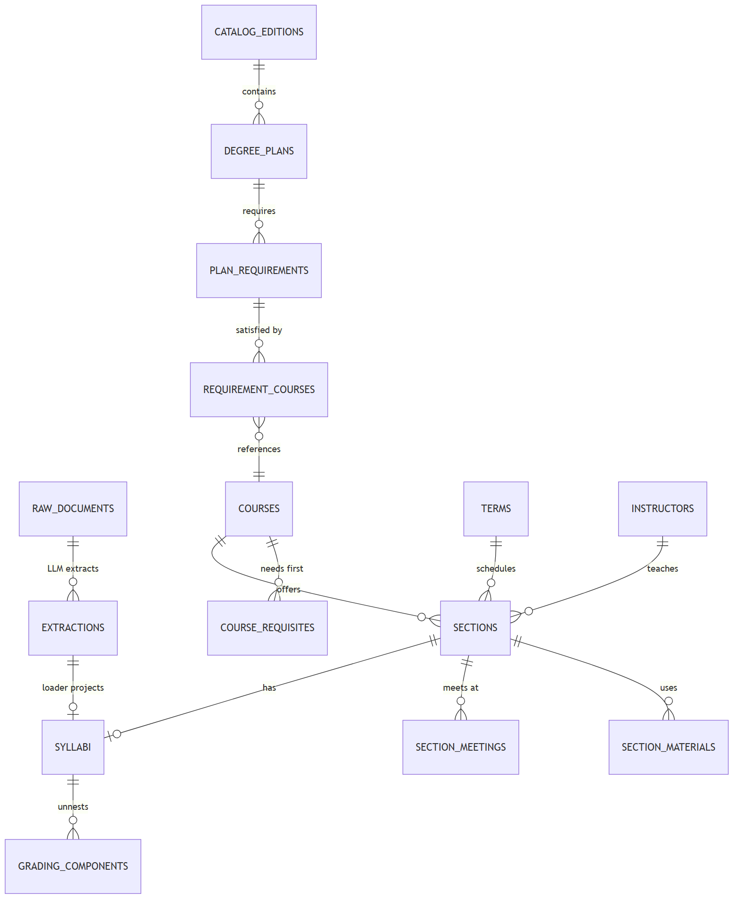

# DallasAI Club Success Coach Chatbot - Data

## Requirements

- uv

## Installing uv

**Windows:**

```bash
powershell -ExecutionPolicy ByPass -c "irm https://astral.sh/uv/install.ps1 | iex"
```

**Mac/Linux:**

```bash
curl -LsSf https://astral.sh/uv/install.sh | sh
```

or

```bash
wget -qO- https://astral.sh/uv/install.sh | sh
```

## Setting up the environment

```bash
cd apps/data
uv sync
```

## Running code locally

```bash
uv run python -m dallasai.main
```

## Adding a library

```bash
uv add <library-name>
```

## Running tests

```bash
uv run pytest
```

---

# Database & Pipeline Runbook

The data layer for the chatbot MVP: **raw → LLM extraction → thin relational
core + SQL views**, on vanilla PostgreSQL. Plain SQL files and one small
Python pipeline — no ORMs, no dbt, no migration framework (a deliberate
choice; see ADR-004 in [schemas/DESIGN_NOTES_ADR.md](schemas/DESIGN_NOTES_ADR.md)).

> Design package: [schemas/schema_v2.dbml](schemas/schema_v2.dbml) (the model) ·
> [schemas/DATA_DICTIONARY.md](schemas/DATA_DICTIONARY.md) (every field, where it
> comes from, what it answers) · [schemas/DESIGN_NOTES_ADR.md](schemas/DESIGN_NOTES_ADR.md)
> (the settled decisions) · [diagrams/DIAGRAMS.md](diagrams/DIAGRAMS.md) (rendered
> mermaid diagrams).



## 1. Database setup (Neon or any Postgres)

**Prereqs:** Python ≥3.11, Node ≥20 (only for the TypeScript client), `psql`,
and a PostgreSQL 15+ database. **Neon:** create a project at
console.neon.tech → open your project → **Connect** → copy the connection
string it shows.

```bash
cd apps/data
cp .env.example .env       # then paste your connection string as DATABASE_URL
```

**How settings flow (Python AND TypeScript):** everything reads the
git-ignored `.env` (or real environment variables). Python code gets
connections from [`db/client.py`](db/client.py)
(`from db.client import get_connection`); TypeScript from
[`db/client.ts`](db/client.ts) (`import { pool } from "./db/client"`). Both
pool connections, size the pool from `DB_POOL_MAX`, and close cleanly on
shutdown. **No other file creates a connection** — that one-file isolation is
what keeps a future move off Neon a config change. Instead of `DATABASE_URL`
you may set the standard libpq variables (`PGHOST`, `PGPORT`, `PGUSER`,
`PGPASSWORD`, `PGDATABASE`); CI does exactly that. Never put a connection
string in code — CI greps for it and fails the build.

**Python dependencies:** `uv sync` installs everything (runtime deps live in
`pyproject.toml`). Non-uv users: `python -m venv .venv` +
`pip install -r requirements.txt` — keep the two files in step when adding
libraries (CI installs from `requirements.txt`).

## 2. Create the database

```bash
psql -f db/schema.sql                 # 25 tables (pipeline, serving core, directory, governance, catalog)
psql -f db/views.sql                  # the 8 search/comparison views
psql -f db/seed_field_visibility.sql  # visibility registry (all current fields public)
psql -f db/seed_directory.sql         # non-personal directory scaffolding
psql -f db/optional_pgvector.sql      # OPTIONAL — needs the pgvector extension
```

(`psql` honors the same `PG*` variables, or pass `"$DATABASE_URL"` as its
argument.) The pgvector file is optional by design (ADR-005): skip it on hosts
without the extension; nothing else references it. Its `vector(768)` dimension
is pinned to `EMBED_MODEL=nomic-embed-text` — an OpenRouter/OpenAI-style
embedding model means `vector(1536)` + re-embed (edit the dimension in that
file; dimension, metric, and model are a matched set recorded per row in
`embeddings.embed_model`).

**Mock data** (dev/test only — truncates what it seeds, prints row counts):

```bash
psql -f db/seed_mock.sql
```

Captured proof of a successful run: [db/SEED_PROOF.md](db/SEED_PROOF.md).
CI re-executes all of the above on every push touching `apps/data/`.

## 3. Run the pipeline: scrape → extract → load

```bash
# 1. SCRAPE — the only writers of raw_documents (append-only, hash-deduped)
python -m pipeline.scrape_schedule "<path-to>/dallas_classes_2022_Summer.csv"
python -m pipeline.scrape_syllabi --urls-from-db          # or --file <pdf>
python -m pipeline.scrape_catalog --catoid 5              # Acalog 2026-27

# 2. EXTRACT — LLM -> validated JSON (provider set by EXTRACTOR in .env)
python -m pipeline.extract --all-pending

# 3. LOAD — project JSON into the core (idempotent; re-runs change nothing)
python -m pipeline.load_extractions
```

Every extraction row records `extractor`, `extraction_method`,
`prompt_version`, `schema_version` — mixed-model data coexists and is
auditable (ADR-002).

## 4. Re-extract with a new model

The schema never changes when the model does:

1. Edit `.env`: `EXTRACTOR="ollama:qwen2.5-14b"` (any `provider:model`).
2. Re-run `python -m pipeline.extract --raw-id <N>` (or `--all-pending`).
   New rows insert alongside old; `is_current` flips to the newest loadable
   output — nothing is deleted, so old vs. new stays diffable against
   `tests/gold/`.
3. `python -m pipeline.load_extractions` re-projects the core.

Prompt or schema changes work the same way: copy `prompts/extract_v1.md` →
`extract_v2.md` / bump `schema_version` — never edit in place.

## 5. Rebuild everything from raw

The core is a projection; raw is sacred (never edit or delete
`raw_documents`). On a fresh database: apply the SQL files (§2), restore
`raw_documents` from backup, then run extract + load (§3) — every core table
rebuilds.

## 6. Tests

```bash
# point PG*/DATABASE_URL at a *_test database — the suite DROPS the public
# schema and rebuilds it from the committed SQL files, then runs the
# acceptance queries (section search, cross-professor comparison,
# distinctives, staleness, grant routing, schedule conflicts)
python -m pytest tests/ -v
```

CI (`.github/workflows/data-ci.yml`) runs on every push touching `apps/data/`:
applies schema/views/pgvector + seeds on Postgres 17 (the seed prints its
row-count proof into the log), live-checks both client adapters, runs the
test suite, and fails if a connection-string literal appears in code. A second
workflow (`data-pipeline-cron.yml`, disabled until secrets are configured)
runs scrape→extract→load on a schedule.

## Rules that keep this maintainable

Never edit `raw_documents` or hand-edit core tables (fix the prompt/loader and
re-run); nulls mean "the source didn't say"; instructor identity comes from
schedule rows, never syllabus text; every degree-plan answer cites its catalog
edition; no ORMs/dbt/migration frameworks; no genuinely private personal data
in the repo — the support-contact directory itself is PUBLIC info (staff emails
and office locations are published by the college; instructor emails appear on
HB 2504 syllabi), so confirmed contacts may be seeded; `field_visibility` is
the mechanism for any future private field. Full list + reasoning:
[schemas/DESIGN_NOTES_ADR.md](schemas/DESIGN_NOTES_ADR.md).
