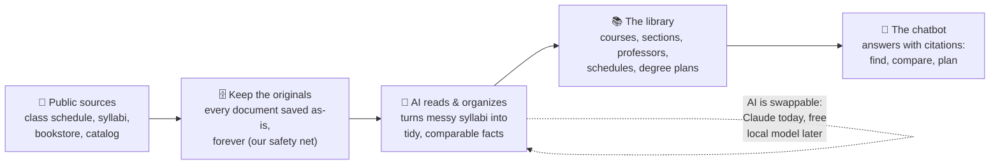
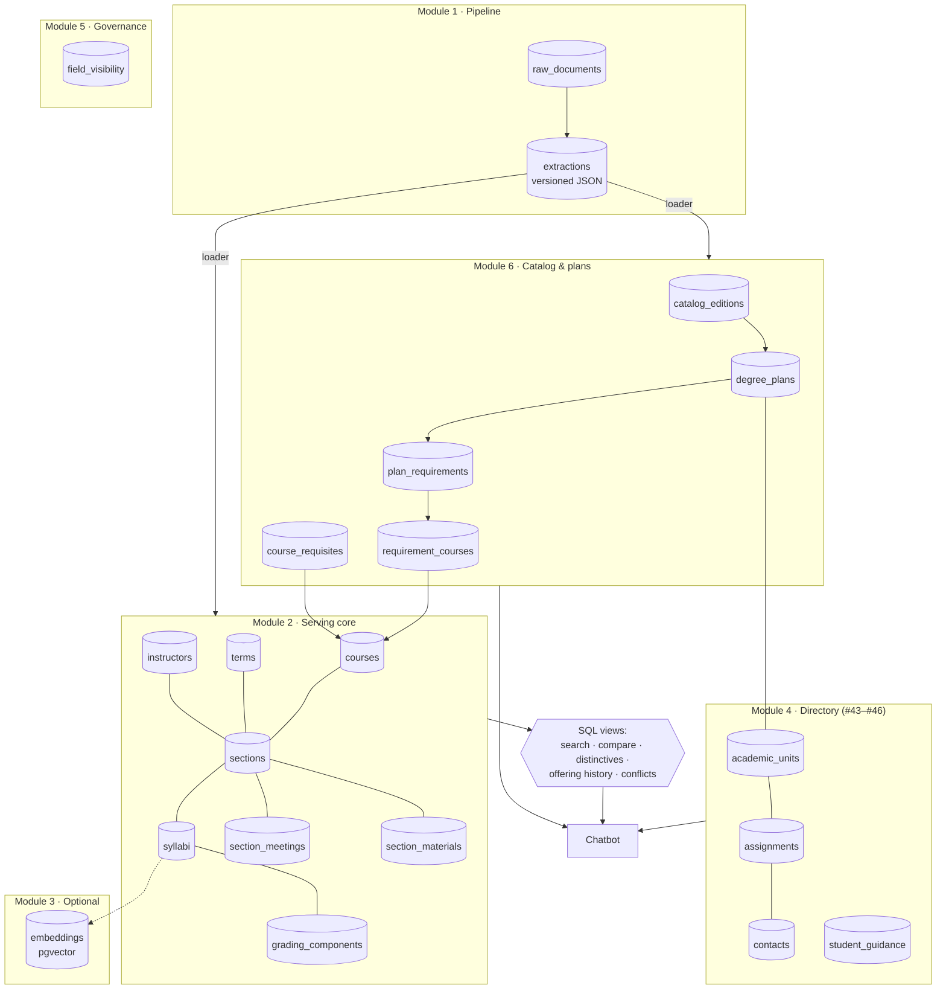
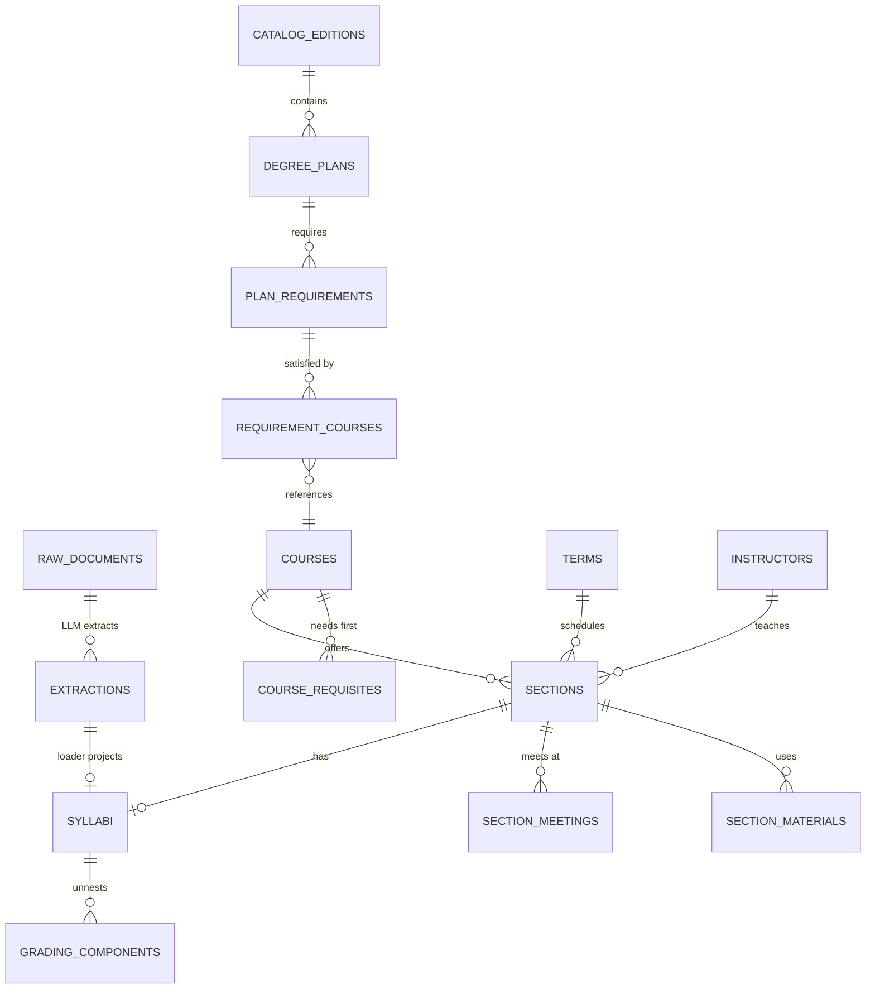
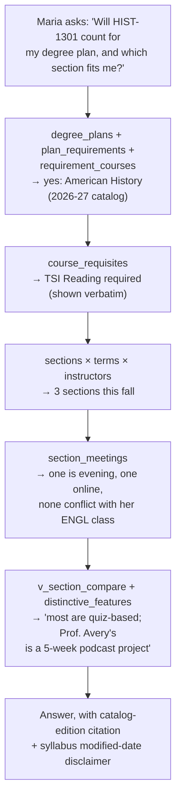

# Diagrams — sources & rendering guide

All diagrams are Mermaid: **GitHub renders these code blocks automatically** in the repo, so non-technical reviewers see pictures, not code — and there is no image file to keep in sync with the schema. To export PNG/SVG for slides: paste a block into https://mermaid.live, or have Claude Code run `mmdc` (mermaid-cli). For the full table-level ERD, paste `schema_v2.dbml` into https://dbdiagram.io.

---

## D1 · The data journey (for non-technical audiences — use this one in presentations)

**The one-sentence pitch:** *we keep every original document, let AI do the tedious organizing, store the results in a small tidy library, and the chatbot only ever answers from that library — so every answer can show its source.*

## D2 · Module map (how the pieces relate)

## D3 · Serving-core ERD (key tables; full ERD from the DBML)

## D4 · A question's path through the schema (walkthrough for reviews)

