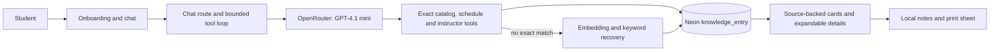

# Success Coach frontend

Major helps students explore Dallas College's published programs, courses, class sections and instructor backgrounds. It produces planning notes for a human Success Coach. It does not determine eligibility, transfer acceptance, graduation or financial-aid awards.

## Run locally

Requires Node.js 20.9+ (CI uses Node 22), npm, a populated Neon database and a personal OpenRouter key.

```sh
cd apps/frontend
npm ci
cp .env.example .env.local
# Fill DATABASE_URL and OPENROUTER_API_KEY in the local file.
npm run dev
```

On PowerShell, use `Copy-Item .env.example .env.local`. Open http://localhost:3000. The example selects `openai/gpt-4.1-mini`; calls use paid OpenRouter credits. Keep credentials in ignored local configuration or the hosting platform's secret store. Never place them in source, screenshots, issues or PRs.

The app queries existing data; startup does not import or repair the database. Follow the [data runbook](../data/REPRODUCE.md) for ingestion. An empty database cannot answer the demo questions. The historical SQL seed is illustrative, not the audited catalog/schedule corpus.

## How an answer reaches the student



- `app/api/chat/route.ts`: request validation, model streaming, cancellation and bounded recovery.
- `lib/tools/`: read-only queries. Program scope is enforced from the current question; schedules keep distinct sections, explicit totals and pagination. Named instructors are enumerated across all matching sections.
- `lib/embedding.ts`: lazily loaded **all-MiniLM-L6-v2**, 384 dimensions, matching stored vectors. First retrieval may download model weights; subsequent requests reuse the process cache. Broad recovery combines embeddings with topical keyword evidence and labels related results as candidates.
- `lib/course-details.ts` and `features/chat/course-results.tsx`: validated display fields, semester filtering, section grouping, inline CV summaries and literal keyword highlights. Large UI details are omitted from model replay where they are unnecessary.
- `features/onboarding/handoff-copy.ts`: starter questions reflect the selected goal, program, schedule preference and student situation. Chat hides all starter buttons after the first user message. `saved-courses.ts` and `summary-sheet.tsx` provide local notes and print content.
- `features/onboarding/`: existing Simple, Playful and Focus layouts. [Playful mascot design and checks](../../docs/PLAYFUL_MASCOTS.md).

## Verify

```sh
npm run verify
```

The regression scripts use `node:test` through `tsx`; provider traffic is mocked in the boundary suite. They do not need production credentials. CI also builds the app and tests the Python pipeline. A build may need internet access for fonts. Read-only database comparisons and real model/browser checks are recorded separately in the [audit](../../docs/SHOWCASE_AUDIT_AND_CLEANUP_STRATEGY.md#final-review-checkpoint); their local traces are intentionally ignored.

## Demo boundaries

The reviewed data includes the 2026–2027 catalog and a saved Fall 2026 schedule. Meeting facts were restored from an approved August 12 snapshot: 12,872 sections, 6,520 with fully parsed times; the rest retain source text. Missing times mean unknown. This is not a live seat-availability feed. Schedule pages contain up to 100 sections; the UI shows totals and how to request the next page. Instructor rosters cover all matching sections, independently of that page limit.

Broad faculty discovery returns related indexed CVs; it does not enumerate every expertise match. Exact remaining-credit calculations, completed-course subtraction, exhaustive faculty expertise and pipeline/corpus reconciliation belong to the follow-up tracked by #191. Automatic timetable construction and syllabus-policy answers remain outside this release.

Publishing code does not change the host's environment settings. Before a presentation deployment, verify its commit, `LLM_MODEL`, configured database and the same acceptance flows. See the [advisor decision sheet](../../docs/SHOWCASE_EXECUTIVE_DECISIONS.md) for remaining choices.
