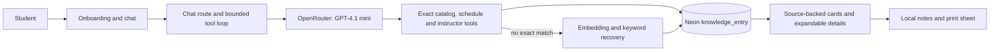

# Success Coach frontend

Major helps students explore Dallas College's published programs, courses, class sections and instructor backgrounds. It produces planning notes for a human Success Coach. It does not determine eligibility, transfer acceptance, graduation or financial-aid awards.

## Run locally

Requires Node.js 20.9+ (CI uses Node 22), npm, a populated Neon database and a personal OpenRouter key.

```sh
cd apps/frontend
npm ci
cp .env.example .env.local
# Fill DATABASE_URL and OPENROUTER_API_KEY in the local file.
npm run dev
```

On PowerShell, use `Copy-Item .env.example .env.local`. Open http://localhost:3000. The example selects `openai/gpt-4.1-mini`; calls use paid OpenRouter credits. Keep credentials in ignored local configuration or the hosting platform's secret store. Never place them in source, screenshots, issues or PRs.

The app queries existing data; startup does not import or repair the database. Follow the [data runbook](../data/REPRODUCE.md) for ingestion. An empty database cannot answer the demo questions. The historical SQL seed is illustrative, not the audited catalog/schedule corpus.

## How an answer reaches the student



- `app/api/chat/route.ts`: request validation, model streaming, cancellation and bounded recovery.
- `lib/tools/`: read-only queries. Program scope is enforced from the current question; schedules keep distinct sections, explicit totals and pagination. Named instructors are enumerated across all matching sections.
- `lib/embedding.ts`: lazily loaded **all-MiniLM-L6-v2**, 384 dimensions, matching stored vectors. First retrieval may download model weights; subsequent requests reuse the process cache. Broad recovery combines embeddings with topical keyword evidence and labels related results as candidates.
- `lib/planning.ts`: student-reported course history, conservative prerequisite labels, credit allocation and exact program comparisons.
- `lib/course-details.ts` and `features/chat/course-results.tsx`: validated display fields, semester filtering, section grouping, inline CV summaries and literal keyword highlights. Large UI details are omitted from model replay where they are unnecessary.
- `features/onboarding/handoff-copy.ts`: starter questions reflect the selected goal, program, schedule preference and student situation. After the first message, `follow-ups.ts` selects relevant next questions from finished tool results. `conversation-store.ts` preserves this tab's chat across navigation and refresh; `saved-courses.ts` and `summary-sheet.tsx` persist local notes and sheet edits.
- `features/onboarding/`: existing Simple, Playful and Focus layouts. [Playful mascot design and checks](../../docs/PLAYFUL_MASCOTS.md).

## Verify

```sh
npm run verify
```

The regression scripts use `node:test` through `tsx`; provider traffic is mocked in the boundary suite. They do not need production credentials. CI also builds the app and tests the Python pipeline. A build may need internet access for fonts. Read-only database comparisons and real model/browser checks are recorded separately in the [archived showcase audit](../../docs/archive/2026-09-20-SHOWCASE_AUDIT_AND_CLEANUP_STRATEGY.md#final-review-checkpoint); their local traces are intentionally ignored.

## Demo boundaries

The reviewed data includes the 2026–2027 catalog and a saved Fall 2026 schedule. Meeting facts were restored from an approved August 12 snapshot: 12,872 sections, 6,520 with fully parsed times; the rest retain source text. Missing times mean unknown. This is not a live seat-availability feed. Schedule pages contain up to 100 sections; the UI shows totals and how to request the next page. Instructor rosters cover all matching sections, independently of that page limit.

Faculty expertise search enumerates every indexed CV with explicit matching evidence, including the requested AND/OR meaning, source links and coverage dates. It cannot establish unrecorded expertise or cover faculty without indexed CVs. Semantic recovery remains a candidate search.

Planning checklists track explicit student-reported completed/in-progress courses and remove them from courses to consider. Credit calculations are exact only when verified course credits and the published rules reconcile. Simple exhaustive elective groups are allocated without double-counting; ambiguous choices, grades, placement and transfer review remain unresolved. Program comparisons use deterministic required-course sets. These are not official degree audits. Automatic timetable construction and syllabus-policy answers remain outside this release.

## Release the demo

Before staging, apply `scripts/chat-request-budget.sql` to the database configured for that
deployment. It creates only expiring request counters; it does not change knowledge records.
Production enforces the shared limits automatically; set `CHAT_RATE_LIMIT_ENABLED=1` to exercise
them during development. Optional `CHAT_EVIDENCE_SECRET` signs tool outputs; otherwise the existing
server-only provider key supplies the signing secret. Rotating it invalidates old tool evidence,
which the next answer must retrieve again. Verify the provider account's spending limit separately.

The demo is Vercel project `major-demo` in scope `ai-c64d`, with root directory `apps/frontend` and public URL https://major-demo-chi.vercel.app. It currently uses manual deployments; merging a GitHub PR does **not** publish the app. Verify the project before deploying, and keep local configuration, raw data and build artifacts out of the upload.

1. Verify that every intended PR reached `main`. A stacked PR merged into another feature branch has not necessarily reached `main`, especially after a squash merge.
2. From a clean checkout of the approved release commit, run the frontend verification above and the [pipeline tests](../data/REPRODUCE.md). Inspect `vercel project inspect major-demo --scope ai-c64d` and confirm the project and root directory. Existing credentials stay in Vercel's secret store; the demo model is `openai/gpt-4.1-mini`.
3. From the repository root, stage the release without moving the public URL:

   ```sh
   vercel deploy --project major-demo --scope ai-c64d --prod --skip-domain
   ```

4. Verify the returned deployment: the seven approved Playful characters, Simple/Focus switching, transfer onboarding, answerable starter and follow-up questions, repeated completion changes, course details/notes, and complete schedule/faculty results. Check small phones and landscape, sheet-to-chat return, refresh and restored edits. Compare sampled answers with configured source records and check a small concurrent burst. A successful build alone is insufficient.
5. Promote the tested deployment with `vercel promote <deployment-url> --scope ai-c64d`. Recheck the **public** URL in a fresh navigation and record the release commit, deployment URL, model, checks and previous deployment for rollback in the PR. Do not call a local or staged fix live before this check.

Open choices are listed in [docs/DECISIONS.md](../../docs/DECISIONS.md). Future automatic Git deployments require a separately configured Vercel Git connection; this procedure does not enable one.
