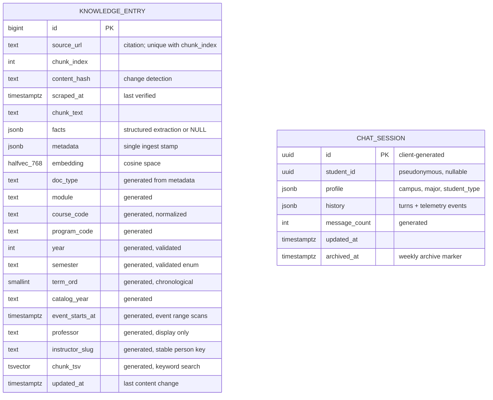

# Database Architecture

> **Issue**: #36 — Database Architecture Design & Initialization
> **Database**: [Neon](https://neon.com) serverless PostgreSQL (free tier) with the `pgvector` extension
> **Schema DDL**: [`db/schema.sql`](../db/schema.sql) · **Sample data**: [`db/seed_mock.sql`](../db/seed_mock.sql) · **Setup**: [README §Database](../README.md#database)
> **Next steps**: [`docs/handoff/ISSUE_51_HANDOFF.md`](handoff/ISSUE_51_HANDOFF.md) converts this design to SQLAlchemy models + Alembic migrations (issue #51); a TypeScript (Drizzle) mirror follows in a later issue.

---

## 1. Design goal: one question, one tool call

The chatbot answers student questions through LLM tool calls (Vercel AI SDK function calling, issues #37/#38). Every extra tool call adds a full LLM round-trip of latency and a chance to reason incorrectly, so the schema is optimized for **one SQL statement per question class** — which leads to a deliberately denormalized design of exactly **two tables**:

| Table | Purpose |
|---|---|
| **`knowledge_entry`** | Everything the chatbot knows: course catalog, degree plans, class sections, syllabi, instructor CVs, support contacts, campus events, curated articles — as vector-searchable prose chunks *and* structured fact documents in one table |
| **`chat_session`** | Anonymous student profiles (client-generated UUID) and their chat histories with per-turn telemetry, for evaluating knowledge gaps and system performance |

There are **no other tables, no joins between entities, and no foreign keys**. Where a normalized design would join `courses → sections → instructors → syllabi`, here each row carries everything its question needs, and rows reference each other through a small set of governed, indexed keys (`course_code`, `instructor_slug`, `catalog_year`). Integrity that foreign keys would normally provide is enforced by the ingest pipeline against repo-committed contracts (§6).

Three question classes, three query shapes, all against one table:

1. **Exact lookups** — *"What are the prerequisites for ENGL 1302?"* → an indexed point-read returning a structured `facts` document. No vector math, no joins.
2. **Semantic questions** — *"Is there a biology class that doesn't need a physical textbook?"* → hybrid retrieval (vector + keyword, rank-fused), pre-filtered by the same indexed columns so results come only from the right course/term.
3. **Enumerations** — *"Which BIOL 1406 sections are online this fall?"* → `SELECT DISTINCT` over indexed columns. Deliberately *not* vector search: top-k retrieval silently under-returns exhaustive lists.

---

## 2. How entities map to rows

`knowledge_entry` holds one row per *retrievable unit*. A `doc_type` discriminator (from the metadata stamp) says what kind of unit:

| `doc_type` | One row per | `facts` contains | Scoping |
|---|---|---|---|
| `course` | course × catalog year | code, title, credits, description, state outcomes, prerequisites/corequisites (with "one-of" groups **and** the verbatim requisite text) | catalog year |
| `program_map` | degree plan × catalog year | award type, total credits, requirement groups (name, TX core component-area code, credits, course lists, free-text rules). The program-independent TX Core Curriculum ingests as its own row (`CORE-42`) so undeclared students get structured answers | catalog year |
| `section` | scheduled class section (one row per section — **its syllabus facts ride along**) | section number, instructor, modality, campus, start/end dates, meeting blocks (a required field: `[]` means online — times are never invented), materials links, credit hours, session, **plus `facts.syllabus`** — the offering's full syllabus extraction (grading components with verbatim label + canonical type + weight, policies, schedule, materials, office hours, ≤120-word summary, modified date), carried on the offering's *representative* section; sibling sections of the same professor+course+modality carry `facts.syllabus_ref` (one point-read away) with `facts.syllabus_source_url` supplying the Concourse citation | year + semester |
| `syllabus` | **prose chunks only** — searchable markdown sections of the syllabus document (`facts = NULL`; the structured extraction is embedded in the section row above, so a section and its syllabus are ONE fact row, not two) | — | year + semester |
| `cv` | instructor | name, department, CV link, courses taught | timeless |
| `contact` | support-office routing entry | office, school/unit, category, topics, eligibility criteria (relayed verbatim — the bot routes, it never determines eligibility), prep steps, verification provenance | timeless |
| `event` | campus event | title, campus, location, category, start/end times (UTC epoch) | year + semester |
| `academic_calendar` | term-wide dates (registration windows, census/drop deadlines, payment dates) | labeled deadline list | year + semester |
| `transfer_guide` | transfer-pathway guidance for a target university (route-don't-determine content; no equivalency promises) | target institution, program notes, advisor contacts | catalog year |
| `knowledge_article` | curated guidance page (e.g., F-1 enrollment basics, lost & found procedures per campus) | — | timeless |
| `catalog` | other catalog prose | — | catalog year |

Long documents also produce plain **prose chunks** (markdown sections with `facts = NULL`) that serve semantic search; a document's structured extraction lives on a single facts row — a `#facts` pseudo-URI row when the document also has prose chunks, or the document's only row when a source yields one row per entity (e.g., each schedule-CSV section). Both kinds are embedded, so everything is reachable by vector search *and* fact rows are reachable by point-read.

**ERD** (full column detail and rationale comments in [`db/schema.sql`](../db/schema.sql)):



### The generated-column pattern

The Python pipeline stamps **one JSONB `metadata` object** per row. Every column the LLM tools filter on (`doc_type`, `course_code`, `year`, `semester`, `catalog_year`, `instructor_slug`, …) is `GENERATED ALWAYS AS (metadata->>'…') STORED` with a btree index. Consequences:

- The filter columns **cannot drift** from the stamp — there is exactly one write path.
- Normalization is enforced in the database: `course_code` becomes canonical `ENGL 1302` regardless of whether the source wrote `engl-1302` or `ENGL1302`. The tool layer applies the same normalization to LLM-supplied arguments before binding.
- When issues #37/#38 reveal the next hot filter, promoting another metadata key is a **one-line `ALTER TABLE`** — so if tool calling later needs more denormalization, the answer is a small migration, not a redesign. (Honest cost note: each generated-column `ALTER` rewrites the table and rebuilds its indexes — minutes at current scale; schedule alongside an ingest run.)

This table is also where the two named academic entities live: **courses** are `course` fact rows (code, title, credits, prerequisites, description), and **faculty** are `cv` fact rows (name, department, email policy per the field-visibility config (see Privacy posture, §6), CV link) joined to their sections via `instructor_slug`.

**How a course links to its syllabi.** A catalog `course` row carries no syllabus link of its own — a syllabus belongs to a specific *offering* of a course (a professor's section in a given term), not to the catalog course. The link is the shared, governed `course_code`: to find a course's syllabi, look up its `section` rows for a term (`WHERE course_code='BIOL 1406' AND doc_type='section' AND year=2026 AND semester='fall'`). Each section carries its offering's syllabus inline in `facts.syllabus` (with `facts.syllabus_source_url` as the citation), or a `facts.syllabus_ref` pointer to the sibling section that holds it. The chain is **course → (course_code) → section → embedded `facts.syllabus`** — a join on a governed key rather than a stored URL column, which is why one syllabus is never duplicated across a professor's sections.

Write-time validation backstops bad stamps: `CHECK` constraints reject a missing `doc_type`, a semester outside `fall|spring|summer|winter|may`, or an out-of-range year — so a malformed ingest fails loudly at insert instead of silently hiding rows from every filtered query.

---

## 3. Vector search configuration

- **Two different models, two different roles.** The chatbot uses one model to *write answers* (a chat/generation model — OpenRouter's free gateway) and a separate model to *turn text into vectors* for search (an embedding model). They are unrelated; the paragraphs below are only about the embedding model. OpenRouter serves no embedding models, so it is never the embedding provider.
- **Column**: `embedding halfvec(768) NOT NULL` — half-precision floats halve storage with negligible recall loss.
- **Distance metric**: **cosine**, via an HNSW index (`halfvec_cosine_ops`, `m=16`, `ef_construction=64`).
- **Dimension**: **768**, frozen project-wide. The binding constraint: **the same embedding model must serve both ingest (Python pipeline) and query time (Next.js API route)**, and OpenRouter's free tier serves no embedding models, so the provider is a deliberate team decision (§9). Candidate free options: a hosted free-tier API reachable from both runtimes (e.g. Google `gemini-embedding-001` at `output_dimensionality: 768`, with `RETRIEVAL_DOCUMENT`/`RETRIEVAL_QUERY` task types), or a local 768-dim model served through LM Studio/Ollama (e.g. `nomic-embed-text`) — noting a purely local server covers ingestion, while query-time embedding on Vercel then needs the *same model* behind a reachable endpoint. ⚠️ Confirm before issue #51 freezes the column.
- **Filtered search**: `hnsw.iterative_scan = 'relaxed_order'` is set database-wide (see `db/schema.sql`) so vector scans keep iterating until enough rows satisfy the `WHERE` filters — required because metadata pre-filtering (by course, term, doc_type) is the core retrieval pattern.
- **Hybrid search**: a generated `tsvector` column + GIN index provides the keyword leg; the canonical retrieval query fuses both legs with Reciprocal Rank Fusion (§5, query B). No extra infrastructure.
- **Re-embedding path** (model/dimension change): add `embedding_v2 halfvec(N)`, backfill from Python over the direct connection, build the new HNSW index, flip the query column, drop the old — both generations fit the storage budget during transition (§7).

---

## 4. Time scoping: `year`/`semester` and `catalog_year`

Getting the *right* course offering is a correctness requirement, so time scoping is explicit and validated rather than parsed from strings at query time.

**Term-scoped rows** (`section`, `syllabus`, `event`, `academic_calendar`) must stamp `year` (integer) and `semester` (validated enum) — two separate indexed columns, so *"BIOL 1406 this fall"* is `WHERE course_code='BIOL 1406' AND year=2026 AND semester='fall'` and can never fuzzy-match the wrong term. A derived `term_ord` column (`year*10` + season order: spring 1, may 2, summer 3, fall 4, winter 5) gives chronological ordering and `BETWEEN` ranges; wintermester is stamped to the year of its December start. *"This semester"* resolves against an `ACTIVE_TERM` value in `src/config/runtime.json` (alongside `ACTIVE_CATALOG_YEAR`) — never LLM date math.

**Catalog-scoped rows** (`course`, `program_map`, `catalog`, `transfer_guide`) must stamp `catalog_year` (`"2025-2026"`). Catalog pages are only reliable for one academic year, and community colleges honor **catalog rights** — continuing students follow the requirements of the catalog year they enrolled under — so the schema **retains multiple catalog years side-by-side**:

- Catalog rows live under year-namespaced pseudo-URIs: `<page_url>#2025-2026`, fact rows at `<page_url>#2025-2026#facts`. Each year's rows are independent; a year is ~1,100 rows ≈ 10 MB.
- **Annual rollover is blue-green**: scrape the new catalog into its own namespace while the current year keeps serving; verify (row counts, and a referential check that every course a program map references exists as a course row in the same catalog year); then flip `ACTIVE_CATALOG_YEAR` in repo config. Rollback = flip it back. Pages that vanished from the new edition are swept afterwards with a delete scoped to the new `catalog_year` only — frozen prior years are untouched by construction. Old years are retired only by an explicit, reviewed job (suggested window: 3 years).
- Catalog lookups take an optional `catalog_year` argument defaulting to `ACTIVE_CATALOG_YEAR`; an answer combining a program map and course facts pins **one** catalog year for both. Whenever the cited year differs from the active one, the answer appends *"based on the 2024-2025 catalog; confirm with an advisor."* Every catalog answer cites its edition.

**Timeless rows** (`cv`, `contact`, `knowledge_article`) carry none of these stamps; their freshness signal is `scraped_at`/`updated_at`.

**Term-scoped rows are retained across terms** — they are small, and offering-history questions ("is this usually offered in spring?") and `term_ord` ranking depend on them. Reconciliation only removes rows a source no longer produces *within the term being ingested* (sections and syllabi get this for free because their source URLs are per-term, e.g. `2026FA.csv`). **Events are the deliberate exception**: freshness beats history, so the calendar's reconcile intentionally removes events the source no longer lists — expired and cancelled events disappear from the live corpus. Old terms of sections/syllabi are pruned, if ever, by an explicit reviewed job (same rule as catalog years).

The registry (§6.1) records which doc_types require which stamps; the pipeline enforces it at write time, and the retrieval tool **drops (and logs) inapplicable filters** server-side — e.g. `year` passed against a catalog row — instead of returning a silently empty result.

---

## 5. Query catalog

The canonical statements the tool layer runs. These are the contract between the schema and issues #37/#38; the tool layer binds parameters and applies the same normalization as the generated columns, but never re-implements the semantics. (A–C, E, and G–J run in Next.js over the pooled connection; D belongs to the pipeline and F to the weekly scheduled job.)

**A. Fact point-read** — `get_course_facts(course_code, catalog_year?)`:

```sql
SELECT facts, chunk_text, source_url, catalog_year, scraped_at
FROM knowledge_entry
WHERE course_code = $1 AND doc_type = 'course'
  AND catalog_year = coalesce($2, :ACTIVE_CATALOG_YEAR);
```

Same shape for `get_program_map(program_code, catalog_year?)`.

**B. Hybrid semantic retrieval** — `search_knowledge(query, embedding, filters…)`; both legs share the filters, fused by Reciprocal Rank Fusion:

```sql
WITH vec AS (
    SELECT id, row_number() OVER (ORDER BY embedding <=> $1) AS rnk
    FROM knowledge_entry
    WHERE doc_type = ANY($2)                       -- allowlist from the registry
      AND ($3::text IS NULL OR course_code = $3)
      AND ($4::int  IS NULL OR year = $4)
      AND ($5::text IS NULL OR semester = $5)
    ORDER BY embedding <=> $1
    LIMIT 30
),
kw AS (
    SELECT id, row_number() OVER (ORDER BY ts_rank_cd(chunk_tsv, q) DESC) AS rnk
    FROM knowledge_entry, websearch_to_tsquery('english', $6) AS q
    WHERE chunk_tsv @@ q
      AND doc_type = ANY($2)
      AND ($3::text IS NULL OR course_code = $3)
      AND ($4::int  IS NULL OR year = $4)
      AND ($5::text IS NULL OR semester = $5)
    ORDER BY rnk
    LIMIT 30
)
SELECT ke.chunk_text, ke.source_url, ke.chunk_index, ke.metadata, ke.scraped_at,
       sum(1.0 / (60 + rnk)) AS rrf_score          -- RRF constant k = 60
FROM (SELECT id, rnk FROM vec UNION ALL SELECT id, rnk FROM kw) AS hits
JOIN knowledge_entry ke USING (id)
GROUP BY ke.id, ke.chunk_text, ke.source_url, ke.chunk_index, ke.metadata, ke.scraped_at
ORDER BY rrf_score DESC
LIMIT 8;
```

**C. Enumeration** — `list_sections(course_code, year, semester, filters?)`; exhaustive lists never go through top-k retrieval:

```sql
SELECT facts, source_url
FROM knowledge_entry
WHERE doc_type = 'section' AND course_code = $1 AND year = $2 AND semester = $3
  AND ($4::jsonb IS NULL OR metadata @> $4);       -- e.g. '{"modality":"online"}'
```

**D. Idempotent ingest upsert + reconcile** (Python, direct connection, one transaction per source document). Freshness always updates; content fields update only when the hash changed, so unchanged rows cost no re-embedding and no index churn:

```sql
INSERT INTO knowledge_entry
    (source_url, chunk_index, content_hash, scraped_at, chunk_text, facts, metadata, embedding)
VALUES (...)
ON CONFLICT (source_url, chunk_index) DO UPDATE SET
    scraped_at   = EXCLUDED.scraped_at,            -- always: "verified today"
    chunk_text   = CASE WHEN knowledge_entry.content_hash IS DISTINCT FROM EXCLUDED.content_hash
                        THEN EXCLUDED.chunk_text   ELSE knowledge_entry.chunk_text   END,
    facts        = CASE WHEN knowledge_entry.content_hash IS DISTINCT FROM EXCLUDED.content_hash
                        THEN EXCLUDED.facts        ELSE knowledge_entry.facts        END,
    metadata     = CASE WHEN knowledge_entry.content_hash IS DISTINCT FROM EXCLUDED.content_hash
                        THEN EXCLUDED.metadata     ELSE knowledge_entry.metadata     END,
    embedding    = CASE WHEN knowledge_entry.content_hash IS DISTINCT FROM EXCLUDED.content_hash
                        THEN EXCLUDED.embedding    ELSE knowledge_entry.embedding    END,
    content_hash = CASE WHEN knowledge_entry.content_hash IS DISTINCT FROM EXCLUDED.content_hash
                        THEN EXCLUDED.content_hash ELSE knowledge_entry.content_hash END,
    updated_at   = CASE WHEN knowledge_entry.content_hash IS DISTINCT FROM EXCLUDED.content_hash
                        THEN now()                 ELSE knowledge_entry.updated_at   END;

-- Same transaction, after the document's batch: remove rows the source no
-- longer produces (a shortened document's tail chunks; expired events).
-- starts_with() is literal (no LIKE wildcards), and the catalog_year predicate
-- means a run can only reconcile rows of the year it is stamping — retained
-- prior catalog years are structurally protected:
DELETE FROM knowledge_entry
WHERE (source_url = :src OR starts_with(source_url, :src || '#'))
  AND scraped_at < :run_started_at
  AND (catalog_year IS NULL OR catalog_year = :run_catalog_year);
```

Timestamp semantics: `scraped_at` = last pipeline verification (drives staleness disclaimers and reconciliation); `updated_at` = last content change (the "last updated" a student sees).

**E. Session append** (Next.js, pooled connection; single statement). Runs at **every terminal stage** of the guardrail pipeline ([RFC-0006](rfcs/RFC-0006-GUARDRAIL-RUNTIME-ARCHITECTURE.md)) — deterministic blocks and fallbacks included, not just answered turns — so guardrail metrics are complete:

```sql
UPDATE chat_session SET history = history || $2::jsonb, updated_at = now() WHERE id = $1;
```

**F. Weekly archive + purge** (GitHub Actions cron):

```sql
-- archive: idle, unarchived sessions only (served by the partial index)
SELECT * FROM chat_session
WHERE archived_at IS NULL AND updated_at < now() - interval '48 hours';
-- export succeeds → UPDATE chat_session SET archived_at = now() WHERE id = ANY($ids);

-- purge: only archived rows never appended-to after export
DELETE FROM chat_session
WHERE archived_at IS NOT NULL AND updated_at <= archived_at;
```

**G. Instructor background for a course** — `get_instructor_background(course_code, year, semester)`; one statement across two row kinds, one tool call. `instructor_slug` is a stable person key stamped on every instructor-bearing row — derived from the instructor's public CV page URL (Texas colleges must publish faculty CVs under state law HB 2504), so two same-named instructors stay distinct; `professor` is display-only:

```sql
SELECT cv.chunk_text, cv.facts, cv.source_url
FROM knowledge_entry cv
WHERE cv.doc_type = 'cv' AND cv.facts IS NOT NULL
  AND cv.instructor_slug IN (
      SELECT s.instructor_slug FROM knowledge_entry s
      WHERE s.doc_type = 'section' AND s.course_code = $1
        AND s.year = $2 AND s.semester = $3 AND s.instructor_slug IS NOT NULL);
```

**H. Cross-professor comparison** — unnest embedded grading facts across a course's section rows in one statement. Representatives-only by construction: `facts->'syllabus'` is non-null on exactly one section per (professor, course, modality), so no dedup is needed:

```sql
SELECT s.metadata->>'section' AS section, s.professor,
       g->>'canonical_type' AS component, sum((g->>'weight_pct')::numeric) AS pct
FROM knowledge_entry s
CROSS JOIN LATERAL jsonb_array_elements(s.facts->'syllabus'->'grading') AS g
WHERE s.doc_type = 'section' AND s.course_code = $1 AND s.year = $2 AND s.semester = $3
  AND s.facts->'syllabus' IS NOT NULL
GROUP BY 1, 2, 3
ORDER BY 1, 4 DESC;
```

**I. Event listing** — `list_events(campus?, from, to, category?)`; events are an enumeration (never top-k retrieval), served by the `event_starts_at` index:

```sql
SELECT facts, source_url
FROM knowledge_entry
WHERE doc_type = 'event'
  AND event_starts_at >= $1 AND event_starts_at < $2
  AND ($3::text  IS NULL OR metadata->>'campus'   = $3)
  AND ($4::text  IS NULL OR metadata->>'category' = $4)
ORDER BY event_starts_at;
```

**J. Support-contact routing** — `get_contacts(unit?, category)`; **deterministic first** — routing runs on stamped, indexed keys, with semantic search only as a fallback for free-form phrasings, and a college-wide `General / All` row guaranteeing routing never dead-ends:

```sql
SELECT facts, source_url, scraped_at
FROM knowledge_entry
WHERE doc_type = 'contact' AND facts IS NOT NULL
  AND (facts->>'active')::boolean
  AND metadata->>'category' = $2
  AND (metadata->>'unit' = coalesce($1, 'General / All')
       OR metadata->>'unit' = 'General / All')
ORDER BY (metadata->>'unit' = 'General / All');   -- unit-specific match first
```

Subject-level questions ("an english class", "history profs") pass a stamped `subject` filter (`metadata @> '{"subject":"ENGL"}'`) to queries B/C/H instead of an exact `course_code`; the tool schemas expose both parameters.

Genuinely relational-looking needs stay app-side by design, safe at this scale (~800 courses): prerequisite *chains* walk course facts iteratively with a visited-set; meeting-time conflicts compare two sections' `facts.meetings` arrays.

---

## 6. Data contracts (what replaces foreign keys)

Small, PR-gated files in the repo govern what the pipeline may write and what the tools may query — **committed as starter files**: [`src/config/metadata-registry.json`](../src/config/metadata-registry.json), [`src/config/facts-schemas/`](../src/config/facts-schemas/) (one JSON Schema per doc_type), [`src/config/telemetry-event.schema.json`](../src/config/telemetry-event.schema.json), and [`src/config/runtime.json`](../src/config/runtime.json). Validation runs in the pipeline **before** any row is written; a CI check (issue #51) keeps all artifacts in sync (registry ↔ facts schemas ↔ Python models ↔ tool-layer allowlists).

**6.1 Metadata key registry** — the canonical key list and vocabularies: `doc_type`, `module`, `course_code` (canonical `SUBJ NNNN`), `subject` (the prefix alone, for subject-level filtering), `program_code`, `year`, `semester`, `catalog_year`, `professor`, `instructor_slug`, `department`, `section`, `campus` (open code list — scrapers never fail on a new code; a display-name map is added with the tool layer, issues #37/#38), `modality`, `dayparts` (array, derived from meeting start times at ingest: morning < 12:00 ≤ afternoon < 17:00 ≤ evening; `weekend` added independently for Sat/Sun meetings — a Saturday 09:00 class is `["morning","weekend"]`), `header_path`, `modified_date`, `event_start_epoch`/`event_end_epoch` (UTC; display timezone `America/Chicago` is a named constant), `category` (governed vocabularies per doc_type: event categories like social|career|academic|international|food; contact resource categories like grants|scholarships|financial_aid|emergency_aid|tutoring|counseling), `unit` (school/academic unit for contact routing, incl. the `General / All` fallback), `topics` (contact trigger topics), `target_institution` (transfer guides), `institution` (defaults to `dallas-college`; reserves multi-college data without key-semantics surprises), `lang` (defaults to `en`), `source`, extraction provenance (`extractor`, `extraction_method`, `prompt_version`, `schema_version`, `embed_model`, `raw_hash`, `extracted_date`), and source identifiers (`acalog_catoid`/`acalog_poid`/`acalog_coid`) — the exhaustive canonical list is [the registry file itself](../src/config/metadata-registry.json). The `module` vocabulary is governed here too (`degree_planning | events | contacts | international | lost_found | general`), with a default doc_type→module mapping so the pipeline never guesses. `instructor_slug` derivation rule: `slugify()` of the instructor **display name**, normalized to one canonical first-last direction (NFKD ASCII-fold, lowercase, hyphenate) — computed **deterministically by the pipeline's shared helper** and stamped identically on cv rows and section rows so the cv↔section join key matches byte-for-byte (the LLM extractor never emits it; both sides derive from the same `professor` display string, since section rows carry no HB 2504 profile URL). An unresolvable instructor ("Staff/TBA") gets `instructor_slug = null` with `professor` still stamped — query G tolerates NULL. Known MVP limitation: no collision qualifier is implemented yet, so two distinct same-named professors would merge to one slug; when addressed, the shared helper appends a department qualifier (e.g. `maria-chen-biology`). The registry also annotates which facts arrays are **set-semantic** (`topics`, `courses_taught`, `program_codes`, `dayparts` — sorted before hashing) vs order-preserving (`meetings`, `grading`, `prerequisites[].one_of` groups, `deadlines`), and the pipeline ships one shared `canonical_hash()` helper so two implementers can never produce different hashes for identical content. It also records which doc_types require which time stamps (§4). The retrieval tool's `doc_type` allowlist is generated from this file.

**6.2 `facts` JSON Schemas** — versioned schemas (course, program_map, section, syllabus, cv, contact, event, academic_calendar, transfer_guide) defining the shapes shown in §2. Note that `facts-syllabus-v1` defines the syllabus object **embedded inside a section row's `facts.syllabus`** (a section and its syllabus are one row; `doc_type='syllabus'` rows are prose chunks only), while every other schema defines its doc_type's own facts row. Non-negotiable rules baked into the schemas:

- **Verbatim text always survives structure** — requisite sentences, grading labels, meeting strings are stored as-written alongside their parsed form, so a parser bug never loses truth.
- **Nulls mean "the source didn't say"** — never invented values; an online section has `meetings: []`, and a syllabus without a late-work policy yields `late_work: null` (the bot says "the syllabus doesn't state one").
- **`confidence` is required** — low-confidence extractions are quarantined for human review, never upserted; a failed extraction never displaces the last good row.
- Grading `canonical_type` uses a fixed taxonomy (`exam|quiz|homework|project|lab|participation|paper|presentation|final_exam|other`) so cross-professor comparison is a `GROUP BY`.
- Section and syllabus facts carry `inclusive_access: boolean|null` (free digital materials / no physical textbook purchase), making cost-of-materials questions an exhaustive filter rather than a prose hunt.
- Contact facts carry the routing semantics — `{office, unit, campus?, category, topics[], helps_with, scope: "all_programs"|"specific_programs", program_codes?, criteria, prep_steps, awareness_msg, url, email?, active, verification: {source, verified_by, last_verified_date}}`. `unit`/`category`/`topics` are **also stamped into metadata** so query J routes on indexed keys — routing never depends on semantic search. `criteria` is relayed **verbatim**: the bot routes; it never determines eligibility. `verification` records the human confirmation chain (which office confirmed, who, when), distinct from `scraped_at` (pipeline verification); answers add a staleness disclaimer when verification is older than 90 days. A `seed://contacts/general-all` college-wide fallback row guarantees routing never dead-ends. Real staff emails never enter the public repo — confirmed directory data arrives through the staff authoring sync (e.g. `source_url = 'airtable://<record_id>'`) via the standard §5D upsert.

**6.3 Per-turn telemetry event schema** — the shape of each `chat_session.history` element:

```jsonc
{ "v": 1, "role": "user" | "assistant" | "system", "ts": "…",
  "content_scrubbed": "PII replaced with placeholders; user turns ≤300 chars, assistant turns ≤1500",
  "event": {
    "state": "answered | clarifying | fallback_empty_context | blocked_injection | declined_classification | handoff | onboarding_started | onboarding_completed | onboarding_skipped",
    "intent": "…", "confidence": 0.94,
    "config": { "personality": "…", "model": "…", "prompt_version": "…", "experiment": null },
    "retrieval": { "k": 8, "top_score": 0.91, "results": [{ "source_url": "…", "chunk_index": 3, "score": 0.91 }] },
    "guardrail": { "classification": "…", "refusal": false, "injection_detected": false },
    "grounding": { "matched": [{ "phrase": "…", "target": "…", "match_kind": "…" }], "unresolved_phrases": ["…"] },
    "citation_present": true, "dropped_filters": null, "handoff_target": null,
    "feedback": null,            // "up" | "down" when the student rates the answer
    "latency_ms": 1240, "tokens": { "in": 1900, "out": 210 } } }
```

Field rationale:
- **`config` is the experimentation backbone**: which agent personality, model, and prompt version produced each turn — without it, "which personality do students prefer?" and "did the guardrail change reduce jailbreaks?" are unanswerable before/after questions. Same idea as the extraction-provenance stamps on `knowledge_entry`; `feedback` supplies the outcome variable. `personality` values will be the slugs of the personalities issue #41 defines (its draft names candidates like `friendly-guide`, `professional-advisor`, `academic-planning-coach`, `empathetic-support-assistant`).
- `retrieval.results` records exactly which chunks the model saw (by `source_url` + `chunk_index`), so citation-correctness and retrieval-quality evaluation run offline from `chat_session` alone.
- `grounding.unresolved_phrases` (scrubbed key-phrases, never full utterances) feeds a weekly vocabulary-growth review: unmatched student phrasings become PR'd aliases in the alias/vocabulary config (added with the tool layer, issues #37/#38).
- `role: "system"` events capture the onboarding funnel (started/completed/skipped) so entry-flow effectiveness is measurable server-side.
- The `intent` and `guardrail.classification` vocabularies are **governed in the same registry file** as everything else (CI-pinned) — vocabulary drift silently fragments every aggregate.
- Budget ≈1 KB/event; 200 events/session cap (CHECK-enforced). **At the cap the API stops appending and emits console-only events** — it must never send an append that would violate the CHECK. Long-session rotation is a documented growth path, not an MVP need.

**6.4 Pipeline handshake (issues #34/#35)** — how the scraping framework's and processing pipeline's output lands in this schema, key for key:

| Pipeline concept (#34/#35) | Where it lands here |
|---|---|
| Markdown frontmatter `source_url` | the `source_url` column (with `chunk_index`, the upsert identity) — **after fragment rewriting**: the *processing pipeline* (not the scraper — the scraper archives under the real URL) appends `#<catalog_year>` to catalog-scoped rows, `#facts` to the facts row of any multi-row document, and `#<row-fragment>` for one-row-per-entity sources (e.g. `#BIOL-1406-72002` per schedule-CSV row). Writing the raw URL unmodified would collide catalog years on re-scrape. |
| frontmatter `document_type` | `metadata.doc_type` — same vocabulary as the registry (§6.1) |
| frontmatter `course_id` (e.g. `HIST-1301`) | `metadata.course_code` — any separator/case form; the generated column normalizes to `HIST 1301`. Standardize on the name `course_code` end-to-end; the stamp validator accepts `course_id` as an alias but warns. Also stamp `subject` (the prefix — mechanically derivable) whenever `course_code` is stamped. |
| frontmatter `extracted_date` | **informational provenance only** (`metadata.extracted_date`). `scraped_at` must be the **DB-write run's start timestamp** — one value captured at run start and passed to *both* the upsert `VALUES` and the reconcile's `:run_started_at`. Never pass a file-generation date: re-processing old markdown would write rows whose `scraped_at` predates the run, and the same transaction's reconcile would immediately delete them. |
| chunk payload metadata (professor, campus, section, term) | registry keys: `professor` + `instructor_slug`, `campus`, `section`, `year` + `semester` |
| markdown-aware splitting (header sections intact, 500–1000 tokens, 10–20% overlap) | one row per chunk, `chunk_index` = ordinal; overlap simply lives in adjacent rows — no schema impact |
| "vector database namespaces" | pgvector has no namespaces; the equivalent isolation is the `doc_type`/`module` filters (data stamps, not env config) — one HNSW index serves every domain |
| provider-agnostic embeddings engine | must emit **768-dim cosine-space vectors with the same model used at query time** (§3) and expose a `task_type` parameter (`document` at ingest, `query` at answer time — required by asymmetric-embedding providers). Cache embeddings keyed by `(embed_model, task_type, sha256(chunk_text))` so re-runs of unchanged text cost nothing and a model change can never serve stale vectors. ChromaDB's default embedder (384-dim MiniLM) does not meet this contract and must not be used. |
| structured-stream output + schema validation (#34's Pydantic/JSON-Schema hook) | validate stamps against the metadata registry and `facts` schemas **before** the write (§6.1–6.2). Failed or low-confidence extractions are **quarantined** (e.g. `apps/data/quarantine/<run_id>/…`) with a per-run report — pages crawled, parses, failure counts (#34's run-metrics deliverable lives in logs/reports, never in the database) — and re-enter by fixing the extractor and re-running; they never displace the last good row. |
| "save original HTML so we don't have to rescrape" (#34) | the raw archive lives **outside** the database, keyed by `source_url` + a **document-level** `raw_hash = sha256(raw response bytes)` — distinct from the row-level `content_hash`, which is per-chunk and doesn't exist at fetch time. Location and layout are #34's decision (repo folder vs external storage); optionally stamp `raw_hash` into metadata so rows link back to their archived source. `knowledge_entry` holds only the serving projection. |

**Scope split for facts rows**: #35's acceptance criteria cover markdown conversion, chunking, and embedding — i.e. **prose-chunk ingestion (`facts = NULL`)**, which is fully shippable on its own. Producing the structured `facts` rows (prerequisite parsing into one-of groups, the grading taxonomy, `confidence` scoring, the fact-row `chunk_text` rendering) is a distinct extraction stage and should be its own follow-up issue; queries A/C/G/H/I/J light up as those rows land.

**#34 → #35 interchange** (agree before either side hardens; one page, referenced from both issues): JSON Lines, one record per fetched page — `{source_url, fetched_at, raw_path, payload}` — with one canonical name per concept (`course_code` everywhere).

Write path: batch upserts over `DATABASE_URL_UNPOOLED`, one transaction per source document, using §5D verbatim (upsert + reconcile). Pipeline configuration (chunk size, overlap, embedding provider keys) lives in `apps/data/.env` — see [`apps/data/.env.example`](../apps/data/.env.example); the database needs nothing from it beyond the contract above.

**Privacy posture** (FERPA-minimal): the server stores no student identity — `student_id` is a random client-generated UUID; `profile` is CHECK-constrained to an allowlist of keys so free-text PII cannot enter it. The allowlist mirrors the onboarding question set: **adding an onboarding question means extending the CHECK in the same PR**, values come only from the entry flow's closed option lists (e.g. `major` holds a `program_code` chosen from the program list, never typed text), and the question→key mapping is documented in the registry. Chat content is scrubbed server-side before every append. Weekly archives **replace `student_id` with a salted hash** — cohort/retention analysis stays possible across weeks while raw identifiers never leave the live table; a student can request their data (`SELECT … WHERE student_id = $1`) or its deletion (`DELETE …`), and archives need no per-student deletion because they carry no raw id. Field-level visibility (e.g., whether instructor emails are shown) is a repo config registry consulted by the answer layer.

---

## 7. Storage budget (Neon free tier, 500 MB)

| Component | Estimate |
|---|---|
| `knowledge_entry` @ ~22k chunks (text + halfvec(768) + HNSW + tsvector/GIN/btrees) | ~150–200 MB |
| Additional catalog years (~1,100 rows each) | ~10 MB / year retained |
| `chat_session` (weekly-purged) | ~10–50 MB steady state |
| Headroom (covers a transient re-embed with two vector generations) | ~200 MB |

Growth is additive by design: a new content domain = new rows + a registry entry (no DDL); a new hot filter = one generated-column migration; a non-English corpus = a `lang` metadata stamp plus a per-language tsvector rebuild (the one generated expression Postgres can't alter in place — drop + re-add + GIN rebuild; the vector leg keeps working throughout); if per-message rows or full relational structure are ever truly needed, the extraction-complete `facts` documents can materialize normalized tables via `INSERT … SELECT jsonb_to_recordset(…)` — the current shape is the source of that migration, not an obstacle to it.

---

## 8. ORM and connection management

**Python is the schema's source of truth.** Issue #51 implements this design as SQLAlchemy 2.0 declarative models with Alembic migrations — see [`docs/handoff/ISSUE_51_HANDOFF.md`](handoff/ISSUE_51_HANDOFF.md) for the implementation guide.

**TypeScript mirrors it with Drizzle** (later issue), hand-written from the Python models. Drizzle is the chosen TS ORM because it has first-class pgvector support — native `halfvec` column type and typed `cosineDistance()` query helpers (pin `drizzle-orm ≥ 0.44.3`) — plus `generatedAlwaysAs()` so generated columns are excluded from insert types, and a lightweight `neon-http` driver suited to serverless. (Prisma was evaluated and rejected: it has no native pgvector type — vector columns must be declared `Unsupported("vector")` and every similarity query drops to raw SQL.) Because Alembic owns all DDL, the mirror is a read/write client only: **do not install `drizzle-kit`**, and never run its migration or introspection commands against the database.

**Connections** — Neon provides two connection strings; each side of the stack uses the right one:

| Env var | Neon string | Used by | Why |
|---|---|---|---|
| `DATABASE_URL` | pooled (`…-pooler…`) | Next.js API routes (`@neondatabase/serverless` + `drizzle-orm/neon-http`) | PgBouncer-pooled HTTP one-shot queries fit serverless request patterns; no connection management code needed |
| `DATABASE_URL_UNPOOLED` | direct | Alembic migrations, Python bulk ingest (SQLAlchemy + psycopg) | DDL, long transactions, and session-level semantics that transaction-mode pooling does not support |

The Next.js app is full-stack: its API routes own the database connection (there is no separate backend server). All credentials live in `.env` files (see [`.env.example`](../.env.example)) and platform secret stores (Vercel / GitHub Actions / Colab) — never in source control.

---

## 9. Decisions to confirm before implementation

1. **Embedding provider** (blocks issue #51; team decision): must serve both Python ingest and the Vercel runtime with identical 768-dim cosine-space vectors. Candidates in §3 — a hosted free-tier API (e.g. Gemini embeddings) or an LM Studio/Ollama-served local model with a query-time-reachable endpoint. If the chosen model's native dimension differs, update `halfvec(N)` here and in `db/schema.sql` before the first migration.
2. **Catalog retention window**: 3 years proposed (§4); confirm against the college's catalog-rights policy.
3. **User-submitted content (moderated events and Lost & Found)**: read-only guidance and officially-scraped events ship in `knowledge_entry`; **interactive intake** — club event submissions and lost/found reports with moderation states (`pending/approved/rejected`, `pending/active/claimed`), moderator roles, submitter contact info, and photos (stored externally per the free-tier plan, URLs only in the DB) — is transactional and PII-bearing and is deliberately **out of scope for this schema**. When either feature is greenlit, it arrives as a dedicated intake/moderation table plus an auth/roles decision; **approved submissions then publish into `knowledge_entry` as normal `event`/`knowledge_article` rows**, so the read path never changes.
