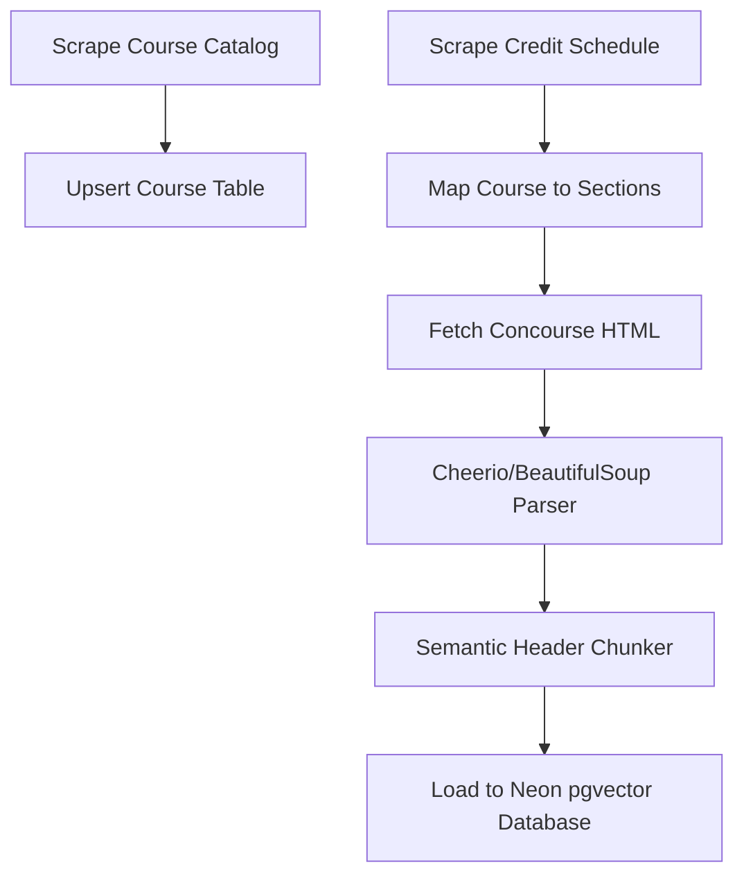

# Issue #12: Research & Mapping Strategy for Dallas College Academic Data
> **Title**: Compliance Mapping & Ingestion Architecture for Texas HB 2504
> **Status**: COMPLETED RESEARCH DRAFT
> **Assigned**: `netflix2023`

---

## 1. Course Catalog Data Discovery

### API Feasibility & Findings
* **Does Dallas College provide a public REST API, XML, or JSON feed?**
  **No.** There are no public, developer-facing data feeds (JSON, XML, or REST APIs) for the Dallas College course catalog. Course data is locked inside the web catalog system and class schedule search pages.
* **Scraping Feasibility & Effort**:
  * **Source URL**: [Dallas College Catalog Website](https://catalog.dcccd.edu/)
  * **Feasibility**: **High.** The catalog pages are served as static HTML, which makes parsing clean and efficient.
  * **Effort Required**: **Low-to-Moderate** (Estimated 4–8 hours of engineering time).
  * **Technical Approach**: Build a Python crawler using `aiohttp` (for asynchronous page fetching) and `BeautifulSoup` (using `lxml` parser). The scraper will:
    1. Parse the main catalog index page to extract unique course prefixes and codes (e.g., `COSC`, `ENGL`).
    2. Extract individual course detail page URLs.
    3. Crawl each course page to extract the name, credits, prerequisites, corequisites, and catalog description.

---

## 2. HB 2504 Data Retrieval (Syllabi & CVs)

### Why Concourse is Required (Catalog vs. Concourse)
It is important to distinguish between the **Course Catalog** and the **Concourse System**:
* **The Course Catalog** (`catalog.dcccd.edu`) only lists *generic, static course information* (e.g., "COSC 1436 is 4 credits and covers programming fundamentals"). It does not contain semester-specific schedules, who is teaching what section, or what textbooks a specific professor requires.
* **The Concourse System** (`concourse.dallascollege.edu`) hosts the *section-specific compliance data* (Syllabi and Instructor CVs/Vitas). Since different professors teaching the same course can require different textbooks, write different grading scales, and assign different project counts, we must scrape Concourse to answer detailed student questions (e.g., *"Does Malone require a physical textbook for accounting?"* or *"What is Patrick Penton's teaching experience?"*).

### Link Extraction Mechanics (How We Access the Information)
To programmatically retrieve this data, the crawler crawls the **Credit Class Schedule** tables using the following steps:
1. **Fetch the Schedule HTML**: The crawler fetches the schedule list for a given term (e.g., `Summer 2026`).
2. **Locate Course Section Rows**: The scraper parses the table structure. Each course section (like `ACCT-2301-9`) has a dedicated table row (`<tr>`).
3. **Extract the Link Elements**:
   * **Faculty Vita/CV Link**: Inside the row's "Faculty Information" cell, the scraper extracts the href from the `<a>` tag text containing `/ Vita` (e.g., pointing to `https://concourse.dallascollege.edu/syllabus/public/<faculty_id>/cv`).
   * **Class Syllabus Link**: Inside the row's "Links" cell, the scraper extracts the href from the `<a>` tag labeled `Class Syllabus` (pointing to `https://concourse.dallascollege.edu/syllabus/public/<syllabus_id>`).
4. **Download and Parse Concourse HTML**: The crawler makes a standard web GET request to these Concourse URLs. Because Concourse serves public compliance pages under HB 2504, we can download the HTML pages directly without needing any authentication, then parse the page elements (e.g., the left-hand "Education" list or the right-hand "Course list" on a faculty profile).

### Document Formats
* **Syllabi**: Concourse offers two formats:
  1. **HTML Web Pages (Recommended)**: Accessible via `https://concourse.dallascollege.edu/syllabus/public/<syllabus_id>`. This is highly structured using semantic HTML elements (like `<h3>` headers and `<table class="...">` schemas), making text and table extraction very accurate.
  2. **PDF Documents**: Accessible via `https://concourse.dallascollege.edu/syllabus/public/<syllabus_id>/pdf`. These are harder to parse programmatically without column/table layout corruption.
* **CVs (Vitas)**: Rendered as HTML profile sheets inside Concourse, detailing academic history, professional credentials, and teaching backgrounds.

### Scraping Obstacles & Rate Limits
* **CAPTCHAs**: No visual CAPTCHAs (like reCAPTCHA) are currently active on public schedules or Concourse profile views.
* **Rate Limits & Anti-Scraping**: Dallas College systems implement network-level rate limits (causing connection resets or HTTP `429 Too Many Requests` errors) if a single IP makes excessive concurrent requests.
* **Mitigation Strategy**: The scraper must:
  * Restrict concurrent requests to a maximum of 5.
  * Implement a randomized delay (0.5 to 1.5 seconds) between downloads.
  * Handle HTTP `429` errors using an exponential backoff retry mechanism.

---

## 3. Data Schema & AI Viability

### Proposed JSON Schema
The following JSON schema links a core Course description to its active term sections, Concourse syllabi, and instructor CVs:

```json
{
  "$schema": "http://json-schema.org/draft-07/schema#",
  "title": "CourseMappingSchema",
  "type": "object",
  "properties": {
    "course_code": { "type": "string", "example": "COSC-1436" },
    "course_name": { "type": "string", "example": "Programming Fundamentals I" },
    "credit_hours": { "type": "integer", "example": 4 },
    "description": { "type": "string" },
    "prerequisites": { "type": "string" },
    "sections": {
      "type": "array",
      "items": {
        "type": "object",
        "properties": {
          "section_id": { "type": "string", "example": "11001" },
          "term": { "type": "string", "example": "2026Fall" },
          "syllabus": {
            "type": "object",
            "properties": {
              "syllabus_id": { "type": "string" },
              "concourse_url": { "type": "string" },
              "textbooks": {
                "type": "array",
                "items": {
                  "type": "object",
                  "properties": {
                    "title": { "type": "string" },
                    "required": { "type": "boolean" },
                    "cost_estimate": { "type": "string" }
                  }
                }
              },
              "grading_rubric": {
                "type": "array",
                "items": {
                  "type": "object",
                  "properties": {
                    "component": { "type": "string" },
                    "weight_percentage": { "type": "integer" }
                  }
                }
              }
            }
          },
          "instructor": {
            "type": "object",
            "properties": {
              "name": { "type": "string" },
              "email": { "type": "string" },
              "cv_url": { "type": "string" },
              "education": {
                "type": "array",
                "items": { "type": "string" }
              }
            }
          }
        }
      }
    }
  }
}
```

### High-Value Syllabus Sections for AI Context
To avoid overloading the LLM's context window and wasting tokens, the parser should extract and prioritize these specific sections from the Concourse syllabus:
1. **Required Materials & Textbooks**: To answer student questions regarding class materials and cost mitigations.
2. **Evaluation Criteria / Grading Rubric**: To answer queries about weight allocations (e.g., *"How much of my grade is the final project?"*).
3. **Major Assignments & Essays**: For syllabus comparison requests.
4. **Course Schedule / Weekly Calendar**: For generating personalized study planners and tracking deadlines.

---

## 4. Technical Deliverables & System Architecture

### Pipeline Flow
The ingestion pipeline moves data from public HTML pages to our production PostgreSQL database:



### Source-to-Destination Data Mapping
1. **Course Details**:
   * *Source*: `https://catalog.dcccd.edu/content.php`
   * *Format*: HTML Web Page.
   * *Destination*: PostgreSQL `courses` table.
2. **Syllabus Content**:
   * *Source*: `https://concourse.dallascollege.edu/syllabus/public/<syllabus_id>`
   * *Format*: HTML Web Page (parsed to clean Markdown).
   * *Destination*: PostgreSQL `course_chunks` table containing vectorized text blocks.
3. **Instructor CVs**:
   * *Source*: `https://concourse.dallascollege.edu/syllabus/public/<faculty_id>/cv`
   * *Format*: HTML Web Page.
   * *Destination*: PostgreSQL `instructors` table linked to related sections.
