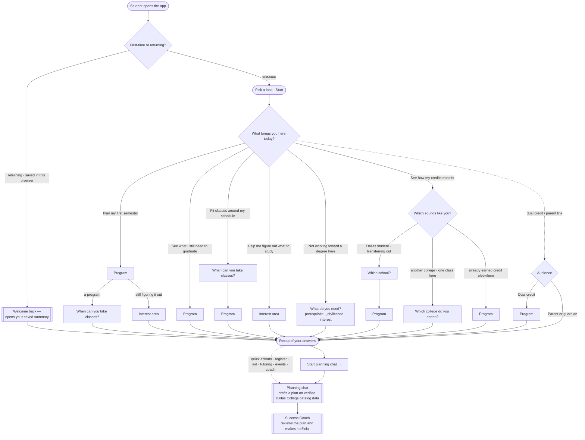

# Landing & Onboarding — UI & UX

| | |
|---|---|
| **Issue** | [#52 — Landing & Onboarding Page UI Implementation](https://github.com/Dallas-College-AI-Club/success-coach-chatbot/issues/52) |
| **App** | `apps/frontend` (Next.js App Router, React, Tailwind v4, ShadCN) |
| **Builds on** | `conversation-entry-design.md` (#40) · `success-coach-interview-summary.md` (#42) · `DATABASE_ARCHITECTURE.md` (#36) · `AGENT_PERSONALITIES.md` (#41) · governance RFCs 0001–0006 (#54) · [`ENGAGEMENT_ONBOARDING_STRATEGY.md`](../research/ENGAGEMENT_ONBOARDING_STRATEGY.md) |
| **Audience** | First-time reader — teammate, reviewer, or Success Coach. No code knowledge assumed. |

The first screen a student sees. It carries the team's [conversational entry flow](conversation-entry-design.md) (#40) into a working surface: a student picks a look, answers a few optional, tap-answerable questions that scope their first request, and is handed into the planning chat. The question set is the intake a Success Coach identified as what students should arrive with (#42); the captured payload is shaped to the profile allowlist in the two-table schema (#36); the copy holds to the trust invariants in the governance RFCs (#54).

---

## 1. Position in the system

Onboarding is the first of three stages. It gathers context; it does not answer.

1. **Onboarding** (this page) — optional, skippable capture of goal and a few scoping answers.
2. **Planning chat** — the OpenRouter chat integration (#37) over the RAG pipeline (#35) and the #36 catalog data, in the register system defined by the agent-personalities work (#41), inside the scope the guardrails enforce (#39). It navigates options and drafts a plan, every claim traceable to verified Dallas College records.
3. **Human Success Coach** — verifies the drafted plan and makes it official.

The seam between stage 1 and the rest is a single console-logged payload whose keys match the #36 profile allowlist — ready for the client store and anonymous analytics (#50) and the backend models (#51). Onboarding asserts no academic outcome: requirements, transferability, and graduation are the chat's to answer on cited data, and the coach's to confirm. This is the entry design's own principle — onboarding stays optional and a student can begin without answering anything — carried into a live flow that keeps to the fewest questions the first answer needs. Campus, for instance, is left out: a student may take classes across campuses or online, requirements are campus-independent, and it matters only later, as a section filter inside the chat.

---

## 2. The screen

- **Welcome.** The *Success Coach* brand cover (`public/title.png`, coded fallback), a one-line greeting, a style picker — **Simple · Playful · Focus** — and a Start button. The Dallas College AI Club logo (`public/logo.png`) links to the club site.
- **First-time vs returning** — the fork the entry design (#40) opens with. A first-time student picks a look and starts the questions. A returning student — one whose answers are saved in this browser — instead sees a **"Welcome back — pick up where you left off"** button that opens their saved summary directly, skipping the questions. Detection is client-side and SSR-safe (`useSavedSession`), so the return option appears without a hydration flash. The saved value is the same console payload (`onboarding-store.ts`), which is the seam the anonymous client store (#50) replaces.
- **Persistent style switcher.** A control at the top changes the look at any point and preserves every answer; the wordmark returns to the welcome page.
- **Single-mode ship.** Each mode is data — a `Skin` (class strings), a `Copy` (strings), a font, and a wizard shell. Setting the mode list to one entry drops the picker and switcher and gives every student that one look.

The audience is broad — first-year, returning, first-generation, working adults, ESL speakers, dual-credit students — so the student chooses the tone rather than receiving one.

| Mode | Interaction | Type | Status |
|---|---|---|---|
| **Simple** | A chat: the bot asks in a bubble, answers sit back as the student's bubbles, new questions slide in. The default. | Manrope | Complete |
| **Playful** | A campus the student strolls, with the seven Dallas College campus mascots roaming it. | Nunito | **Background polish in progress** — the mascots and flow are in place; the campus backdrop and motion are being refined. |
| **Focus** | A calm single-scene climb that advances one step per answer. | Space Grotesk | Complete |

---

## 3. The questions

One goal question routes everything after it. Follow-ups are conditional — computed from every answer so far — so the flow never asks something that does not fit the path. Most students answer two or three; none more than four. Every option is a closed choice; free text never enters the payload.

**Q1 — "What brings you here today?"**

| Goal | Follow-ups |
|---|---|
| Plan my first semester (I know what I want to study) | Program → Schedule |
| See what I still need to graduate | Program |
| See how my credits transfer | Direction + school → Program (degree-here directions only) |
| Fit classes around my schedule | Schedule → Program |
| Help me figure out what to study (I'm not sure yet) | Interest area |
| Not working toward a degree here (one class, a certificate, or license prep) | Purpose |

A secondary link under the goals routes the audiences the goal list does not fit: **Dual credit · Parent or guardian**. The set covers what the #42 interview named — program, transfer intent, target school, full- or part-time, class format, scheduling constraints. Topics that suit a live conversation — transcript status, prior-learning credit, holds, questions for a coach — are deferred to the chat.

**Staging.** Goal options and the capability directory both read from one shipped-intents file. An option renders as a routing signal while the answering layer is built, and the same flag hides it once — and only once — its backing intent ships, so the entry never points at an answer the pipeline cannot yet give. This tracks the sprint order in the [degree-planning user stories](user-stories/DEGREE_PLANNING_STORIES.md).

---

## 4. The adaptive flow

The flow honors one rule:

> **Never ask a question that doesn't fit the path the student is on.**

A visiting student taking one class is never asked which Dallas program they want; an already-enrolled student is asked which program they are *in*, not what they *want* to study.

### Diagram



Every **Program** step offers *"I'm still figuring it out,"* which reroutes to
**Interest** (drawn on the first-semester path; the same reroute applies wherever a
Program step appears). The visiting-student transfer path never asks a program. No
path exceeds four questions before the hand-off.

### Every path

"→ Interest" appears only when a student selects *"I'm still figuring it out"* at the program step.

| Goal | Path | Questions | Asks program? |
|---|---|---|---|
| Plan my first semester | Program → Schedule *(→ Interest if unsure)* | 3 | Yes |
| See what I still need to graduate | Program *(→ Interest if unsure)* | 2–3 | Yes |
| See how my credits transfer — *transferring out* | Direction + school → Program *(→ Interest if unsure)* | 3–4 | Yes |
| See how my credits transfer — *visiting (one class here)* | Direction + home school | 2 | **No** |
| See how my credits transfer — *bringing credits in* | Direction → Program *(→ Interest if unsure)* | 3–4 | Yes |
| Fit classes around my schedule | Schedule → Program *(→ Interest if unsure)* | 3–4 | Yes |
| Help me figure out what to study | Interest | 2 | No |
| Not working toward a degree here | Purpose | 2 | No |
| Dual credit *(audience)* | Program | 2 | Yes |
| Parent or guardian *(audience)* | *(completes at once)* | 1 | No |

### The rules

1. **The goal picks the follow-ups** — a default chain of one or two questions.
2. **Transfer depends on whose school is home.** The program question is added for the Dallas student (transferring out) and the inbound student; it is omitted for the visiting student, who is not pursuing a Dallas program.
3. **"I'm still figuring it out" reroutes to Interest** on every path, so the flow helps find a direction instead of pressing for specifics the student does not have.
4. **The program question adapts its wording.** An enrolled student — checking graduation, or transferring Dallas credits out — is asked *"What degree or certificate are you working toward?"*; everyone else, *"What do you want to study?"*
5. **One intent, one door.** Taking a class to count toward a degree elsewhere is the visiting-student transfer option, which also captures the home school.
6. **The budget is four.** No path exceeds the goal plus three follow-ups.

The rules are one pure function, `followUpsFor(answers)`, in [`questions.ts`](../apps/frontend/features/onboarding/questions.ts); the program wording is `programFor(answers)` in the same file.

---

## 5. The transfer branch

*"Which of these sounds like you?"* — the student self-identifies by home school, the distinction that determines the path:

- *I'm a Dallas College student, planning to transfer later* → asks the destination, then the program.
- *I go to another college — just taking one class here* → asks the home school; no program.
- *I already earned college credit somewhere else (another college, the military, or exams like AP, IB, or CLEP)* → asks the program; routes to Admissions for evaluation.

The school picker is tiered by what the catalog can ground an answer in. **UT Dallas** and **UNT** are named — Dallas College's coordinated articulation with them is in the catalog — so the chat can be school-specific. The rest are buckets — *Another Texas school*, *Out of state*, *International*, and *Not sure yet* — that route to the correct process and the receiving school's own verification, in line with the credit-portability principle that the receiving institution decides. The prompt reads *"Where are you hoping to transfer?"* for the outbound student and *"Which college do you normally attend?"* for the visiting student.

---

## 6. The hand-off

Onboarding does not end in a summary screen; it opens the planning chat. The final panel shows a brief recap of the answers, then the chat's opening, and asserts nothing this page cannot back:

- **A forward line** tailored to the goal — *"Next, in your planning chat we'll…"*.
- **A preview of the chat, drawn from the answers.** The starter prompts are chosen to fit the student's goal and sub-answers — a student taking a class for a job or license sees *"Who confirms this class counts?"*, not "classes for my major." A destination name appears only for the two named transfer partners; every other school reads as a plain phrase.
- **Authority routing, never a claim.** Transfer credit and prior-credit evaluation route to the deciding institution. This holds to the interview's standing rule — no promises about transferability, financial aid, or graduation without Success Coach confirmation (#42) — and to the guardrail scope (#39).
- **The close, on every path:** *"Koa helps you plan; a Success Coach makes it official."*
- **The entry point:** a **Start planning chat** button routes to `/chat`, the chat surface (#37, wireframed in #3). A placeholder holds that route until the chat lands, carrying the same welcome and starter prompts so the student sees where the conversation continues.
- **A few quick actions.** Beneath the entry point, a quiet row of shortcuts — *Register for classes*, *Academic calendar*, *Financial aid*, *Tutoring*, *Campus events*, *Talk to a Success Coach* — kept deliberately short so the close stays scannable rather than a wall of options. Each opens the planning chat, which answers the topic or routes to the office that owns it; as those surfaces ship, a shortcut can point at its real destination.

The hand-off copy is the pure module [`handoff-copy.ts`](../apps/frontend/features/onboarding/handoff-copy.ts), rendered by [`chat-handoff.tsx`](../apps/frontend/features/onboarding/shared/chat-handoff.tsx); the shortcuts are [`quick-actions.tsx`](../apps/frontend/features/onboarding/shared/quick-actions.tsx). The chat it opens into carries the answers so the conversation starts already scoped.

---

## 7. What gets captured

Completion logs one object to the console — the placeholder for the global-state integration (#50). Its keys mirror the #36 profile allowlist, so persistence stores it without reshaping and the chat route reads it as the same context seam.

| Key | Meaning |
|---|---|
| `goal` | The Q1 selection |
| `major` | A catalog program id, or `null` for "I'm still figuring it out" |
| `target_institution` | Destination/home school code, or a category (`TX_OTHER`, `US_OTHER`, `INTL`) |
| `student_type` | Set via the audience link |
| `modality_pref` / `dayparts_pref` | Class-format and time preferences |
| `transfer_direction` / `interest_area` / `oneoff_purpose` | Path-specific context |
| `skippedSteps` | Steps left blank — separates a skip from a "no preference" answer |
| `onboardingVersion` / `completedAt` | Version stamp and timestamp |

Two properties keep the payload stable for whoever consumes it next. **Closed-list values only:** each answer stores an exact value; *"I'm still figuring it out"* is a real answer (`null`), distinct from a skip. **Skips are derived at completion** from the resolved branch, so back-navigation and branch changes still yield a correct record.

The same object is also kept in this browser ([`onboarding-store.ts`](../apps/frontend/features/onboarding/onboarding-store.ts)) so a returning student can reopen their summary without re-answering — the local stand-in for the anonymous client store #50 will own, and the single seam to replace when it lands. It never leaves the browser and never reaches a student record; the welcome footer says exactly that. The read is `useSavedSession`, an SSR-safe `useSyncExternalStore` hook that returns `null` on the server and the stored value on the client, so the returning view resolves without a hydration mismatch, and a corrupt or shape-changed value parses back to `null` (first-time), never a throw.

---

## 8. Correctness

State lives in one shared hook, [`use-onboarding.ts`](../apps/frontend/features/onboarding/use-onboarding.ts): each step stores the selected option id and the payload reads the value back from that option, so the record always matches what was shown; re-answering the goal clears the prior branch's answers; every exit runs through one guarded function, so the payload logs exactly once.

The decision logic is exercised by [`onboarding-flow-stress.ts`](onboarding-flow-stress.ts), which drives the real functions through every reachable path (85 structural, ~5,000 with the full program picker) and adversarial back-navigation, asserting: no path exceeds four questions; the program picker never appears for a student not pursuing a Dallas program, and always appears for one who is; the program wording matches enrolment; the hand-off never asserts an outcome and always closes on the coach step; and no unfilled placeholder ever reaches a student.

```bash
cd apps/frontend
npx tsx ../../docs/onboarding-flow-stress.ts          # readable structural map
FULL=1 npx tsx ../../docs/onboarding-flow-stress.ts   # exhaustive run
```

A green run prints `✓ all invariants held across every path`.

---

## 9. Look, motion, accessibility

- **Colour roles.** A dark colour carries text and primary actions; a bright colour marks progress, the selected-choice ring, and the finish mark. The split is an accessibility requirement — the bright colour never fills a text button. Each mode carries its own palette on a light background.
- **Progress.** Shown in each mode's own terms. Because the flow is adaptive, the count seeds at the shortest possible flow and only grows as the path reveals more questions — it never snaps downward.
- **Motion.** Short fades and slides, one continuous scene motion per mode, one finish mark. Everything non-essential uses `motion-safe:` and stops under `prefers-reduced-motion`.
- **Accessibility.** Full keyboard path; focus moves to each step's heading; choice groups are labelled radio groups; selection shows border, ring, and check, so colour is never the only signal.
- **Devices.** The layout is fluid from a 375px phone through tablet and desktop, in portrait or landscape — no horizontal scroll, and each screen sizes to the space under the header so a short screen scrolls once rather than in nested layers. On touch devices every control (including the style switcher, the program picker rows, and the quiet text links) carries a comfortable ≥44px hit area, while mouse pointers keep the compact look.

---

## 10. Structure

```
app/page.tsx                     renders the flow
app/chat/page.tsx                planning-chat entry (placeholder until #37 lands)
features/onboarding/
  use-onboarding.ts              the shared state machine
  questions.ts                   goal question, branch rules, program wording, school options
  programs.ts                    Dallas College programs of study (picker)
  build-payload.ts               answers → payload; derives skippedSteps
  handoff-copy.ts                the personalized chat hand-off copy (pure, UI-free)
  onboarding-store.ts            browser persistence + useSavedSession (returning-user seam, #50)
  shipped-intents.ts             single source for staged capability
  telemetry.ts                   console instrumentation
  skin.ts                        Skin / Copy / Mode contracts
  shared/                        flow, welcome, brand, switcher, recap, transfer step,
                                 chat hand-off, quick actions, capability dialog, step transition
  shared/shells/                 one wizard shell per mode (simple, playful, focus)
  shared/scenes/                 the per-mode scenery
  variants/                      one data file per mode + registry + fonts
```

The picker is populated from the 2026–2027 catalog's programs of study; each entry's `code` is the catalog program id. Interactive elements use ShadCN — `ToggleGroup` for single choice, `Command` for the searchable picker, `Dialog` for the capability directory — and avoid dropdowns so options stay visible on mobile.

**Instrumentation.** The funnel logs to the console with names matching the #50 telemetry vocabulary — `page_load`, `cta_tap`, `onboarding_started`, `question_answered`, `question_skipped`, `onboarding_skipped`, `onboarding_completed`, `onboarding_resumed`, `audience_link_tap`, `capability_opened` — so an anonymous analytics transport is a drop-in.

---

## 11. Issue #52 — status

| Acceptance criterion | Status |
|---|---|
| Next.js landing route; reusable component scaffold; ShadCN in `components/ui` | Complete |
| Hero + primary CTA; supporting capability section; Tailwind brand styling | Complete (Playful scenery in progress, §2) |
| Questionnaire UI; wizard with Next/Back + progress indicator | Complete |
| Interactive elements capture input via local `useState`; `currentStep` drives conditional rendering without a route change | Complete |
| Final action prevents default and `console.log`s the payload | Complete |
| Responsive across mobile/tablet/desktop; accessibility (semantic HTML, aria-labels, keyboard) | Complete |
| Input validation | Every question is a closed set of tap buttons or a searchable picker — no free-form text — so there is nothing to validate; a student answers or moves on at any step |

High-fidelity match to the Canva theme is met in structure and brand; the flow extends the mockup with the conditional question logic and the three-mode presentation the strategy specifies.

---

## 12. Scope and planned enhancements

**In this page.** The landing with its first-time/returning fork, the style switcher, the conditional flow, all local state, the console payload, instrumentation, the chat hand-off, and the closing quick actions. A returning student's summary is restored from a small browser store — the local stand-in for #50. **Elsewhere:** durable persistence and analytics as an anonymous client store (#50), backend models (#51), and the chat surface the payload feeds (#37).

Planned enhancements, sequenced with the surrounding work:

- **Playful scenery** — animated mascots and a richer background (§2).
- **Schedule as two taps** — time and delivery mode separately, matching the distinct `dayparts_pref` and `modality_pref` keys the #36 schema already carries.
- **Home-school search for visiting students** and destination-led ordering for outbound transfers, as the articulation data in #35/#61 lands.
- **A signposted visiting-student route** and a workforce / continuing-education door, as their backing intents ship.
- **SSO prefill** — with the client store (#50), the program and returning-student steps collapse toward a single confirmation.

### The name (working placeholder: "Koa")

Students meet the AI as **Koa**, an AI **planning companion** that helps them plan and get ready. It is not the human role: a **Success Coach** is a person who makes plans official. "Koa" is a working placeholder in the front-end copy only. The governed assistant name is unchanged (strategy §13.1).

Handily, "Koa" reads well across the languages Dallas College students speak:

| In | "Koa" reads as |
|---|---|
| Hawaiian | *brave / warrior*, and the strong koa tree: strength and moving forward |
| Vietnamese | a near-homophone of *Khoa*: science, intellect, academics (a quiet win for a planning tool, and familiar to many students) |
| Japanese | コア = *core* (a nod to core classes and prerequisites) |
| Māori | *joy, happiness* |
| Spanish | nothing, so no awkward slang; reads as a clean, trendy name |

**Gen-Z fit:** short, soft, gender-neutral, easy to say ("KOH-ah"). A friendly peer, not a corporate bot. **Watch-out:** no direct Dallas/Texas tie, and other brands use "Koa" (e.g. Koa Health), so clear the trademark before it goes official.

---

## References

- [`ENGAGEMENT_ONBOARDING_STRATEGY.md`](../research/ENGAGEMENT_ONBOARDING_STRATEGY.md) — the engagement & onboarding strategy this implements
- [`conversation-entry-design.md`](conversation-entry-design.md) (#40) — the entry flow this carries forward
- [`success-coach-interview-summary.md`](success-coach-interview-summary.md) (#42) — source of the question set
- [`DEGREE_PLANNING_STORIES.md`](user-stories/DEGREE_PLANNING_STORIES.md) — intents and sprint order
- [`onboarding-flow-stress.ts`](onboarding-flow-stress.ts) — the flow verification harness
- [`handoff/CHAT_UI_HANDOFF.md`](handoff/CHAT_UI_HANDOFF.md) — what the planning-chat build (#37) inherits from onboarding
- Issues [#36](https://github.com/Dallas-College-AI-Club/success-coach-chatbot/issues/36) (schema) · [#37](https://github.com/Dallas-College-AI-Club/success-coach-chatbot/issues/37) (chat) · [#41](https://github.com/Dallas-College-AI-Club/success-coach-chatbot/issues/41) (personalities) · [#50](https://github.com/Dallas-College-AI-Club/success-coach-chatbot/issues/50) (persistence & analytics) · [#51](https://github.com/Dallas-College-AI-Club/success-coach-chatbot/issues/51) (backend models)
