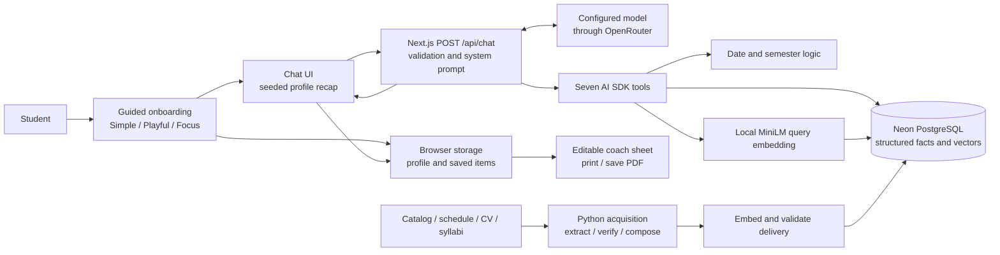
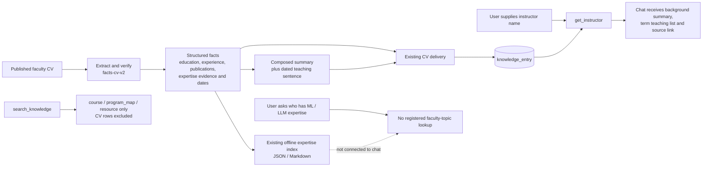
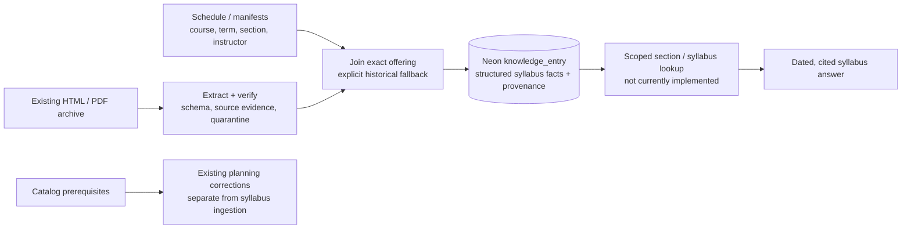
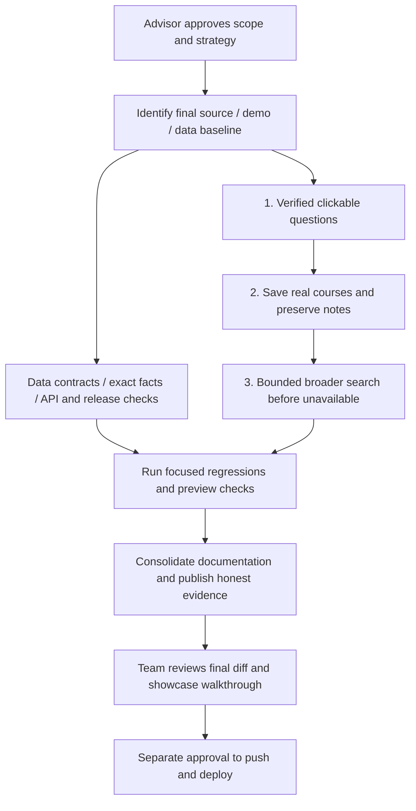

# Success Coach: repository audit and showcase cleanup strategy

**Audit baseline September 19, 2026; final showcase review September 20.**

<a id="final-review-checkpoint"></a>

## Final review checkpoint — issue #189

**Current status supersedes the dated local checkpoints below.** The owner expanded the original two-change scope to include schedule repair/grouping, broad recovery, complete course-instructor rosters, inline CVs/highlights, reliability fixes, coordinated Playful mascots, documentation and a commit/PR. The approved Fall facts import is already applied. Branch: `bugfix/189-showcase-demo-polish`; [issue #189](https://github.com/Dallas-College-AI-Club/success-coach-chatbot/issues/189) is on the Success Coach Kanban. Merge and deployment remain separate. The original findings below describe the baseline; they are not all claims about the changed branch.

| Requested outcome | Implemented and verified behavior | Boundary |
|---|---|---|
| Useful changing examples | Direct program/prerequisite/tuition/resource prompts; no advisor-question generation. Used topics retire; verified course follow-ups follow the visible course order. | Curated/topic matching, not arbitrary semantic paraphrase detection. |
| Correct semester and compact lists | Explicit numbered semesters enforced before enrichment; numbered rows, credits, Show more and save actions. Long elective rules are under the elective row. | A curriculum semester is distinct from a Fall/Spring offering. Choice eligibility and completed-course subtraction are deferred. |
| Meaningful Fall schedules | Individual sections, source dates/times, page totals and section/day/professor/time/campus grouping; missing times are unknown. | Saved August 12 snapshot; no live seats. Up to 100 sections/page, with explicit next-page instructions. |
| Every professor for a course | Independent full roster query across all matching sections, even beyond the loaded page; named instructors bold; TBA separate. | Applies to the selected course/term in the saved records, not every professor by arbitrary expertise. |
| CV access and highlighted expertise | CV details open inline; exact-key unambiguous source links; literal keyword highlights; long backgrounds and teaching records collapsed. | Saved summaries may describe earlier terms. Original-source link remains; no inferred expertise claims. |
| Broader retrieval before fallback | One forced all-type recovery after an exact miss; per-type embedding plus keyword retrieval; topical evidence filter; deduplicated candidates. | Six related candidates, not exhaustive enumeration. No false substitution of a similar program. |
| Calendar and resilience | Empty/zero provider defaults normalized; Dallas timezone/date boundary correct; invalid requests return limitations. Lazy embedding load, Stop cancellation, safe empty-reply retry, official resource citations and storage-unavailable hydration. | Calendar partitions are not live deadlines; dependency outages remain possible and are surfaced honestly. |
| Original themes and approved mascots | Coordinated final handoff from “Refine playful theme mascots”; seven final assets, lazy Playful scene, reduced-motion and WebGL fallback; obsolete scene removed. | Decorative geometry tests are distinct from a full accessibility/device certification. |

**Final evidence:** 34 demo/boundary/mascot tests, 12 course-normalization and 26 sheet-filter checks; Python 74 passed/4 skipped. Full-project ESLint (zero warnings/errors), TypeScript and the optimized production build passed. Independent read-only comparisons verified **216 section rows** (professor, source key, dates) and **151 CV links**. ITSE 1370 returns 16 Fall sections; ENGL 1301 has 942, with two disjoint 100-row pages. All grouping modes retain every loaded section. Complete instructor rosters match independent database enumeration, including later pages.

**Student-perspective conversation run:** ten paid GPT-4.1-mini turns, including a five-turn program → MySQL teachers → named background → Python schedule → prerequisite/history sequence, a nonexistent certificate, qualified ML/LLM background discovery, and three concurrent course/schedule/tutoring requests. All returned nonempty text without stream/tool errors, in **1.8–4.3 seconds** locally. This is smoke/conversation stress coverage, not a public concurrency SLA. Raw text/tool traces remain ignored in `.tmp/final-conversations.json`; read-only comparison results in `.tmp/final-real-data-results.json`.

**Source accuracy:** structured course/schedule fields match the sampled stored records. The approved import independently matched all 12,872 Fall facts and hashes to the reviewed CSV delivery; this is source-snapshot agreement, not live schedule freshness. Demetria Mathews's official CV was opened and checked against the saved education/employment summary. Fresh automated access to two catalog pages and a Concourse syllabus was blocked/unavailable, so no new whole-catalog recertification is claimed. The current ITSE 2370 tool preserves “Prerequisites: Recommended: ITSE 1370.” and the model distinguished that recommendation from required prerequisites in the tested turn. Missing fields remain unknown in the cards.

**Browser evidence:** actual `/chat` preserved Simple/Playful/Focus controls; first-semester starter showed only Semester 1 and then retired; elective text appeared only after expanding its row; a saved MySQL course retained description/credits/source in the printable sheet. The reported MySQL question now checked the calendar successfully and displayed all four named instructors plus TBA sections. Inline CV disclosure exposed highlighted source phrases; all nine sections survived day/time/professor regrouping. These checks used the real app, not a replacement test UI. Native print pagination and full mobile/screen-reader certification remain separate release checks.

**Remaining next-PR strategy work:** deterministic completed-course tracking and comparison arithmetic; full faculty expertise indexing/enumeration; source refresh/legacy ingest cleanup; server-side trust for replayed tool history and public spend controls; syllabus ingestion; deployment identity, device/print and agreed capacity testing. Model explanations can still overstate null prerequisites or flatten choice rules. Canonical cards preserve the stored facts, but that does not certify arbitrary generated prose. The [executive sheet](SHOWCASE_EXECUTIVE_DECISIONS.md) gives concise methods, alternatives and advisor comment fields.

## Historical audit and implementation log

The following chronological entries retain the evidence available at each checkpoint, including failures, old model settings and then-current authorization. Statements such as “not pushed” or “import pending” describe those earlier checkpoints; use the final checkpoint above and PR for current state.

| Audit subject | Reference |
|---|---|
| Public repository | [Dallas-College-AI-Club/success-coach-chatbot](https://github.com/Dallas-College-AI-Club/success-coach-chatbot) |
| Latest `main` retrieved and reviewed | [`1e87c578df87bb5880cff88c8e4a6ffd43676a1a`](https://github.com/Dallas-College-AI-Club/success-coach-chatbot/commit/1e87c578df87bb5880cff88c8e4a6ffd43676a1a), September 18, 2026, “refactor jobs to use ai-sdk (#188)” |
| Live application tested | [major-demo-chi.vercel.app](https://major-demo-chi.vercel.app/) |
| Published CI for that commit | [Successful run, September 18](https://github.com/Dallas-College-AI-Club/success-coach-chatbot/actions/runs/35360806400) |
| Intended outcome | A credible developer showcase of the existing project, with no expansion of product scope |

**Clean GitHub baseline:** at the project owner's explicit request, the old local checkout, local-only files, configuration, dependencies and nested worktrees were discarded and replaced with a fresh clone of the GitHub commit above. No merge of old local changes was performed. Only this audit and the executive decision brief were retained. The external `club-project/raw` archive was left untouched. Tests, dependencies and synthetic fixtures remain in temporary audit storage. No application changes, commits, pushes, deployments or database writes were made by this audit.

**Evidence boundary:** repository findings below refer to the exact commit above. Live observations refer to the deployed application on the audit date. The deployed commit and effective model configuration remain unverified. A subsequent read-only census and source/row/tool comparisons established the configured Neon database contents; its endpoint identity has not yet been matched to Vercel configuration. See [verified data coverage](#capabilities-and-data). Live tool responses differ from the latest source, so a passing live case does **not** establish that the corresponding latest code works. Neither source inspection nor a build establishes the state of the production database.

<a id="local-demo-checkpoint"></a>

### September 20 follow-up: scope, repeated questions, schedules and model latency

The owner subsequently requested narrower semester answers, expandable elective options, suggestions that change after use, schedule details, model comparisons, and simpler implementation. Code changes remain local; remaining audit recommendations are still proposals. The owner subsequently explicitly approved the reviewed Fall facts import, which was applied and verified on September 20.

| Observed defect | Local correction / evidence | Remaining limit |
|---|---|---|
| First-semester prerequisite question rendered the complete eight-semester BAT plan. | Add optional numbered-semester scope to the existing program tool; enforce explicit scope from the current user turn before course enrichment; also scope older full-plan UI results. Verified BAT first and second semester separately against Neon. First-semester model payload: 8,982 → 1,404 characters. | Unnumbered source groups are not assigned to invented semesters. Full-program credits stay labeled as such. This does not decide admission or completion eligibility. |
| Long ITSE/INEW elective paragraph dominated the course list. | Keep semester credits visible; preserve full long rules in a closed **Show options and catalog requirements** disclosure. Preserve repeated elective slots and short mandatory rules. | A disclosure does not repair errors in generated explanations of choice rules. |
| Identical starter buttons persisted after being asked. | Remove submitted prompts and labels; retire plan suggestions after a successful plan lookup; suggest specific descriptions/requirements only for courses returned in verified results. | The selector recognizes common typed resource/prerequisite requests, not arbitrary semantic paraphrases. It may show fewer than three buttons when no supported new question is available. |
| Class schedule merged distinct sections, mixed terms, capped at 20 instructor groups, and asserted missing times meant no fixed time. | Existing tool now normalizes course codes, filters year/term, returns individual sections, an explicit total and bounded pagination. Existing chat displays a short section list with expandable remainder. Read-only ITSE 1370 Fall query returns all **16** sections. | **Fall data imported after explicit approval.** All 12,872 rows match the reviewed delivery after commit. Python has seven timed and nine source-text-only online sections. Spring/Summer meeting facts remain unloaded. Snapshot absence is not proof of no college offering; there is no seat-availability feed. |
| Saved Fall source contains meeting details absent from Neon. | Prepared a facts-only delivery for all **12,872** matching Fall rows, with unique source/chunk keys and schema validation. **6,520** fully parsed schedules; **6,352** raw-text-only schedules, including **36** unparsed formats. Full raw meeting text retained; no partial parse is promoted as complete. Existing before-state saved locally. | Owner approval received; before-state verified under locks, all updates applied in one transaction and independently reread after commit. CSV snapshot remains **2026-08-12**. Text, metadata and vectors were not changed. |
| Model appeared slow and sometimes returned no text. | Six authorized comparisons: GPT-OSS 20B **26.5/14.7 s**, GPT-4.1 mini **2.9/2.8 s**, GPT-5.6 Luna with reasoning disabled **3.5/2.8 s**, on the same two scoped catalog questions. Current model spent **154–787 reasoning tokens**; first visible text took **12.2–24.8 s**. | Two cases/model, cache differences and no load test: diagnostic only. All three still blurred suggested electives with preparation in one answer. Previous empty reply with `finishReason:length` remains an acceptance failure. After the comparison, the owner selected GPT-4.1 mini for the local demo; local configuration is updated. |

Implementation reuses existing route/tools/store/styles. There are three new application modules: shared course data, course/section rendering and a pure suggestion selector; a fourth new file holds regression tests. Three temporary helper/component modules were combined during review. No dependencies or alternate demo page were added. Concurrent mascot/background work in the shared checkout is outside these changes and is not reverted.

Latest checks: 15 regression tests and existing 12/26 guards passed; typecheck, targeted lint and production build passed. The browser confirmed separate Semester 1 / Semester 3 results, clickable elective disclosure and all 16 Fall section entries. Post-import schedule-tool checks verified Friday ITSE 1370 times and distinct Tuesday/Wednesday CDEC 1354 times. A GPT-OSS chat retry reused stale pre-import results without calling a tool; an explicit single-course schedule request now forces a fresh first lookup. The subsequent GPT-4.1 mini chat response displayed all 16 sections, with all instructors/dates/meeting strings checked against the verified records (zero mismatches). The remaining 11 sections expanded correctly. General model prose and unsupported inference remain governed by decision 04.

Local artifacts (ignored, not for GitHub): `apps/frontend/.tmp/scoped-program-results.json`, `python-fall-sections.json`, `fall-section-before.json`, `fall-facts-proposed.json`, `fall-facts-review.json`, `model-benchmark.json`. Credentials are excluded. See the [executive brief](SHOWCASE_EXECUTIVE_DECISIONS.md#latest-local-fixes-and-model-decision--september-20) for prices, rationale, alternatives and approval fields.

## September 20: local demo changes and verification

**Approved scope and current state.** Starting from the clean GitHub baseline, the owner authorized context-appropriate starter questions and compact course lists with expandable details and explicit add/remove actions for the printout. The implementation also makes semester headings prominent and numbers courses within each group. Existing page geometry, Simple/Playful/Focus themes, backgrounds, branding and style controls are unchanged. A stripped-down fixture page caused confusion during review; it was removed, and subsequent browser checks used the actual onboarding, `/chat` and `/summary` pages. Nothing has been committed, pushed, deployed or written to Neon.

**What changed and why:**

- Starter buttons retain short labels but send self-contained questions tied to the selected program or an explicitly named example. The owner rejected the first candidate's advisor-question generation as unhelpful; those prompts were removed everywhere. Selected programs now offer direct course-plan and first-semester prerequisite questions, plus tuition, aid or recorded advising contacts as appropriate. Nondegree paths offer direct tuition/tutoring/contact lookups; arrival paths offer housing/DART/tutoring facts. Scheduling, transfer and graduation choices do not promise unavailable determinations. The buttons remain available after a response and are disabled during generation. Question text shown in chat/notes contains no internal model-governance instructions.
- Program requirements and exact course results render canonical codes, titles and credits directly from tool data. Each course has collapsed **Show more** details and an explicit **Add to notes** action. Group rules, required credits, exclusions and incomplete-option notices remain visible. Repeated elective slots remain separate; missing records and placeholders cannot be saved as verified courses. Longer generated explanations are collapsed separately; they remain model-generated and may still be wrong.
- The existing program query now resolves picker labels through their stable catalog ID, accepts bounded canonical names and enriches the returned plan with one batch of course records from the same catalog edition. A conservative parser also recognizes structured entries such as `ACCT 2301 - Title (3 Credit Hours)`; it does not select one course from a combined OR expression. Expandable descriptions are removed from model-context replay, while codes, titles, credits, rules and verbatim requisite text remain available. This lets prerequisite questions use existing records without one additional model/tool round trip per course.
- Saved courses survive returning to chat. The print sheet includes saved descriptions, requirements, credits and catalog sources. Storage-denial behavior, question filtering, official eligibility and the broader search strategy remain separate audit items.
- Credentials are in ignored local configuration; the supplied secrets file was not added to Git. The saved free-model setting was unavailable at the provider. The owner explicitly approved `openai/gpt-oss-20b` for local tests; no deployment model setting was changed.

| Evidence | Result and boundary |
|---|---|
| All 335 picker labels through the real program tool | All resolve to the expected catalog ID; no empty program groups. 334 return some concrete course details. International Business and Trade Skills Achievement Award (2889) returns a plan but no matching concrete course details; show the limitation, never invent saveable courses. This is not proof that every plan is complete. |
| Seven maps compared to configured Neon course rows | 263 program/course projections match stored title, credits, description, catalog edition/source and available raw requisite text. Includes Administrative, Python, Medical Assisting, Accounting Assistant, Digital Art and Design, Welding Applications and Core requirements. Count includes reuse across maps. This checks DB → tool, not a fresh recertification of every official catalog page. |
| Candidate starter questions on public deployment | 35 requests across 15 scenarios; all returned responses. Candidate wording was later narrowed where needed. This tests the existing public deployment, not the local changes. |
| Candidate starters on changed local app | 35 requests across the same scenarios with paid gpt-oss-20b, preserving complete tool/message history. All produced responses without stream errors, but some facts/explanations were wrong. These are coverage counts, not a 100% factual pass rate. |
| Focused wording revisions | Coach-contact lookup was rechecked fresh, after graduation preparation and after tuition: 3/3 retrieved the stored advising contact. Housing, DART and tutoring questions were narrowed to recorded benefits/source links rather than unsupported sign-up steps; all three retrieved relevant information. A three-turn catalog → advisor-preparation → exact-course candidate was also checked, but the owner then rejected preparation prompts; that historical test is not evidence for the final replacement prerequisite question. |
| Replacement direct-answer prerequisite starters | Five requests: Administrative plan → prerequisites; Python prerequisites → plan; Software Development bachelor’s prerequisites. Four returned text. The repeated Python plan returned an empty text part with `finishReason: length` (HTTP 200; about 55 seconds). BAT answered after about 61 seconds, including a missing elective-course lookup. Required/recommended details were partly useful, but “no prerequisites”/“only prerequisites” wording overstated missing records. These are unresolved F02/D02 reliability issues, not a fully passing demo suite. |
| Actual browser journey | Original Playful onboarding → weekend preference → Administrative Certificate → click program starter → expand details → save course → switch to Focus → click advisor-preparation starter → inspect sheet. Six courses, 18 credits and 6/7/5 groups appear; the internship rule remains visible. Saved courses persist after returning to chat; removal works. No native print/PDF pagination certification or mobile-device certification is claimed. |
| Automated checks | 15 behavior/regression tests; 12 existing course-normalization cases; 26 existing sheet-question cases; TypeScript; targeted ESLint; production build. Prior baseline full-project lint failures remain separate. |

**Remaining response defects found during these checks (extend existing A05/F02/F06/G02; not silently marked fixed):**

1. The paid model still generated long course tables despite the compact-response instruction. In Medical Assisting and Digital Art and Design prose it flattened alternatives; in Welding it summed both/all options inside a choose-one group. Canonical cards retain the stored group credits and rules, but opening “Major's explanation” can still reveal incorrect reasoning. Deterministic factual rendering/validation remains decision 04.
2. A generic coach-contact starter produced a missing-data fallback without a retrieval call. The revised explicit records lookup passed three different contexts. This is a bounded prompt repair, not a general solution to skipped retrieval.
3. Earlier tutoring/DART questions asking how to access a service prompted operational details absent from the retrieved snippets. Revised buttons ask for recorded benefits and sources. Broader answers still require evidence controls.
4. “Planning around weekends” was interpreted as keeping weekends free in one run. The entire advisor-preparation starter was subsequently removed at the owner's request. Actual weekend-section filtering still needs the schedule repair below.
5. The paid-model replacement prerequisite tests exposed an empty response at the 2,000-token generation limit and unsupported certainty for missing prerequisite records. Rendering stored text does not fix later free-text reasoning. Proposed follow-up under decisions 04/09: treat `finishReason: length` with no visible text as a failed answer; surface a safe retry/error state and evaluate the model's reasoning/output budget with bounded cost. Keep absent prerequisite facts explicitly unknown in deterministic factual summaries. No general response-budget change has been made.
6. The owner's public-app screenshot again submits “Which are evening or weekend?” and calls `search_knowledge` with “Python Developer Certificate evening weekend classes,” then reports no information. That queries program prose instead of Fall section records, reproducing A06/A11/G02. The public site is unchanged; local starter edits are not evidence of a deployed repair.

<a id="fall-schedule-decision"></a>
### Fall schedules: course requirements alone do not meet the planning need

**Conclusion:** the owner is correct that the new course list does not establish what can be taken this fall. A program's “Semester 1” is a curriculum sequence, not a Fall 2026 offering list. Keep both concepts visibly distinct and require real section evidence for term/scheduling claims.

**Rechecked September 20, read-only:** configured Neon has 12,872 Fall 2026, 11,163 Spring and 5,018 Summer section rows. None contains a `meetings` fact. The raw `schedule/dallas_classes_2026_Fall.csv` has the same 12,872-row count and includes section number, instructor, course dates and raw meeting information. For the six Administrative Certificate courses, both sources contain the following eight Fall records (snapshot captured August 12; not live availability):

| Course / section | Instructor | Format / campus | Dates in 2026 | Meeting text in archived source |
|---|---|---|---|---|
| CDEC 1318 / 3 | Mikal Body | In person / DEC | Aug 24–Dec 10 | Monday/Wednesday 08:45–10:05 AM; room TBD |
| CDEC 1318 / 1 | To be announced | Online | Oct 19–Dec 10 | Online; no clock time stated |
| CDEC 1319 / 3 | Daphne Cyriaque | Online | Aug 24–Dec 10 | Online; no clock time stated |
| CDEC 1319 / 1 | To be announced | Online | Oct 19–Dec 10 | Online; no clock time stated |
| CDEC 1354 / 8 | Azucena Garcia | Online | Aug 24–Dec 10 | Online; no clock time stated |
| CDEC 1354 / 6 | Daphne Cyriaque | Synchronous online | Aug 24–Dec 10 | Wednesday 06:30–07:20 PM |
| CDEC 1354 / 2 | Daphne Cyriaque | Synchronous online | Oct 19–Dec 10 | Tuesday 06:30–07:20 PM |
| CDEC 1413 / 2 | Johnny Castro | Synchronous online | Aug 24–Dec 10 | Monday 06:30–07:20 PM |

CDEC 2336 has Spring records but no Fall row in this snapshot; CDEC 2289 has no matching section record returned by the tool. Neither absence proves the college does not offer it. The public schedule could not be independently refreshed in this session (HTTP 403), so do not call this the complete current schedule or imply that registration remains open.

**Baseline defect (the local query/display and approved Fall import are now repaired):** `getClassSchedule` accepts only one course code, has no selected-term input, groups multiple sections by instructor/term/format/campus, drops section IDs and course dates, picks one group's meeting array, and caps results at 20 groups. Even after loading times, the grouped query would merge CDEC 1354 sections 6 and 2 despite different dates and weekdays. It also falsely describes missing meetings as no fixed meeting time. These are A02/A06/A07, now demonstrated on the exact demo program.

| Choice for Prof. Bracewell | Precise implementation GPT-6 Astra would prepare after approval | Rationale / limitation |
|---|---|---|
| **02-S A — Repair existing section path (recommended)** | Reuse the existing meeting builder and `facts-section-v1` fields for section ID, instructor, modality, campus, start/end dates, raw meetings and parsed meetings. Validate/join on year + term + normalized course + section; report unmatched/ambiguous rows; preserve other facts and embeddings; review a dry-run import diff before any DB write. Correct the empty-meetings contract so missing, variable and explicitly untimed are not conflated. Extend the existing schedule tool with selected year/term and exact course-code inputs; return one row per section, stable ordering, total count and continuation if needed. Render sections under their course's Show more area using the existing theme; retain course saving and explicitly identify which section is being discussed if section notes are approved. | Uses data already collected and existing infrastructure. No new model or embedding search is needed for exact term/section lookup. Requires approval for the data repair/import and query/UI expansion. A refresh is required for a claim of current completeness; seats and registration remain unavailable. |
| **02-S B — Expose only existing section metadata** | Add term-filtered individual-section reads using metadata section IDs, professor, campus/format and sources. Return full matched counts; mark dates/meeting times unavailable until repaired. Keep official schedule links visible. | No import; useful instructor/format discovery. Does not establish weekend/evening fit, distinguish short sessions or build a timetable. |
| **02-S C — Catalog plus official schedule link** | Keep current requirement cards clearly labeled; link students to the official class schedule to choose actual term sections. Do not offer a “complete Fall schedule” starter. | Smallest presentation change, but the chatbot remains a requirements/reference tool rather than a practical scheduling assistant. |

**Acceptance for A:** this stored snapshot returns eight distinct Administrative section rows under four courses; retains both distinct CDEC 1354 meetings and all course dates; marks the other two courses “not found in this snapshot”; exposes total/result counts without hidden truncation; never maps missing time to asynchronous. A mixed-format course with more than 20 sections must remain fully discoverable. Validate a newly refreshed source before labeling results current, and display its retrieval date. **No schedule repair or data import has been executed.** Approval/comment boxes are in the [executive brief](SHOWCASE_EXECUTIVE_DECISIONS.md).

## Contents

1. [Big picture and recommended decisions](#1-big-picture-and-recommended-decisions)
2. [What the project actually does](#2-what-the-project-actually-does)
3. [Issue map and priorities](#3-issue-map-and-priorities)
4. [A — Student experience and answer correctness](#4-a--student-experience-and-answer-correctness)
5. [B — Data integrity and reproducibility](#5-b--data-integrity-and-reproducibility)
6. [C — Trust, dependencies, and public operation](#6-c--trust-dependencies-and-public-operation)
7. [D — Tests, evaluation, and deployment evidence](#7-d--tests-evaluation-and-deployment-evidence)
8. [E — Developer presentation and repository cleanup](#8-e--developer-presentation-and-repository-cleanup)
9. [F — Conversation flow and use of existing data](#9-f--conversation-flow-and-use-of-existing-data)
10. [G — Verified data, story coverage and syllabus feasibility](#capabilities-and-data)
11. [Test ledger and limits](#11-test-ledger-and-limits)
12. [Smallest implementation sequence, after approval](#12-smallest-implementation-sequence-after-approval)
13. [Advisor decisions](#13-advisor-decisions)
14. [Source references](#14-source-references)

## 1. Big picture and recommended decisions

**First fixes, in the owner's requested order:** (1) replace the example questions with verified, clickable questions; (2) expose the existing course-save action for more verified course answers and preserve the notes; (3) attempt a bounded broader embedding search before reporting that information is unavailable. These are the first three decisions in the [executive approval brief](SHOWCASE_EXECUTIVE_DECISIONS.md). Supporting data and release checks remain acceptance dependencies, not a replacement for this order.

The project has a useful working vertical slice: guided onboarding, a streamed planning conversation, structured catalog tools, semantic discovery, source links, and a printable coach sheet. The main weakness is **agreement between layers**, rather than a shortage of features. Tool descriptions disagree with schemas, persisted state is cleared by navigation, embedding contracts differ between writers and readers, and historical design documents describe mechanisms the application does not run.

The strongest showcase would make a narrow claim and prove it: **a student-built, source-backed Dallas College information assistant that helps prepare for a conversation with a Success Coach.** It can demonstrate thoughtful data work, explicit boundaries, and useful interaction design without claiming official degree audits, guaranteed transfer decisions, comprehensive scheduling, or production-grade reliability.

**Conversation follow-up:** the 60-turn S round and 83-turn R round tested planning, course-history corrections, prerequisites, faculty access, resources and topic changes. Straightforward lookups often work; list calculations and prerequisite meaning remain unreliable. The subsequent complete folder scan and 25 targeted demo-prompt requests bring this report to **43 consolidated findings and 202 API requests**, plus browser checks. Request counts are not factual pass rates. Faculty-topic discovery remains unavailable through the current chat tools despite existing offline expertise-index work.

| Team's question | Observed answer | Evidence |
|---|---|---|
| Does semester-two planning pull the right courses? | Often for a fixed Python map; it can omit required courses during comparisons or a program switch. Choice-based maps also need clearer handling. | S01, S02, S09, S10, S17, S18; F01/F06 |
| Are courses already taken removed? | Simple passed-course subtraction works. Corrections, withdrawal, and pending transfer credit are unreliable. | S01, S10, S17, S20, S21; F03 |
| Does advanced Python account for introductory Python? | It finds the sequence, but later turns convert recommended preparation into mandatory prerequisites and make unsupported eligibility claims. | S03/S04; F02 |
| Can it move between program, course, and professor topics? | Yes in the tested five-turn return-to-plan conversation. Topic routing does not ensure accurate titles or current teaching facts. | S06/S08; A05, F04 |
| Can it list professors with ML or LLM backgrounds? | The failure is reproducible. Name-based CV lookup works, but broad expertise requests fail without a tool call. | S07/S11 and browser; F04 |
| Is all the available data being used? | No: 2,709 configured DB CV rows contain richer fields than the named tool returns. Source completeness and deployment endpoint identity remain unverified; syllabus facts are absent from all 29,053 section rows. | F04 and the data-access map below |

### Recommended decisions

| Decision | Simplest recommended direction | Why it matters |
|---|---|---|
| **First: clickable examples** | Replace all unsupported starter variants and the matching introductory promises; use exact tested program/course prompts. | Visitors should be able to click a question and obtain an answer supported by the available records. |
| **Second: courses in notes** | Reuse structured course facts to show save controls more consistently; fix navigation loss in the same change. | The demonstration should end with courses the visitor deliberately saved. |
| **Third: broader fallback search** | One bounded expansion after an unsuccessful lookup; distinguish related evidence, missing records, unsupported actions and service errors. | Recover retrievable information without turning a nearby course into the requested course. |
| Freeze scope | Keep the existing information-assistance and coach-preparation experience. Remove or soften unsupported promises. | Avoid turning cleanup into a new project. |
| Establish one release baseline | Identify the deployed commit, model, and data snapshot before choosing the final showcase revision. | GitHub and the demo currently give different evidence. |
| Align contracts first | One embedding model/width, one supported data-loading path, compatible tool schemas, and explicit missing-data semantics. | These disagreements cause most consequential defects. |
| Repair the visible journey | Preserve saved courses, restore relevant official citations, correct answer grounding, and clarify what “resume” retains. | These are problems a visitor can encounter immediately. |
| Publish reproducible evidence | Report actual build/test results and a small dated evaluation set with failures and limitations. | Concrete evidence is more persuasive to developers than broad quality claims. |
| Curate the repository | A concise README and a small current-documentation path; clearly label historical research and superseded instructions. | Preserve the team’s work while making the current system understandable. |

### Work worth keeping and showing

- A shared onboarding decision model supports three presentation styles. The supplied exhaustive flow exercise completed **25,272 paths with zero invariant violations**, within its stated model of the flow.
- Exact course/program tools and semantic discovery have distinct roles. Course saving reads structured tool results rather than extracting facts from generated prose.
- The extraction pipeline has schema checks, quarantine evidence, provenance fields, deterministic verifiers, and hand-reviewed examples. These are substantial engineering assets even though their enforcement needs tightening.
- The current application builds, type-checks, and passes the existing Python suite and two frontend guards. Sampled refusals, Spanish responses, ambiguous instructor handling, and several grounded lookups worked.
- Source-host validation, server-owned system instructions, controlled profile fields, bounded generation steps, and friendly provider-error messages show attention to trust and reliability. The report identifies the gaps in those mechanisms rather than dismissing them.

## 2. What the project actually does



The seven registered tools are `get_current_date`, `get_semester`, `get_instructor`, `get_class_schedule`, `get_course_info`, `get_program_requirements`, and `search_knowledge`. The frontend is Next.js/React; the online API is a Node.js route. Python primarily supports offline data preparation. There is no need to add another backend to explain or showcase this architecture.

Chat history lives in the mounted chat instance. The browser persists onboarding and saved sheet items. A `chat_session` database model exists, but that alone does not mean the current chat route saves conversations or runs analytics. Likewise, the RFC guardrail design and the unused prompt builder are not the implemented request path.

## 3. Issue map and priorities

**P1:** resolve or explicitly contain before promoting the final showcase. **P2:** resolve during cleanup or document a clear limitation. **P3:** presentation/maintenance improvement. Priority reflects this showcase, not an external security severity rating.

**LIVE:** observed on the deployment. **LOCAL:** reproduced against the audited source with local execution. **CODE:** supported by source inspection; production manifestation is not claimed. **DOC:** documentation or evidence mismatch. **DB:** directly queried configured Neon data. **SOURCE:** inspected original public/archived source. **VERIFY:** important unknown requiring a specific follow-up. Findings may carry several labels.

| Group | ID | Priority | Finding |
|---|---|---|---|
| Experience | [A01](#a01) | P1 | Program tool rejects its documented input forms |
| Experience | [A02](#a02) | P1 | Schedule tool does not normalize course codes |
| Experience | [A03](#a03) | P1 | Visiting chat clears the saved coach sheet |
| Experience | [A04](#a04) | P1 | Official resource citations disappear; unrelated citations remain |
| Experience | [A05](#a05) | P1 | Generated facts can contradict verified results |
| Experience | [A06](#a06) | P1 | Missing and grouped meeting times are misrepresented |
| Experience | [A07](#a07) | P2 | Result caps and catalog selection can mislead |
| Experience | [A08](#a08) | P2 | Calendar inputs and date contracts disagree |
| Experience | [A09](#a09) | P2 | Real questions disappear from the sheet; edits are temporary |
| Experience | [A10](#a10) | P2 | Storage denial can leave chat blank |
| Experience | [A11](#a11) | P1 | Entry prompts promise work the available data cannot support |
| Experience | [A12](#a12) | P1 | Course-save controls are restricted to one tool's output |
| Data | [B01](#b01) | P1 | Embedding model, width, metadata, and retrieval calibration disagree |
| Data | [B02](#b02) | P1 | Clean database setup is not reproducible from the documented migrations |
| Data | [B03](#b03) | P1 | Database helpers can destroy data or report success after failure |
| Data | [B04](#b04) | P1 | Loader validation accepts invalid payloads and relies on old counts |
| Data | [B05](#b05) | P1 | Verification can report success without verifying meaningful input |
| Data | [B06](#b06) | P2 | Public corpus reproduction and syllabus/resource coverage are incomplete |
| Data | [B07](#b07) | P2 | Extraction utility runs machine-specific file writes on import |
| Data | [B08](#b08) | P1 | Extraction refresh/resume can keep stale facts and source provenance |
| Data | [B09](#b09) | P1 | Successful archive receipts include login pages and unreadable input |
| Trust | [C01](#c01) | P1 | Production dependency audit reports critical/high advisories |
| Trust | [C02](#c02) | P1 | Two profile fields permit arbitrary system-prompt text |
| Trust | [C03](#c03) | P1 | Client-provided tool history is treated as tool evidence |
| Trust | [C04](#c04) | P2 | Public usage and cancellation controls have gaps |
| Trust | [C05](#c05) | P2 | Browser retention and provider processing need clearer boundaries |
| Evidence | [D01](#d01) | P2 | Lint fails while CI is green |
| Evidence | [D02](#d02) | P1 | Existing tests do not protect the contracts failing in this audit |
| Evidence | [D03](#d03) | P1 | Demo/source identity and deployment instructions disagree |
| Evidence | [D04](#d04) | P2 | Historical evaluation claims lack matching execution evidence |
| Presentation | [E01](#e01) | P2 | README does not guide a developer through the working project |
| Presentation | [E02](#e02) | P2 | Current, superseded, and proposed documentation are mixed |
| Presentation | [E03](#e03) | P3 | Showcase needs a smaller reading path and explicit attribution |
| Conversation | [F01](#f01) | P1 | Program comparison and remaining-course lists lose required courses |
| Conversation | [F02](#f02) | P1 | Prerequisite meaning and enrollment conclusions change between turns |
| Conversation | [F03](#f03) | P1 | Withdrawn and unevaluated courses are handled as completed or disappear |
| Conversation | [F04](#f04) | P1 | Faculty expertise queries cannot reach the existing CV evidence |
| Conversation | [F05](#f05) | P1 | Missing exact records are silently replaced with different programs/courses |
| Conversation | [F06](#f06) | P2 | Elective and specialization slots are treated as individual courses |
| Coverage | [G01](#g01) | P1 | Handoffs lose the receiving institution or responsible office |
| Coverage | [G02](#g02) | P1 | Retrieval misses are treated as absent data despite existing records |
| Coverage | [G03](#g03) | P2 | Catalog option pages are indexed as ordinary courses |
| Coverage | [G04](#g04) | P1 | 105 archived catalog courses have no configured Neon course row |

## 4. A — Student experience and answer correctness

<a id="a01"></a>
### A01 — Program requirements schema blocks its own lookup strategy

**P1 · LOCAL / CODE · Sources:** [program tool][program-tool], [program options][program-options], [search tool][search-tool].

The description accepts partial names and program codes, and the implementation contains matching logic for them. The new input schema instead enumerates onboarding display labels. Local schema checks accepted `Python Developer Certificate` and `Associate of Science A.S.`, but rejected `Associate of Science`, `Nursing`, `python certificate`, `CORE-42`, and `Computer Science`. Search also instructs the model to pass exact database names, which need not equal picker labels. This can fail before the useful matching code runs, or prevent a disambiguation result from being selected.

**Smallest strategy:** use a bounded, trimmed string for discovery/lookup input and retain the existing matching and ambiguity behavior. Keep the picker’s closed list for the picker. Do not send its entire label inventory as the tool’s required vocabulary.

**Acceptance:** the examples in the tool description, codes, exact returned names, C#/C++ distinctions, and ambiguous follow-ups all reach the correct lookup behavior. Live C02 and C19 currently accept forms rejected locally; treat that as deployment drift, not a local pass.

<a id="a02"></a>
### A02 — Schedule lookup loses course-code normalization

**P1 · LOCAL / CODE · Source:** [schedule tool][schedule-tool].

The input description says spacing and case do not matter, but its schema is an unrestricted string and all three queries compare against `input.courseCode` directly. Local parsing leaves `engl1301`, `ENGL-1301`, and even an empty string unchanged. The normalization guard currently covers the course-information tool, not this consumer. Live C04 succeeded because the model supplied `ENGL 1301`; that does not repair the API contract.

**Smallest strategy:** reuse the existing course normalization function, use the parsed/normalized value in every query, and reject empty input. Avoid a separate normalization implementation.

**Acceptance:** equivalent input forms produce the same result through both course and schedule tools, including direct tool execution rather than model-assisted correction.

<a id="a03"></a>
### A03 — Saved courses and questions are erased when chat mounts

**P1 · LIVE / CODE · Sources:** [chat screen][chat-screen], [saved-items store][saved-store], [summary sheet][summary].

Reproduction: ask about ENGL 1301 → save it → open the coach sheet → see the course and question → select **Back to chat** → reopen the sheet. The course and question are gone. `ChatScreen` hydrates saved items and then unconditionally calls `clearCourses()` on its first mount. A second open tab can still display “Saved,” creating inconsistent views of the same browser storage.

The print link opens a separate tab to preserve the original conversation, but its return link creates another chat mount. Reloading/navigating also loses the in-memory transcript. The welcome page’s “Pick up right where you left off” implies more continuity than exists.

**Smallest strategy:** remove the mount-time clear; reserve clearing for an explicit user reset. Keep conversation persistence out of scope and say exactly what resumes: profile/style, not conversation history. Define how sheet changes in another tab are refreshed, using the existing store lifecycle.

**Acceptance:** saved items survive chat → sheet → chat, refresh, and reopening; explicit clear still works; multiple tabs do not silently restore stale items. No new account or history service is required.

<a id="a04"></a>
### A04 — Resource answers lose the citations that justify them

**P1 · LIVE / LOCAL / CODE · Sources:** [citation policy][constants], [chat screen][chat-screen], [Markdown renderer][markdown].

The allowlist includes the catalog and Concourse hosts but excludes `www.dallascollege.edu`, which the live resource records use. Local `citationHref()` checks return `null` for tutoring and Success Coaching URLs. The browser contact/tutoring test produced helpful prose but no tutoring resource link, despite referring to linked resources. An unrelated coaching/sports catalog hit remained as the visible “Catalog page” citation. The model is instructed not to print URLs because the UI is supposed to provide them.

Schedule results have no source URL of their own. Some mandated handoffs therefore tell users to consult an official resource without furnishing a usable link. Citation display currently proves that a search ran, not that every displayed source supports the answer.

**Smallest strategy:** allow the verified official hosts actually used by the corpus; retain strict URL validation. Distinguish a search result from a supporting citation and suppress irrelevant result citations. Use clear source labels and the existing official resource links. Do not relax the policy to arbitrary URLs.

**Acceptance:** resource answers expose the relevant official pages; course/program answers retain their links; an unrelated hit is not presented as support; malicious/lookalike hosts remain rejected.

<a id="a05"></a>
### A05 — Successful tool execution does not guarantee a grounded answer

**P1 · LIVE · Sources:** [instructor tool][instructor-tool], [program tool][program-tool], [system prompt][system-prompt].

In C05, asking what David Bracewell teaches in Fall 2026 invoked `get_instructor`; the response labeled **ITSD 3301 “Data Structures and Algorithms.”** The tool supplied that course code without a title. C17’s direct course lookup returned **“Ethics in Data Usage.”** This is a concrete answer-level contradiction, not merely a wording preference.

C02 displayed requirement placeholders such as `MATH XXXX` and `HIST XXXX` although component-area details were available and the tool explicitly prohibits showing placeholders. Several answers omitted catalog editions or exceeded the five-item format policy. Discovery C03 described one returned database course as “the class,” without establishing completeness or doing the advised point lookup.

**Smallest strategy:** omit any unverified course title or obtain it through the existing exact lookup. Make placeholder handling and source edition explicit in the result-to-answer contract. Use a small factual regression set; further prompt length alone is unlikely to establish correctness. A tool-status checkmark should mean the lookup completed, not that the prose was verified.

**Acceptance:** C05/C17 agree; unavailable titles remain absent; component choices replace placeholders without inventing a plan; source editions and incomplete result sets are stated accurately.

<a id="a06"></a>
### A06 — Meeting-time representation can produce incorrect schedule advice

**P1 · LIVE / LOCAL / CODE · Sources:** [schedule tool][schedule-tool], [meeting builder][meeting-builder], [section schema][section-schema], [committed Fall schedule][fall-csv].

The query groups sections by course, term, instructor, modality, and campus, then selects `(array_agg(facts->'meetings'))[1]`. Sharing those grouping fields does not imply sharing a timetable. The committed ENGL 1301 sample includes sections 14, 18, and 66 in one such grouping with different times/days: Monday/Wednesday 08:00–09:20, Monday/Wednesday 09:30–10:50, and Tuesday/Thursday 08:00–09:20. Taking one meeting list makes it falsely representative.

Missing/invalid meeting arrays are coerced to `[]`, while the description insists that `[]` means no fixed meeting time rather than unknown. Live C10 returned empty meetings for in-person/hybrid BIOL 1406 offerings and described them as having no fixed times. That does not establish that they fit a weekend schedule.

The parser recognized 12,836 of 12,872 committed Fall rows; **36 were unrecognized**, including `Independent Study`. Of the recognized rows, 6,316 produced no timed meetings. Recognition is based on only 60% character coverage. The builder logs unparsed rows but has no corresponding failure exit, and labels emitted facts high-confidence.

**Smallest strategy:** treat missing information as unknown. Preserve the distinction between explicitly asynchronous, variable, unparsed, and timed source information. For the showcase, suppress meeting-time recommendations when the existing record cannot substantiate them. If meeting details remain displayed, keep section identity or aggregate distinct schedules truthfully; do not invent a timetable planner.

**Acceptance:** different section times are not collapsed; empty data never becomes an affirmative “no fixed time”; all parser exclusions are accounted for and cause a deliberate review/failure outcome.

<a id="a07"></a>
### A07 — Caps and catalog selection can hide relevant records

**P2 · CODE / LIVE · Sources:** [schedule tool][schedule-tool], [course tool][course-tool], [program tool][program-tool], [instructor tool][instructor-tool].

Schedule offerings are capped at 20 groups and sorted newest-first, with no requested-term filter. The separate `terms_on_record` field can name an older term whose offerings are outside the cap; asking again cannot select that term through the current schema. Instructor result lists also have limits that do not consistently communicate truncation. C04 returned `truncated: true`, while the answer’s list did not clearly explain its limited scope.

Course reads use a first matching row without pinning a catalog edition; program, component, and title lookups likewise do not consistently select one edition. If multiple editions coexist, the result can depend on row/order choices. A production multi-edition collision was not verified. The unused runtime configuration still claims to control this selection.

**Smallest strategy:** freeze and document one supported catalog snapshot for the final demo. Apply that selection consistently, and describe capped results as samples. If an existing schedule question cannot be answered within the available tool contract, say so and link the official schedule rather than implying exhaustive coverage.

**Acceptance:** seeded multiple-edition records resolve deterministically; a busy current term does not produce false statements about another term; every displayed limited list has an honest completeness indicator.

<a id="a08"></a>
### A08 — Calendar parsing and descriptions do not match returned data

**P2 · LOCAL / CODE · Sources:** [semester tool][semester-tool], [calendar][calendar], [date tool][date-tool], [runtime configuration][runtime-config].

`asOf` is parsed with `new Date()` and then read using host-local getters. On the Chicago audit host, `2026-08-24` resolved to **Summer 2026 ending August 23**, while the echoed input remained August 24. Date-only JavaScript inputs represent UTC midnight, so this boundary depends on the host zone. `2026-02-30` was also accepted and rolled into March. The returned `timeZone` omits the effective default.

The calendar repeats 2026–2027 month/day boundaries for other years even though actual dates shift. The term parameter’s description says not to combine it with year, contradicting the documented named-term example. The current-date tool promises time/day-of-week support but now returns only a locale date string. Live C06 returned the earlier richer date object, another deployment mismatch.

**Smallest strategy:** parse valid calendar dates without host-zone conversion; return the effective timezone; align schemas, descriptions, and outputs. Label the calendar’s supported edition and partition semantics. Use existing curated records for actual deadlines rather than extrapolating future academic dates.

**Acceptance:** first/last term days, leap dates, invalid dates, UTC/Chicago execution, and named-term inputs agree; unsupported future dates are not presented as verified college dates.

<a id="a09"></a>
### A09 — Sheet question filtering is overbroad; edits are volatile

**P2 · LOCAL / CODE / LIVE · Sources:** [question filter][question-filter], [summary sheet][summary].

The filler filter rejects real questions beginning with certain first-person phrases. All three local examples were silently discarded: “I am taking ENGL 1301; what comes next?”, “I live in Dallas County; what will 12 credits cost?”, and “I am planning a transfer; which classes count?” C24 shows the second shape can receive a valid chat answer while being omitted from the coach checklist.

Name, notes, question annotations, and hidden profile answers are page-local state. Refreshing/remounting loses those edits. Notes use a single-line input; visibility of long notes in actual printed output remains unverified. The UI does not explain this temporary edit lifecycle clearly.

**Smallest strategy:** narrow filler matching to actual acknowledgments/answers and retain mixed context-plus-question messages. Keep print-time editing simple, but clearly state its lifetime and verify the actual printed output. Do not add a document editor.

**Acceptance:** the three examples survive; existing filler examples still filter correctly; a user understands whether edits survive refresh; long notes and multiple courses remain legible in PDF output.

<a id="a10"></a>
### A10 — A browser that refuses storage can stay on an empty chat page

**P2 · CODE / VERIFY · Sources:** [onboarding store][onboarding-store], [chat screen][chat-screen].

When storage is unavailable during store creation, `persist` may be absent. `useHydrateSession()` optional-chains the rehydrate call and leaves `hasHydrated` false. The chat derives no mode until hydration and returns an empty `<main>`. Comments describe graceful degradation, but this path has no completion/fallback state. Ordinary storage-enabled browsing worked; storage-denied execution was not reproduced in the browser tool.

**Smallest strategy:** distinguish “storage unavailable” from “still loading,” and permit the existing in-memory experience to render. Provide an accurate message if persistence is unavailable.

**Acceptance:** blocked storage, malformed persisted JSON, a cold `/chat` visit, and private browsing produce a usable page or clear recoverable error, never an indefinite blank surface.

<a id="a11"></a>
### A11 — Onboarding and fallback copy overpromise the supported scope

**P1 · LIVE / CODE / DOC · Sources:** [onboarding questions][questions], [handoff copy][handoff], [system prompt][system-prompt].

Entry options and suggested questions include remaining graduation requirements, credits still needed, transfer outcomes, and a schedule that fits evenings/weekends. The application does not obtain an authoritative student transcript, determine equivalencies, or check live registration. Several paths reasonably end with a human referral, but their opening promise sounds like the requested analysis will be performed.

Missing-dataset replies repeatedly recruit visitors to help wire new datasets, including a shortened URL that does not fit the citation policy. That message conflicts with the intended finished showcase and the no-new-functionality direction. The prompt also calls meeting times missing while the schedule tool claims to return them.

**Smallest strategy:** describe the existing capabilities precisely: explore published requirements, look up prerequisites and historical offerings, find official resources, and prepare questions for a coach. Change unsupported suggestions to supported questions or official handoffs. Present incomplete research in the repository’s limitations section, not as a development solicitation in every student reply.

**Acceptance:** each entry promise maps to a demonstrated existing tool or an explicitly described handoff. No degree-audit, transfer engine, registration system, or new dataset is required.

**Owner's screenshot:** `SETS.sched_default` supplies exactly “Which classes are online?”, “Which are evening or weekend?” and “What fits around work?”, under “Next, we'll build a schedule that fits.” The selected program is Administrative Certificate and the selected preference is weekends. Neither that preference nor this copy establishes usable meeting-time data. `handoff-copy.ts` contains **20 sets / 60 starter slots**; review all sets, including graduation, transfer, first-semester and settling-in promises, rather than correcting only this screenshot.

**Proposed Administrative Certificate demo copy:** intro: **“Explore published program and course information. You could ask:”**

| Button label | Complete prompt submitted by the button | Observed control |
|---|---|---|
| Show my program's courses | Show the published requirements for the Administrative Certificate, with course codes and credit hours. | Q01-T1 returned all six codes, 18 credits and the 6/7/5 semester totals. |
| What is CDEC 1354? | Tell me the exact catalog title, credit hours and description of CDEC 1354. | Q04-T1 returned Child Growth and Development, three credits and the source-backed description. |
| Prepare questions for my coach | What should I ask my Success Coach about the Administrative Certificate? Give me three preparation questions, without deciding my eligibility. | Q04-T2 returned three preparation questions, including the map's CDEC 2289 internship. |

These are proposed button changes, not implemented UI. The actual submitted question must identify the program/course even if the visible label is shorter. This requires either a small `{label, prompt}` representation or using the complete question as the existing string label. Reuse the current click-to-send behavior. Never substitute CDEC 1354 into a different program's pathway; each personalized course needs a verified code from that program and catalog. If no reliable selection exists, show a reviewed explicit catalog/resource question or coach-preparation question. Preserve the student's weekend preference as a question for the coach, without claiming that a compatible timetable has been found. All three styles and a fresh session need click checks after implementation; API success alone does not verify the button wiring. Label the program result as a published course plan, not a complete admissions/eligibility assessment: the original source has additional program-entry conditions missing from the returned projection, as detailed in F02.

<a id="a12"></a>
### A12 — Real course answers do not consistently offer the save action

**P1 · CODE / LIVE · Sources:** [chat UI][chat-screen], [saved-course store][saved-store]. **Owner priority 2.**

`toSavedCourse()` accepts only successful `get_course_info` output. Program requirements, schedule results and previously verified course facts referenced in a later text-only answer cannot generate this action through that adapter. Q01-T1 retrieves six real required courses using only `get_program_requirements`; latest source therefore has no save control for that result. Q04-T1's exact course lookup is eligible. Q02 asked for one course but triggered all six course lookups, showing why forcing extra model calls is an inefficient general remedy. These are source/tool-path observations; the replacement UI has not been built.

**Recommended method:** extend the existing structured-result adapter to normalize concrete numeric course candidates from supported program/course/schedule outputs. Use already verified canonical facts, with bounded exact lookup only when the returned record lacks necessary fields. Do not scrape model prose for course names, assign group credits to individual courses, or turn `XXXX`/elective slots into saveable courses. Retain the existing explicit save/remove action and deduplication; make its saved state visible beside the corresponding course. Preserve A03's saved data across sheet/back/reload. A completed course can be saved intentionally as a reference; it must not be mislabeled as a remaining recommendation.

**Alternative:** retain the current adapter and guide the visitor through an exact course-detail question after the program response. Fix retention and make that existing control obvious. Smaller change, with an extra click and fewer directly saveable answers.

**Acceptance:** program → course details → save → different topic → sheet → back → sheet keeps the chosen course exactly once; remove works; all styles and printed notes show correct code/title/credits/source. No unrequested auto-saving of the entire program. Invalid, unknown or choice-slot records get no misleading save control.

## 5. B — Data integrity and reproducibility

<a id="b01"></a>
### B01 — Embedding contracts disagree across the active code and instructions

**P1 · LOCAL / CODE / DOC · Sources:** [frontend embedding][frontend-embedding], [embedding constants][constants], [batch embedder][batch-embedder], [embedding updater][embedding-updater], [loader][loader], [ORM schema][frontend-schema].

| Component | Contract found |
|---|---|
| Frontend query embedding | `Xenova/all-MiniLM-L6-v2`, normalized, 384 dimensions |
| Current Python embedding/main and ORM columns | MiniLM / 384 dimensions |
| Loader width check | 384 dimensions |
| `pipeline/embed_rows.py` and carry-embedding assumptions | OpenAI `text-embedding-3-small`, 768 dimensions |
| Frontend `EMBED_*` constants and reference SQL | OpenAI / 768 dimensions |
| `pipeline/update_embeddings.py` | Replaces vectors using MiniLM without replacing embedding provenance metadata |

A local loader exercise rejected the documented 768-dimensional output. A matching vector width alone would still not establish model compatibility. The subsequent read-only configured-Neon census found **384 actual dimensions for all 33,698 rows**, while 33,687 retain OpenAI/768 metadata. This confirms stale provenance, not the actual embedding model or an unusable database. The 11 resources name MiniLM. Bind this census to the deployed endpoint and verify vector origin before choosing a migration.

The retrieval cutoff `0.62` cites an earlier calibration; it should not be presumed valid after changing models or corpus composition. The query file comments promise lazy native-model loading, but top-level runtime imports remain. `embedText()` is also outside the search tool’s `try` block, so model-loading failures do not follow its claimed `{found:false}` fallback path.

**Smallest strategy:** first inspect the deployed model/vector metadata and preserve the known-working contract where possible. Select one model, width, normalization rule, and provenance stamp across all producers and consumers; retire contradictory settings. Recalibrate with the existing query set. Keep native loading and its error handling genuinely scoped to search. Do not start a bulk re-embedding job before this decision.

**Acceptance:** a small approved sample travels through compose → embed → dry-run validation → disposable database → query with matching metadata and useful rankings; search dependency failure leaves unrelated exact lookups usable.

<a id="b02"></a>
### B02 — Database initialization lacks an executable migration baseline

**P1 · LOCAL / CODE / DOC · Sources:** [Alembic setup][alembic], [database helper][database-helper], [Python schema][python-schema], [reference SQL][reference-sql].

`alembic history` completed with **no revisions**, and no migration files are tracked under `apps/data/alembic/versions`. Documentation nevertheless points readers to migration-based initialization. The alternate reference SQL uses the older 768-dimensional contract. `database.init_db()` enables `vector` but not `pg_trgm`, while the model defines a `gin_trgm_ops` index that needs the latter extension.

Both ORM definitions contain an HNSW index, whereas current retrieval comments describe deliberately removing that index from the demo to preserve resource recall. This is another reason a newly created database may behave differently from the deployed one.

**Smallest strategy:** after selecting B01’s contract, provide one non-destructive schema baseline that creates required extensions, tables, generated columns, constraints, and the intended indexes. Keep the other representations explicitly synchronized or historical. Do not restore an old migration blindly over a populated database.

**Acceptance:** a developer can initialize an empty disposable database from the documented command; expected revision, dimensions, and indexes match; repeating setup is safe. Production DDL was not executed during this audit.

<a id="b03"></a>
### B03 — Utility names and exit behavior conceal consequential actions

**P1 · CODE · Sources:** [destructive initializer][init-db], [database helper][database-helper], [general pipeline][main-pipeline].

`dallasai/init_db.py` calls `Base.metadata.drop_all()` before `create_all()` without a disposable-database guard. Its name suggests initialization, but it can remove populated tables. Separately, `database.py --status` calls `init_db()` before reading counts, so it is not read-only. Initialization exceptions are printed and swallowed.

`main.validate_and_upsert_payload()` catches a load exception and can still return `status: "ok"` with `upserted_count: 0`. Its caller can print processed/upserted progress without a successful write. These are source-confirmed paths; no real database writes or destructive tests were performed.

**Smallest strategy:** retire the destructive helper from the supported path, make status strictly read-only, and fail clearly/nonzero on write or initialization failure. Preserve explicit validation-only operation as a distinct successful outcome.

**Acceptance:** a failed connection or injected write failure cannot report successful ingestion; status executes no DDL; setup cannot drop a nonempty database accidentally.

<a id="b04"></a>
### B04 — Loader “Validation passed” exceeds what is actually checked

**P1 · LOCAL / CODE / DOC · Source:** [loader][loader].

Using synthetic one-row supplemental deliveries, dry-run validation accepted: a zero vector, a vector containing NaN, negative/invalid course facts, empty chunk text, a `javascript:` source URL, and a negative chunk index. A non-hash placeholder also passed as `content_hash`. These tests performed no database writes; some payloads could fail later at the database. The defect is the misleading preflight guarantee and missing checks at the supported boundary.

The full catalog gate also hardcodes counts of 1,588 courses, 318 programs, and 16,181 sections. A legitimate changed snapshot is rejected by that mode. Supplemental mode helps single-type batches but does not establish complete-snapshot accounting. The loader’s supplemental vocabulary excludes the `resource` type used by the current application.

**Smallest strategy:** use existing schema definitions and provenance rules to validate facts, finite nonzero vectors, agreed normalization, identifiers, dates, and approved source forms. Reconcile counts against an explicit delivery manifest instead of a historical census. Preserve any intentionally supported non-HTTP internal identifiers as a documented exception, not an arbitrary URL loophole.

**Acceptance:** malformed synthetic rows fail before writes; valid current-contract rows pass; a new complete snapshot has a balanced manifest; the approved resource-loading path is explicit.

<a id="b05"></a>
### B05 — Verification gates can pass without proving the claimed properties

**P1 · LOCAL / CODE · Sources:** [catalog verifier][catalog-verifier], [golden gate][golden-gate], [assembly][assembly], [adjudication list][adjudications].

An empty golden-fixture directory exited 0 and printed **“GOLDEN GATE GREEN — pilot/bulk unlocked.”** An empty facts directory likewise exited 0 with “0 ok, 0 FAIL.” `check_course()` accepted a synthetic wrong `title` because its header check uses the course code and credits, not the extracted title. These are local, no-model reproductions.

For known source-anomaly filenames, the verifier replaces the entire error list with a warning. That can suppress an unrelated new error on a previously adjudicated document. The verifier reports failures but does not physically exclude failed files; assembly reads all fact files in the directory. Assembly’s failure exit is optional, although the principal reproduction examples correctly supply `--fail-on-acceptance`.

**Smallest strategy:** require nonzero expected cases and an input ledger; compare the specific facts claimed by each check; scope exceptions to the exact approved difference and source identity. Feed only explicitly verified inputs into assembly, and make the supported command fail closed. Reuse the existing verifier/quarantine design.

**Acceptance:** empty/missing input, a wrong title, and a new defect on an adjudicated document all fail; no failed record is included in a load-ready delivery; counts explain every accepted, held, and excluded input.

**Whole-folder follow-up:** synthetic, no-provider/no-DB probes also found that a syllabus containing only `{"confidence":"high"}` is accepted by the schema/extraction path; missing raw input returns normally with `missing_raw=1`; and CV assembly accepts an explicit `delivery.status="reject"` with low-confidence facts. `assemble_cv_delivery.assemble()` filters identity-mismatch and `quarantine_rescrape`, but does not require `status="load"` as its docstring promises. This proves a missing boundary, not that rejected rows currently exist in Neon. Source inspection also found `run_catalog.ps1 -Stage bulk` does not itself enforce the preceding gate and wrappers do not consistently propagate failures. Require substantive document-specific facts, an explicit accepted-status allowlist and nonzero failure propagation across the supported command chain. Check expected partial/quarantine outcomes against an explicit reviewed ledger instead of treating every partial run as success or silently dropping rejected inputs.

<a id="b06"></a>
### B06 — The public repository does not fully reproduce the served corpus

**P2 · CODE / DOC / VERIFY · Sources:** [reproduction guide][reproduce], [assembly][assembly], [metadata registry][registry], [search tool][search-tool].

The main reproduction instructions depend on external SharePoint raw archives and fact deliveries. Committed samples include three course and three syllabus examples plus a Fall schedule CSV, but no small complete sample that exercises the current frontend/data contract end to end. Golden cases also expect raw files beyond those samples.

Live search returns useful curated `resource` records for tuition, deadlines, tutoring, and support. Their complete production input/curation/loading path is not represented alongside the supported public pipeline, and the registry/loading vocabulary is not aligned with that type. Their live presence is established; their provenance and freshness were not independently audited.

Syllabus merge work remains explicitly open: `assemble_delivery` passes an empty syllabus map to `compose_sections`; the golden gate only selects course/program kinds. C23/R14 correctly declined details. Subsequent inspection found **32,356 archived syllabus files**, but all configured DB sections have empty facts. The compose helper also shares evidence across terms when given matching professor/course/modality keys. [Syllabus feasibility and safe reuse](#capabilities-and-data) distinguish existing source assets from missing verified extraction, term-safe integration and chat lookup. Completing that capability still requires an explicit scope decision.

**Smallest strategy:** document the final supported dataset types, dates, counts, and acquisition/curation paths. Expose an appropriately licensed small fixture and validation recipe for the existing slice, or clearly separate UI-only setup from full private-corpus reproduction. Mark syllabus-detail support outside the showcase rather than completing the deferred feature.

**Acceptance:** an outside developer can tell what is reproducible, run the supported sample, and understand which assets need authorized access. No claim that the production corpus is empty or corrupt should be made without a live census.

<a id="b07"></a>
### B07 — An extractor module performs machine-specific file writes on import

**P2 · CODE · Source:** [course extractor][course-extractor].

The bottom of `pipeline/course_extractor.py` uses an absolute author-machine directory and opens `programs.jsonl` and `courses.jsonl` in write mode at module scope. Importing its parsing functions can fail on another machine or overwrite those files on the original machine. The audit inspected this path rather than executing it.

**Smallest strategy:** if this is historical research, clearly retire it from supported instructions. If still needed, put execution behind an explicit entry point and parameters. Preserve the useful parsing work without import-time side effects.

**Acceptance:** importing a parser neither writes files nor assumes a particular developer’s directories; its documented invocation works on a clean sample directory.

<a id="b08"></a>
### B08 — Extraction can attach old provenance or silently reuse old facts

**P1 · LOCAL / SOURCE / CODE · Source:** [batch extraction](../apps/data/dallasai/pipeline/extract_batch.py).

The batch runner keeps the **first** manifest receipt for a raw path, then reads the bytes currently at that path without comparing their hash to the receipt. It skips any existing output unless `--refresh` is given, without checking source hash, schema, prompt or extractor settings. A temporary replay probe with two receipts wrote the old hash/date against the newer input; after another source change, resume reported `skipped_existing=1` and left the output unchanged. The real archive includes `cv/raul-martinez.html` with two receipts and two different hashes, so repeated-path handling matters beyond the synthetic case. No production extraction was executed.

**Recommended method:** resolve a receipt whose identity and hash match the actual bytes; if multiple versions must coexist, use immutable versioned raw paths. Define an extraction fingerprint over source bytes, document identity, schema/prompt version and extractor configuration. Skip only when a valid accepted output has the same fingerprint; otherwise invalidate and re-extract after review. Missing/mismatched receipts must be held, not silently relabeled. Record the reason for every skip or refresh.

**Alternative:** freeze one reviewed manifest and immutable corpus snapshot; forbid ambiguous/refetched paths and resume only within that snapshot. This is simpler for a showcase but does not promise general incremental refresh.

**Acceptance:** unchanged reruns skip; changed source/configuration invalidates; two receipts never attach the wrong hash/date; held/failed outputs cannot masquerade as a complete delivery. No paid rerun or production ingestion is approved here.

<a id="b09"></a>
### B09 — HTTP success and matching hashes do not prove usable source documents

**P1 · SOURCE / LOCAL · Related:** B05/B06 and [full folder-review ledger](#folder-review-ledger).

The full archive scan found **107 syllabus HTML files whose title is `Login | Concourse`**, although their receipts report HTTP 200: one Spring 2026 file (`99695.html`, EMSP 2430) and 106 Summer 2026 files. Their saved bytes match their receipts; the content is still not a syllabus. Of 7,060 PDFs, **7,048** have readable page trees in the audit environment, **one** is truncated/unreadable (`2024FA-HIST-1302-61300.pdf`), and **11** could not be validated because AES support requires the missing `cryptography` dependency. Those 11 are dependency-blocked, not proven corrupt. Readable page trees do not establish text/extraction accuracy.

**Recommended method:** classify the fetched body before extraction: expected document identity and structural markers, login/error/challenge detection, parseability and meaningful text. Quarantine with a specific reason and reconcile retry/recovery status by offering. Provide the required PDF dependency or explicitly exclude those files from the supported sample. Re-fetch only invalid inputs through the normal authorized acquisition path; verify replacements before reuse. Require substantive facts after extraction so a confidence-only response cannot pass.

**Alternative:** use a validated HTML-only sample for the presentation and document the historical PDF and login-page exclusions. This reduces preparation while keeping source coverage honest.

**Acceptance:** the 107 login pages and corrupt PDF never become accepted syllabus facts; unsupported encryption is reported distinctly; successful retries replace a held disposition only after identity/content checks. Do not present all 32,356 files as ready-to-load syllabi.

## 6. C — Trust, dependencies, and public operation

<a id="c01"></a>
### C01 — Locked production dependencies include significant advisories

**P1 · LOCAL / VERIFY · Source:** [frontend package lock][package-lock].

`npm audit --omit=dev --json` reported **14 affected package nodes: 1 critical, 7 high, 6 moderate**. These are dependency entries, not 14 distinct vulnerabilities. Locked versions include Next.js 16.2.6, AI SDK 6.0.246, Transformers 4.2.0, Sharp 0.34.5, and Undici 5.29.0. Some entries are transitive or inherit another package’s advisory.

Two primary Next.js advisories confirmed during the audit affect versions below 16.3.3: [Windows-hosted remote code execution](https://github.com/vercel/next.js/security/advisories/GHSA-p293-qw3h-jr36) and [AVIF image-optimization remote code execution](https://github.com/vercel/next.js/security/advisories/GHSA-2xp9-vwfh-vxw4). The former requires a Windows-hosted server; the latter requires the relevant image-optimization path. Their presence in the lockfile is **not proof that the live Vercel deployment is exploitable**. No exploit was attempted.

**Smallest strategy:** update to compatible patched releases after reviewing the dependency graph and actual enabled paths, then rerun build and the focused regressions. The audit’s resolver offered Next.js 16.3.5; verify available fixes again when implementation begins. Avoid an indiscriminate forced major upgrade. Remove unused runtime dependencies only after checking imports and bundling behavior.

**Acceptance:** archive a dated production-dependency audit and explain any accepted residual items by actual applicability; the demo still builds and its seven tools work on the chosen deployment runtime.

<a id="c02"></a>
### C02 — Profile validation allows arbitrary text into the system layer

**P1 · LOCAL / CODE · Sources:** [profile contract][profile], [chat route][chat-route].

Most profile fields use membership checks, but `modality` and `dayparts` are only length-limited strings. Local validation accepted newline-delimited behavioral instructions in both fields, and `profilePromptBlock()` inserted them into the system prompt after the main instructions. This contradicts the nearby claim that every value comes from a closed list. The client-generated origin of normal values is not a trust boundary because the API accepts arbitrary JSON callers.

**Smallest strategy:** validate these values against the existing option vocabulary and render them as data. This is a correction to the current profile boundary, not a new guardrail platform.

**Acceptance:** valid existing preferences survive; unrecognized values, control characters, and instruction-bearing strings do not reach the system layer. Successful model takeover was not attempted or established.

<a id="c03"></a>
### C03 — Client history can supply purportedly verified tool results

**P1 · LOCAL / CODE · Source:** [chat route][chat-route].

Rejecting user-supplied `system` messages is a useful safeguard. However, the route accepts assistant/tool parts in the submitted history using generic UI-message shape validation. A local exercise with the installed AI SDK showed that a client-authored `get_course_info` result was accepted and converted into a model `tool-result` message containing the synthetic facts. It had not been produced by the server’s tool.

This does not establish access to other users or a database write. It means the strong claim “facts came from verified tools” is not enforced for replayed conversation history. A model can be asked to rely on fabricated earlier evidence.

**Smallest strategy:** treat submitted history as untrusted context and require fresh server-side lookup for factual claims; validate permitted message/part types and tool schemas. If the team later wants stronger historical evidence guarantees, assess signed/server-held history separately rather than silently expanding this showcase into an account/session service.

**Acceptance:** synthetic client tool output cannot become the sole authority for a factual answer or a verification claim; ordinary multi-turn clarification remains usable.

<a id="c04"></a>
### C04 — Generation bounds do not bound public usage or input size

**P2 · CODE / LIVE / VERIFY · Source:** [chat route][chat-route].

The route has a 60-second ceiling, an eight-step model stop condition, a forced-answer phase, and an output-token limit. Those help bound one turn, but there is no application-level request budget, history/input-size cap, or per-caller throttle in the code. Missing `Origin` is allowed, so the browser cross-origin check is not a bot/quota control. External platform controls were not inspected.

The frontend Stop button returned the composer to an idle state in a live test. The route does not explicitly pass `req.signal` into `streamText`, so stopping browser display should not be claimed to cancel all provider work or cost without verification. Two concurrent test requests succeeded; that is not a capacity test.

**Smallest strategy:** set an explicit provider/platform spending ceiling and reasonable request/input limits for this public demo. Connect cancellation where supported and verify its behavior. Retain friendly error handling and a straightforward unavailable-state message; an authentication system is unnecessary for the stated showcase.

**Acceptance:** bounded oversize requests fail clearly before expensive work; deliberate cancellation has a documented outcome; quota exhaustion and transient failure are distinguishable; operating-cost claims include input, output, retries, and tool steps.

<a id="c05"></a>
### C05 — Persistence and privacy language should describe actual data movement

**P2 · CODE / LIVE · Sources:** [onboarding store][onboarding-store], [saved-items store][saved-store], [chat route][chat-route], [summary sheet][summary].

The app stores a generated browser identifier, profile, saved courses, and up to 40 retained questions locally. Typed questions are captured before the model replies. The model’s instruction not to repeat sensitive information does not remove it from the submitted request or the saved question list. The landing page says answers are saved in this browser, while chat/profile content also goes to the configured model provider during use.

The sheet’s clear action clears courses/questions, not the onboarding profile and identifier. Stored data on a shared machine therefore has more than one lifecycle. This audit used synthetic student inputs and no real student records. A limited scan of the current tracked text found no matches for selected common credential formats; that was not a full historical secret audit.

**Smallest strategy:** explain local retention, provider processing, lack of official student-record integration, and what each reset clears in a few accurate sentences. Use the existing reset/store capabilities consistently. Avoid adding analytics, accounts, or collecting more personal information for the showcase.

**Acceptance:** students can understand and clear the stored data they create; UI wording agrees with implementation; sensitive examples do not enter public screenshots or evaluation fixtures.

## 7. D — Tests, evaluation, and deployment evidence

<a id="d01"></a>
### D01 — Lint fails despite a successful build and green CI

**P2 · LOCAL / CODE · Sources:** [error page][error-page], [frontend embedding][frontend-embedding], [CI workflow][ci].

`npm run lint` reported one error and one warning: `app/error.tsx:33` uses a raw internal anchor, and `lib/embedding.ts:4` imports an unused `pipeline`. CI does not run lint, so its green status does not cover that advertised quality check.

**Smallest strategy:** resolve the unused import with B01. Decide whether the error recovery link intentionally requires a hard navigation; use a narrow, explained lint exception if that behavior is necessary, or use the appropriate framework link if it is not. Then include the actual lint command in CI. Do not change recovery semantics just to silence a rule.

**Acceptance:** the documented lint command exits successfully and is enforced, with any exception justified at the relevant line.

<a id="d02"></a>
### D02 — Current tests miss the failing integration contracts

**P1 · LOCAL / CODE · Sources:** [CI workflow][ci], [Python tests][python-tests], [onboarding exercise][flow-stress], [contributing guide][contributing].

Python reported **74 passed, 4 skipped, 1 warning**. The skips are for absent sample text/PDF/Concourse fixtures. `test_accepts_exact_supplemental_section_delivery` is defined twice at lines 30 and 86 of the loader test file; the latter definition shadows the earlier one. The Chroma wrapper has a deprecation warning about its missing configuration method.

Frontend CI performs type checking, a build, and two guard scripts. It does not run lint, the exhaustive onboarding exercise, user navigation tests, all seven tool contracts, live grounding cases, a disposable database setup, or the root guardrail corpus. `CONTRIBUTING.md` advertises `npm run typecheck`, `test:unit`, and `test:e2e`, but those scripts are absent. No implemented Vitest/Playwright suite supports those instructions.

**Smallest strategy:** correct the instructions and add only focused regression checks for the defects being repaired: tool inputs, save/return navigation, citations, dates, loader/gate rejection, and a disposable database setup. Reuse the supplied scripts and fixtures. Keep model evaluations separate from deterministic unit tests, with named prompts and reviewed outcomes.

**Acceptance:** the documented command list is executable; test counts exclude shadowed/skipped cases honestly; the defects in this report fail before their fixes and pass afterward. Do not equate exhaustive decision-path traversal with exhaustive browser testing.

<a id="d03"></a>
### D03 — The public demo is not tied to a documented reproducible release

**P1 · LIVE / CODE / DOC / VERIFY · Sources:** [deployment helper][deploy-script], [date tool][date-tool], [program tool][program-tool], [frontend configuration][next-config].

The live date tool returns a structured object; the audited version returns a string. Live program calls accept values the audited enum rejects. The exact cause and deployment commit remain unknown, but source/deployment equivalence cannot be assumed.

The helper chooses a paid model and the `major-demo` alias, whereas the supplied site is `major-demo-chi`. Several environment-add commands swallow failures with `|| true`, so existing or failed settings need not become the requested settings. It deploys directly to production. Other docs describe a strict free-tier approach. No deployment was run during this audit.

**Smallest strategy:** record the intended release SHA, demo URL, model identifier, runtime, and data snapshot in a short deployment receipt. Use an explicitly reviewed deployment procedure and verify effective nonsecret settings. Test the proposed final revision in a preview before separately approving any production update.

**Acceptance:** a reviewer can map demo → commit → build/CI → model/data configuration; the deployment procedure fails on missing configuration and does not imply an unverified cost guarantee.

<a id="d04"></a>
### D04 — Evaluation narratives mix research, mock runs, and production claims

**P2 · DOC · Sources:** [RAG evaluation][rag-evaluation], [POC results][rag-results], [guardrail benchmark plan][guardrail-benchmarks], [mitigation experiment][mitigation].

`RAG_EVALUATION.md` presents successful LLM outputs for textbook and essay questions. The matching `RAG_POC_RESULTS.md` cases, with corresponding retrieval scores, contain **“[MOCK LLM RESPONSE] API key is missing. Cannot perform LLM synthesis.”** These files do not establish that the reported answer-level successes came from that run. They may represent different experiments; the missing connection should be resolved rather than assumed.

The guardrail benchmark document is a proposed set of prompts, not a current scored result. A standalone provider-fallback experiment does not establish that equivalent fallback logic is wired into `/api/chat`. Older research targets Edge routes and syllabus comparison, whereas the current route is Node.js and supports a narrower data path.

**Smallest strategy:** preserve these artifacts as dated research; label synthetic/mock versus live evidence and link each claim to its actual run. Publish a compact current evaluation with commit/model/date, prompt, tools, expected facts, observed outcome, and known failures. No need to rebuild old experiments for the showcase.

**Acceptance:** every headline metric has a traceable denominator and run; retrieval quality is not presented as answer accuracy; research targets are not described as deployed functionality.

## 8. E — Developer presentation and repository cleanup

<a id="e01"></a>
### E01 — The README does not reveal the strongest work or a reliable starting path

**P2 · DOC · Sources:** [root README][readme], [frontend README][frontend-readme], [contributing guide][contributing].

The root README is mostly a stack list and an old database handoff. It does not foreground the demo, the real user journey, current architecture, reproducible setup, measured results, or known limits. Its schema/client links point to removed paths, and it describes Drizzle and Python model work as future work even though they exist. The frontend README remains a framework starter document and mentions a font that is not the implemented choice.

**Smallest strategy:** make the root README the front door. In this order: one-sentence scope, demo and screenshot, what works, architecture diagram, quickstart, data requirements, verified checks, limitations, and credits/license. Keep detailed ingestion research behind links.

**Acceptance:** a developer can understand the project in two minutes and locate an honest runnable path in ten, without navigating issue-number handoffs or guessing which setup guide is current.

<a id="e02"></a>
### E02 — Documentation mixes obsolete implementation claims with current instructions

**P2 · DOC / CODE · Sources:** [database architecture][database-doc], [reproduction guide][reproduce], [runtime configuration][runtime-config], [unused prompt builder][prompt-builder], [RFC directory][rfcs].

A scan found **19 broken relative Markdown file links** (excluding external URLs and anchors):

| File | Broken link occurrences | Main stale destinations |
|---|---:|---|
| Root README | 3 | Old `apps/data/db` paths and frontend `lib/db.ts` |
| `docs/DATABASE_ARCHITECTURE.md` | 3 | Old database SQL paths |
| `docs/handoff/ISSUE_34_HANDOFF.md` | 4 | Old `apps/data/pipeline` directory/scripts |
| `docs/handoff/ISSUE_35_HANDOFF.md` | 2 | Old SQL and composer paths |
| `docs/handoff/ISSUE_51_HANDOFF.md` | 3 | Old SQL/pipeline paths |
| `docs/handoff/ISSUE_61_HANDOFF.md` | 4 | Old prompt, extractor, sample-syllabus, and composer paths |

More consequential contradictions include:

- `runtime.json` claims to control the active catalog/term but still says 2025–2026/summer and is not the route’s active configuration.
- RFCs describe deterministic guardrail stages that are not the implemented production path. `prompt-builder.ts` explicitly says it is not wired and must not be wired as-is.
- Some schema comments imply persisted chat telemetry/history, while the current route does not implement it.
- Setup guidance recommends `main.py`, while the data README/reproduction guide warns against it. Their claim that it still emits dummy 768-dimensional vectors is now stale: current `main.py` calls a real MiniLM embedder, rejects zero vectors, and expects 384 dimensions.
- The reproduction guide still marks manifest-status skipping as open, but current `extract_batch.py` no longer gates on HTTP status in that way. The schedule scraper is committed. Those historic defects should **not** be reported as current missing implementations.
- Meeting-builder examples mention removed flags; old commands use package paths that no longer exist.

**Smallest strategy:** give each document a status and scope: **current**, **historical research**, or **superseded**. Select one setup guide and one architecture reference. Correct or retire runnable instructions first; preserve decision history with links to the current replacement. Do not implement every old RFC just to make prose true.

**Acceptance:** active instructions resolve to real files and execute in a clean sample setup; no “still open,” “fixed,” or “production” label contradicts the selected release; the README links only to the current reading path.

<a id="e03"></a>
### E03 — Curate the reading path, evidence, and attribution for a developer audience

**P3 · DOC / VERIFY · Sources:** [repository tree][repo-tree], [license][license].

The repository contains substantial research, issue handoffs, alternate pipelines, prototypes, prompt versions, UI assets, and a root calendar prototype. This history can show learning, but without an index it makes the implementation look more fragmented than it is. Unused code and duplicate-looking assets should be classified by actual references before anything is removed. Brand/mascot assets and third-party source documents also need attribution or a clear provenance note; no permission violation was established in this audit.

**Smallest strategy:** keep one public narrative with a short historical appendix. Give credit to the team’s extraction, data verification, UI, tooling, and evaluation contributions. Explain the Apache-2.0 code license separately from source data and branding. Use an ordinary repository screenshot and Mermaid diagrams; a new showcase website or redesigned app is unnecessary.

**Acceptance:** a visitor can distinguish shipped code from experiments, find evidence for the interesting technical decisions, and understand project ownership, data sources, and limits without reading the full development archive.

### Proposed documentation shape — no moves have been made

```text
README.md                         concise developer front door
docs/
  architecture.md                 actual request and data paths
  setup.md                        one tested setup/deployment path
  data-and-evaluation.md          snapshot, provenance, measured checks
  limitations.md                  supported scope and known constraints
  archive/                       dated research, RFCs, old issue handoffs
```

These are proposed roles, not a requirement to create four new documents. Existing files can be consolidated to fill them. Keep this decision draft until the advisor discussion is resolved; afterward decide whether the full audit belongs in the public archive or whether a shorter resolved-issues record is clearer.

## 9. F — Conversation flow and use of existing data

These findings extend the initial audit with real multi-turn conversations. They separate **retrieval**, **reasoning over retrieved facts**, **remembering user corrections**, and **capabilities the current tools cannot express**. A response can retrieve the right record and still fail in the other three areas. The live test IDs below are documented in the [conversation ledger](#conversation-stress-test-ledger).

### Reference facts used to check the conversations

The following are the actual structured records returned during these tests, used as a **tool-consistency baseline**, not an independently certified degree audit. The responses identified the 2026–2027 catalog. Direct retrieval of the public catalog through the audit's web reader was unavailable, so the full underlying catalog and CV source documents were not independently revalidated in this follow-up. This limitation does not prevent detecting an answer that contradicts its own tool result.

| Returned program | Semester 1 | Semester 2 |
|---|---|---|
| Python Developer Certificate, 18 credits | ITSE 1329, MATH 1314, ITSE 1370 | ITSE 1350, ITSE 2370, ITSE 2371 |
| Java Developer Certificate, 18 credits | ITSE 1329, ITSE 1333, ITSE 2317 | ITSE 1350, INEW 2338, ITSE 2343 |

For these two fixed maps, exact-code comparison gives:

- **Shared:** ITSE 1329 and ITSE 1350.
- **Python only:** MATH 1314, ITSE 1370, ITSE 2370, ITSE 2371.
- **Java only:** ITSE 1333, ITSE 2317, INEW 2338, ITSE 2343. The returned title of INEW 2338 is **Advanced Java Programming**.
- **After passing ITSE 1329 and ITSE 1350:** no shared courses remain; four courses remain in each certificate's fixed map.
- **After additionally passing ITSE 1370 and MATH 1314:** Python has ITSE 2370 and ITSE 2371 remaining. Those additional Python/math completions do not remove a different required Java course.

| Returned course | Requisite evidence | Interpretation the answer must preserve |
|---|---|---|
| ITSE 1370 — Introduction to Python Programming | Empty prerequisite/corequisite arrays; no requisite prose | No prerequisite is stated in this record; this is not a blanket registration decision |
| ITSE 2370 — Intermediate Python Programming | `Recommended: ITSE 1370.` | Recommended preparation, not evidence of a mandatory enrollment block |
| ITSE 2371 — Python Data Science Tools | `Recommended: ITSE 2370, MATH 1314.` | Both recommendations matter; do not silently forget math or call these hard requirements |
| ITSC 1305 — Introduction to PC Operating Systems | Recommended basic knowledge through ITSC 1401 **or** BCIS 1405 **or** COSC 1401, or approved equivalent experience | Alternatives; all three courses are not required |
| RNSG 1144 — Nursing Skills II | Required RNSG 1413, RNSG 1105, RNSG 1360; concurrent RNSG 1441 **and** RNSG 2362 | Prior completion and concurrent enrollment are different; one concurrent course is insufficient |
| RNSG 1105 — Nursing Skills I | ENGL 1301; BIOL 2401; RNSG 1301 **or** RNSG 1311; MATH 1314 **or** MATH 1342; program admission; concurrent RNSG 1413 and RNSG 1360 | Preserve required groups, alternatives within groups, admission prose, and corequisites separately |

**Important Python nuance:** the audit does not assert that taking intermediate/data-science Python without introductory Python violates a mandatory catalog prerequisite. The tested records describe **recommendations**. The defect is the chatbot changing that meaning, omitting a recommendation, or making an enrollment guarantee that the retrieved evidence cannot establish.

<a id="f01"></a>
### F01 — Correct program records still produce incomplete comparisons and remaining-course lists

**P1 · LIVE / CODE · Sources:** [program tool][program-tool], [system prompt][system-prompt], [chat route][chat-route]. Related: A05, A07, D02.

**Reproduction and evidence:**

| Conversation | What the tools established | What the answer did |
|---|---|---|
| S09-T1: compare Python and Java; ask for exact shared and Python-only codes | Both complete six-course maps, including both shared codes | Reported only ITSE 1329 as shared, even while listing ITSE 1350 in both programs. Omitted MATH 1314 from Python and INEW 2338 from Java. |
| S09-T2: passed ITSE 1329 and ITSE 1350; remove them from shared requirements | The shared remainder is empty; each complete certificate has four other courses | Answered with per-program remaining lists of three, carrying forward the earlier omissions despite full tool results remaining in the conversation history. |
| S18-T1: independent fresh repeat of the S09 comparison prompt | Same maps | Correctly listed both shared courses, but still omitted MATH 1314 from Python-only courses. Its opening said “one” shared code while naming two. |
| S17-T2: switch from Python to Java with the same completed courses | Java still requires ITSE 1333, ITSE 2317, INEW 2338, ITSE 2343 | Returned only three, omitting INEW 2338 even after a fresh Java lookup. |

**Why it matters:** a correct citation and a successful tool indicator can accompany a materially incomplete plan. This is not explained by a missing program row: the omitted codes were present in the response stream. Fresh retrieval alone did not fix S17. The latest prompt already describes overlap as set arithmetic, but the active path leaves that arithmetic to generated prose. Its five-item presentation cap may also pressure six-course summaries; that is a contributing hypothesis, not a proven cause of every omission.

**Smallest strategy after approval:** for the existing fixed-course comparison/remaining-list behavior, compute exact normalized-code sets from the full returned groups, then let the model explain that result. Keep choice groups out of flat subtraction; F06 covers them. Do not use an earlier prose summary as the authoritative course list. Preserve complete counts when shortening presentation, and do not describe a partial list as exhaustive. This is a bounded correctness fix to existing behavior, not a new degree-audit engine. If even that repair is outside the approved cleanup, restrict the showcase to verified requirement listings and stop claiming personalized remaining-course accuracy.

**Acceptance:** the reference sets above match exactly, including MATH 1314 and INEW 2338; completed shared courses produce an empty shared remainder; unrelated prior program lookups do not contaminate the result; repetition produces the same factual sets. Credit totals and the displayed number of items must agree with the relevant complete or explicitly partial list.

<a id="f02"></a>
### F02 — Requisite semantics and enrollment conclusions drift during follow-ups

**P1 · LIVE / CODE · Sources:** [course tool][course-tool], [system prompt][system-prompt], [program tool][program-tool]. Related: A05/A11 and F05.

**Reproduction and evidence:**

- **S03:** “I want to take advanced Python” led to discovery of ITSE 2371 and a correct initial description of recommended ITSE 2370/MATH 1314 preparation. After the student clarified that ITSE 1370 was passed but ITSE 2370 was not, later answers said ITSE 2370 must be completed before enrolling in ITSE 2371. They also said finishing ITSE 2370 would make the student eligible, without resolving the student's unknown MATH 1314 preparation. The requisite record had not changed.
- **S04-T2:** a student currently taking ITSE 1370 asked about concurrent ITSE 2370. The answer inferred that having no corequisite means the courses can be taken together, then suggested enrollment should be possible. Absence of a listed corequisite does not by itself prove concurrent enrollment is allowed, availability exists, or all student-specific conditions are satisfied.
- **S01-T3/T4 and browser B-C02:** after ITSE 1370 was changed from passed to withdrawn, the chat proposed ITSE 1370, ITSE 2370, and ITSE 2371 together as next-semester work, then described taking them in successive semesters. The browser answer contained both positions in one response. It checked the program map, not the relevant course requisites. A course appearing in “Semester 2” is not sufficient evidence for an individualized enrollment sequence.
- **S19-T2:** after the wrong-course substitution in F05, the model weakened a two-course concurrent list to “at least one.” This is a failure in that conversation, not evidence that the model always misreads AND/OR: the correctly grounded S22 control handled both concurrent requirements correctly.

**What worked:** S05 distinguished ENGL 1301 readiness prose from an empty course-code list and recognized that MATH 1314 does not replace the returned MATH 2413 requirement for MATH 2414. S13 did not invent a MATH 2414 requirement for PHYS 2425. S14 handled recommended OR alternatives. S22 preserved both required corequisites and the required OR alternatives in nursing records. These controls show the data and model can express the distinctions; follow-up reliability is the issue.

**Smallest strategy after approval:** consistently present the existing fields as required prerequisites, recommended preparation, corequisites/concurrent requirements, and other requisite prose. Keep “not stated,” “not completed,” and “unknown” distinct. Require exact course evidence before recommending a sequence; do not use a program map or schedule lookup as a prerequisite source. For “advanced Python,” identify the exact course meant instead of treating the nickname as a unique catalog title. Phrase the outcome as what the record and student statement establish, leaving registration and exceptions to the college. A generic coach disclaimer at the end does not repair a contradictory eligibility claim in the body.

**Acceptance:** replay S03/S04 after each correction without turning recommendations into mandates; retain both Python preparation items; retain AND/OR structure and readiness/admission prose; never infer concurrent permission from an empty corequisite array; distinguish a catalog semester map from a proposed order for a student who has missing preparation.

**Additional original-source check for the proposed demo:** the archived Administrative Certificate page (`catalog/2026-2027/programs/2764.html`) states an entry prerequisite of one year working in a licensed child-care center, plus program-level residency/other conditions. The live program result exposes course groups but not that entry prerequisite; the current program-map schema/tool have no dedicated program-admission field. Its presence in the full configured DB facts was not separately queried. Thus the six-course/18-credit answer is a verified curriculum subset, not every condition for entering or earning the award. Smallest containment: label course-plan scope and link the complete catalog conditions, with eligibility referred to a coach. If full program-entry answers are retained in scope, explicitly preserve source-backed program notes through schema, extraction, tool projection and rendering before promising them. Do not infer eligibility from completing the listed courses alone.

<a id="f03"></a>
### F03 — Course-status corrections and pending transfer credit corrupt the remaining list

**P1 · LIVE / CODE · Sources:** [chat screen][chat-screen], [saved-items store][saved-store], [chat route][chat-route], [system prompt][system-prompt]. Related: A03/A11, F01/F02.

**Reproduction:**

1. In **S17**, state that ITSE 1329, ITSE 1350, ITSE 1370, and MATH 1314 were passed; switch to Java; then correct ITSE 1350 to **withdrawn** while keeping the other completions.
2. The next response lists ITSE 1350 under a “completed” heading with “not completed” beside it, duplicates ITSE 1329, includes a Python-only course under Java-completion wording, and **does not restore ITSE 1350 to the remaining Java requirements**. It does restore INEW 2338, which had been omitted in the preceding turn; fixing one omission did not make the list correct.
3. In **S10-T3**, state that English taken elsewhere has **not been evaluated** by Dallas College, and ask to remove ENGL 1302. The answer removes it from the main remaining list, then adds a footnote that the transfer course still needs evaluation. It treats an unresolved possibility as satisfied in the list the student is likely to use.

**Expected:** after the S17 correction, the Java remainder is ITSE 1350, ITSE 1333, ITSE 2317, INEW 2338, and ITSE 2343. In S10, ENGL 1302 remains unresolved, with a conditional note about a possible approved equivalent; the assistant cannot treat unspecified outside English as confirmed credit.

**What worked:** straightforward subtraction in S01/S06/S17-T1; equivalent completion-code formatting in S20; an empty remainder after all six Python courses were reported passed in S21. S04 initially distinguished a saved/planned course from a passed course. Therefore, “completed courses are never removed” would be inaccurate. Corrections and uncertain status are the demonstrated weaknesses.

**Mechanism:** saved courses are planning artifacts, not a transcript. The current request path relies on conversation history/model interpretation to track completion. There is no authoritative student academic record behind these answers. Both complete user history and prior tool results were supplied during the failing API conversations, so loss caused by omitting history from the test harness is not an explanation.

**Smallest strategy after approval:** repair the existing conversational handling of user-reported status: passed, in progress, planned/saved, withdrawn/not passed, and pending equivalency must remain distinct. A correction supersedes the earlier statement; a hypothetical future pass stays conditional. Recalculate against the selected program after a correction or switch and show the relevant assumptions. Keep this within the current session; do not add transcript upload, a student-record database, transfer evaluation, or persistent academic-history features. If status is ambiguous, ask one targeted clarification and leave that requirement unresolved.

**Acceptance:** S17 restores ITSE 1350 and deduplicates the list; S10 retains pending English until an accepted equivalency is actually established; planned/in-progress courses never silently become passed; all-completed and no-shared-remainder cases stay empty; returning from another topic preserves the latest correction, not the older claim.

<a id="f04"></a>
### F04 — Faculty expertise requests cannot reach the existing CV evidence

**P1 · LIVE / CODE · Sources:** [instructor tool][instructor-tool], [search tool][search-tool], [search scope constants][constants], [CV schema][cv-schema], [CV composition][cv-compose], [CV delivery][cv-assembly], [existing expertise index][expertise-index]. Related: A05/A07, B06, D03.

**The user's reported failure is reproduced.** S07 asks for all professors with machine-learning or LLM backgrounds, then asks whether CVs can be searched without a name, then supplies David Bracewell, then asks for other matches. The first, second, and fourth requests produce the generic unavailable-records fallback with **no tool call**. The named request succeeds and returns ML/NLP evidence. S11 uses two different phrasings about research and industry experience; both fail without tools, with one wrongly treated as a general-knowledge question. The browser conversation reproduces the broad-search fallback after course planning.

This establishes a retrieval-capability gap, not absence of faculty expertise. Subsequent direct reads found 2,709 CV rows with distinct instructor slugs and nonempty derived expertise topics. A narrow topic-label search found 18 unique instructors with machine-learning/NLP/large-language-model keyword matches; this is a candidate set, not a reviewed exhaustive ML/LLM faculty list. Delivery reconciliation and source freshness are still needed before claiming institutional completeness.

#### How existing faculty data reaches the chat



| Existing data or mechanism | Available to current chat? | Consequence |
|---|---|---|
| Instructor name and compressed CV background | Yes, through `get_instructor(name)` | A known person can be discussed; a topic cannot be passed as an expertise filter |
| Published term/course teaching list | Yes, joined from section rows | Supports named-instructor teaching questions, subject to caps and dates |
| Full CV education, experience, publication and expertise structures | CV delivery retains them, but the instructor tool selects only `facts.name`, summary text, source URL, and joined teaching | Details absent from the summary cannot be answered reliably; direct DB/source comparison confirms four David Bracewell degrees, while R23 returns only his doctorate |
| Expertise topics with evidence, years, and currency categories | Used by the existing offline `expertise_index.py` | A substantial pipeline asset exists, but it is not a chat capability |
| General semantic search | Explicitly excludes CVs | Cannot discover faculty by ML/LLM topic through the current search tool |
| All-professor completeness/counts | Not exposed | “All,” “only,” “none,” and coverage percentages cannot be justified by a named lookup or top-k result |

**Further evidence and limits:**

- **S16-T1** retrieves David Bracewell's summary and can name the doctorate/institution contained there, but correctly says it cannot verify three exact publication titles/years because the tool did not return them. This is an appropriate limitation response that also demonstrates the narrow projection. Later direct reads verified the full configured David/Jiajun records. David’s publication field stores count/date-range/venue aggregates rather than a full title list; education stores four degrees. Exact publication titles therefore need source extraction as well as projection, whereas his missing degrees need only a bounded existing-field projection after approval.
- **S07-T3/S16-T2** appropriately distinguish ML/NLP evidence from a lack of explicit LLM evidence. ML, NLP, and LLM should not be treated as interchangeable expertise tags. Missing explicit LLM evidence in a summary is not proof that the person has none.
- The named response contains a background sentence scoped to **2024 Fall–2026 Summer** that says “currently teaches,” alongside a separate **Fall 2026** teaching list. S06 reused the older summary's courses as current. S08 also assigned the wrong title to ITSD 3301 before a course lookup returned **Ethics in Data Usage**. These extend A05: use the dated teaching list for term claims and exact course facts for titles.
- S16 changed “18 years of industry experience overlapping 8 years of teaching” into wording that made teaching sound like a subset of industry experience. The derived duration semantics also need faithful presentation; they should not be recomputed in prose.

**Smallest strategy under the no-new-functionality constraint:** keep the named-instructor capability, identify it accurately, and make broad faculty-topic requests explain the access limitation instead of implying missing records or refusing as general knowledge. Link the existing source and preserve historical/current qualifiers. Show the team's existing expertise-index pipeline and a reviewed output as an **offline engineering artifact** in the developer walkthrough, with a date and coverage note. That presents work already done without promising that the chat runs it.

Do not simply add CVs to unrestricted general search: the source comments document earlier CV results crowding out program results. A scoped all-faculty expertise query extends the current online capability and needs a separate scope decision. Returning the already stored education array can instead be reviewed as a correction to the named tool’s existing promise to return credentials; neither change is implemented by this audit. More embeddings or a larger model alone cannot make an unavailable query path available.

**Acceptance within current scope:** a named lookup answers only from returned professional evidence and dated schedules; broad expertise requests state the actual tool limitation; unavailable publication details remain unverified; no completeness/current-LLM claim is inferred from missing summary text. The showcase clearly separates the online named lookup from the existing offline expertise analysis, and any claim about corpus size is tied to a measured census.

<a id="f05"></a>
### F05 — A missing exact record is silently replaced by a different program or course

**P1 · LIVE / CODE · Sources:** [search tool][search-tool], [program tool][program-tool], [course tool][course-tool], [system prompt][system-prompt]. Related: A01/A05 and F02.

**S12-T1:** ask for the official second semester of the deliberately nonexistent “Quantum Python Developer Certificate.” The exact program lookup returns `found:false`; discovery finds the ordinary Python Developer Certificate; the model retrieves that map and answers with its official sequence **without confirming that the student intended a different program**. S12-T2 later clarifies the program, but that subsequent clarification does not validate the earlier assumption.

**S19-T1:** ask for RNSG 1362 requisites. The exact lookup returns `found:false`; semantic search returns other nursing courses, including **RNSG 1144** with prerequisites/corequisites. The answer presents RNSG 1144's requisite list **as RNSG 1362's**, without an exact successful lookup for RNSG 1362. The next turn reasons over the borrowed requirements as if verified. The audit establishes that this exact lookup failed; it does not independently establish whether RNSG 1362 exists in every catalog edition.

**Why it matters:** this is more serious than a generic “could not answer.” A real source citation can lend credibility to information about the wrong entity. A semantic neighbor is a discovery candidate, not an equivalent course or program. The latest prompt already prohibits similar-course guessing and requires exact follow-up verification; live failure is observed, but deployment/source identity remains subject to D03.

**Smallest strategy after approval:** preserve the requested identifier and require a successful exact-match result before attaching official requirements to it. Present a discovered alternative as a clarification choice. If the student accepts it, switch explicitly; otherwise state the lookup limitation. Keep actual typo correction distinct from replacing a course code or changing an award name. Existing ambiguity behavior is sufficient; no new search product is needed.

**Acceptance:** S12 asks whether the student means the ordinary Python certificate before describing its official plan; S19 never attributes RNSG 1144 facts to RNSG 1362. Failed or ambiguous lookups cannot acquire a “verified” answer merely by returning a nearby search hit. The subsequent turn must retain the unresolved identity rather than treating the previous unsupported answer as evidence.

<a id="f06"></a>
### F06 — Choice-based requirement slots are presented and searched as individual courses

**P2 · LIVE / CODE · Sources:** [program tool][program-tool], [course tool][course-tool], [search tool][search-tool], [system prompt][system-prompt]. Related: A05/A07 and F01.

**S02:** the returned Software Development A.A.S. Semester 2 contains two specialization-choice slots, ITSE 1301, ITSC 1305, and a speech elective. The response reproduces labels such as “Specialization A — Introductory Course JAVA/C++/C#/PYTHON” as if they were selectable course names. When asked for prerequisites, it correctly looks up the two exact course codes, then searches the specialization/elective labels and reports that it cannot find “this course's” prerequisites. It also suggests speech electives typically may not have strict prerequisites, without a selected course record supporting that claim.

**S10:** the Associate of Science response exposes `HIST XXXX` and general/math-science elective slots. It does correctly retain a remaining history choice after HIST 1301 is completed rather than dropping the entire requirement. **S15** correctly explains that CORE-42 has component requirements instead of inventing an official second-semester sequence. Those are useful controls to preserve.

**Why it matters:** a requirement slot is not necessarily a catalog course, and choosing one alternative does not mean all choices are required or that the whole component is complete. The existing program result already carries group rules, slot kinds, credits, exclusions, component areas, and sometimes nonexhaustive options. Flattening those fields loses the useful data the pipeline produced. The audit does not assume every specialization can be resolved from the current corpus.

**Smallest strategy after approval:** render existing choice groups as choices, retaining the required credits/rule and distinguishing them from fixed courses. Use an existing conversational clarification to identify the specialization or elective before checking its exact course prerequisites. Exclude a completed exact course from an option list only when the returned rule supports that treatment; keep unresolved requirements visible. If the available record cannot resolve a choice, explain the specific gap and hand it to the coach. Do not build an elective optimizer or a new planner interface.

**Acceptance:** placeholders such as `HIST XXXX` and “Specialization A” are never presented as concrete courses to enroll in; no prerequisite lookup is performed on a slot label as if it were an exact course; alternatives/exclusions and outstanding credits remain visible; an official map is distinguished from an illustrative plan.

<a id="capabilities-and-data"></a>
## 10. G — Verified data coverage and capability boundaries

**Conclusion after the second conversation follow-up:** useful lookups and topic changes work, but the app is not ready for an unqualified “everything works” presentation. A further **83 live requests across 23 scenarios** reproduced incorrect prerequisite claims, incomplete faculty access, unreliable discovery, and missing schedule details. Successful controls also matter: two differently ordered conversations ended with the correct corrected Python remainder, tuition arithmetic changed with the supplied residency/credits, and ordinary course questions recovered after unsupported requests. These results do not erase the earlier failures.

This section maps the **22 active draft user stories and nine deferred stories** to actual data and tools. A story in the backlog is not evidence that the feature shipped. The presentation date has not been supplied, so the sequence below is a dependency order, not a delivery promise.

### What was independently read from Neon

Read-only queries used the existing workspace frontend `DATABASE_URL`, inspected only knowledge data and schema/index metadata, and performed no database mutations or student/chat-history reads. **The configured endpoint has not been independently matched to Vercel's deployment configuration.** Matching sampled records provide strong content agreement, not proof of endpoint identity. Census captured September 19, 2026, approximately 18:48–19:03 America/Chicago.

| Stored type | Rows | Coverage and practical limitation |
|---|---:|---|
| `course` | 1,588 | Catalog 2026–2027; includes 15 `XXXX` option records that need classification, G03 |
| `program_map` | 337 | Catalog 2026–2027; fixed requirements, choices and some program-specific transfer notes; not a comprehensive university equivalency service |
| `cv` | 2,709 | 2,709 distinct instructor slugs; all have education/publication fields and nonempty derived expertise topics; field presence is not factual certification |
| `section` | 29,053 | Spring 2026: 11,163; Summer: 5,018; Fall: 12,872. **All 29,053 have `facts = {}`**, so none contains meeting arrays, `syllabus`, or `syllabus_ref` |
| `resource` | 11 | Tuition, calendars, support and contacts; a small curated corpus, not all college policies |
| **Total** | **33,698** | No standalone syllabus rows; embedded syllabus coverage is also zero |

Every stored vector is 384-dimensional and nonzero, with sampled aggregate norms near one. **33,687 rows still claim OpenAI/768 in their metadata; the 11 resource rows name MiniLM.** Actual width disproves the 768-dimensional stamp but does not identify which model produced each vector. This directly strengthens B01. Existing B-tree/GIN indexes were inspected; absence of an HNSW index is consistent with the source's deliberately scoped exact scan and is not, by itself, a defect.

### Accuracy: source → database → tool → answer

| Boundary | Checked evidence | Conclusion |
|---|---|---|
| Original source → stored course | Public ITSE 2371 catalog page, `coid=16285`, matched the stored title, three credits, description and **recommended** ITSE 2370/MATH 1314 preparation | This specific record agrees; R04-T3 still turns its recommendation into “cannot take” |
| Archived source → stored maps | Team archive `catalog/2026-2027/programs/2968.html` and `2880.html`: both six-course lists, semester grouping and 18-credit totals agree with Python/Java DB facts | Earlier omissions of MATH 1314/INEW 2338 are answer failures, not missing source courses. Live program pages returned empty HTTP 202 responses; these checks used archived originals |
| Public CV → stored education → tool | David Bracewell's linked public CV and DB both contain doctorate, master's, bachelor's and associate degrees; R23-T2 receives only the summary containing the doctorate | Confirmed projection loss. The model appropriately admits its tool lacks other degrees; the underlying database does contain them |
| DB → captured tool fields | **90 comparisons:** 25 exact-course outputs covering nine courses; 22 program outputs covering three maps; 10 summaries covering two instructors; 33 resource results covering 10 stored chunks | No mismatches in the compared fields. Program checks compare name/groups/total credits; course checks compare code/title/credits/description/requisites/campus/source; CV/resource checks compare summary text/source. Unreturned fields are not counted as matches |
| Tool → answer | R04 recommended→mandatory; R10 wrong titles and a definite Spring 2027 absence claim; R21 direct prerequisite returned as a “full chain”; earlier S09/S17/S19 omissions/substitution | Answers are **not consistently accurate**, even when the tool faithfully returns stored facts |

Original-source references: [ITSE 2371 catalog](https://catalog.dallascollege.edu/preview_course_nopop.php?catoid=5&coid=16285), [David Bracewell CV](https://dallascollege.campusconcourse.com/view_cv_information_for_course?course_id=85876). This is a targeted source audit, not verification of all 33,698 rows. Resource rates/deadlines were compared with stored text, not independently recertified as current policy. The published CV bibliography is richer than the stored publication aggregate; not every missing publication title can be recovered merely by returning more existing JSON.

### Active user-story capability map

**Available** means the named check worked within its stated limits. **Repair** means relevant existing data/tools are present but the behavior is incomplete or unreliable. **Unavailable** means an essential served dataset, query or integration is missing; the archive may still contain useful inputs. **Unverified** means the acceptance condition was not established. These labels are dispositions, not a calculated accuracy score.

| Story | Current disposition and evidence | Smallest action / missing requirement |
|---|---|---|
| DP-001 Intent routing | **Repair.** Course/program/faculty/resources switch in R05/R06/R14/R18; transfer direction is lost in R11 | Preserve target institution and intent; distinguish supported lookup from official decision, G01 |
| DP-002 Streaming | **Available, latency partly unmet.** All 83 responses streamed; user-visible first-text median 1.623 s versus draft <1.5 s target | Retain streaming; measure approved release under defined concurrency before claiming the NFR |
| DP-003 Clarification | **Repair.** R01/R04 ask program; R07 asks cost assumptions. Exact program discovery fails in R13 | Clarify unresolved identities using actual returned names; do not silently choose another record, A01/F05/G02 |
| DP-010 Entity resolution | **Repair.** Code-free English succeeds; PHED 1164 is missed in R08 but found in R22; nonexistent ENGL 9999 leads to option rows | Normalize identifiers and prefer exact lookups; classify option records, A02/F05/G02/G03 |
| DP-011 Degree requirements | **Repair.** Python and Java maps contain the expected requirements, but comparisons/status changes lose items in S09/S17/S18 | Preserve full fixed sets, choice groups, credit/grade rules and catalog edition; distinguish published requirements from official completion, F01/F03/F06 |
| DP-012 Full prerequisite chain | **Repair / deeper acceptance unverified.** R21 fetches MATH 2414→2413 only; DB 2413 also requires 2412 or equivalent | Traverse existing records with visited set and bounded depth; preserve unresolved/equivalent branches. Otherwise label answer “direct prerequisites,” not “full chain” |
| DP-013 Citations | **Repair.** Catalog citations appear; resource host filtering loses links, A04 | Exact official-host validation and claim/source relevance; historical source/date labels |
| DP-020 Pathway lookup | **Repair.** Python fixed map works; actual Computer Science Richland/UTD map works in R23 after R13 uses a wrong name | Accept stored names, preserve groups/grade rules; no claim of official degree completion, A01/F06 |
| DP-021 Outbound transfer map | **Partial / unavailable beyond published notes.** Some stored maps include UTD notes; 74 GPS pages exist in the raw archive | Serve only the selected map's explicit notes. Broader mapping needs verified institution/major/year-specific extraction and lookup; no generic guarantee |
| DP-022 Equivalency | **Unavailable as a general evaluator.** R11 cannot establish ENGL acceptance into a particular university major | Dated sending/receiving institution equivalencies and applicability rules, plus the receiving authority; preserve any explicit map note without generalizing it |
| DP-023 Visiting student / counts back | **Unavailable for a determination; handoff needs repair.** R11 retains refusal but points to Dallas College/“Success Coach at UTA” | Identify the student's home university as the receiving authority; link its reviewed advising/evaluation route, G01 |
| DP-024 Inbound/AP/dual credit | **Unavailable for official credit decisions.** R12 refuses an AP waiver; earlier S10 prematurely subtracts pending English | Keep pending credit unresolved. Need dated AP/credit policies and official evaluations before claiming equivalency; no transcript integration now |
| DP-025 Field of Study / Texas Direct | **Repair for discovery; policy completeness unavailable.** R13 misses a related CS map; R23 retrieves its actual name | Distinguish a named degree/transfer map from a verified FoS/Texas Direct designation. Curate the missing policy/designation data before broader claims |
| DP-030 First-semester plan | **Repair.** R03/R04 honor six-credit totals but do not establish all requisite constraints | Calculate from exact fixed requirements and course facts; label illustrative plans and unknown eligibility; alternative: requirement lookup only, F01–F03 |
| DP-031 Multi-term sequencing | **Repair / full solver unavailable.** R03 spreads courses across three terms without requisite validation; older set/status failures persist | Retain exact sets/statuses and verify proposed dependencies. No live availability, official progress or optimal schedule claim; narrow scope if not repaired |
| DP-032 Modality/day/time | **Partial; time filtering unavailable in current data path.** R09 finds online offerings but calls missing times asynchronous; browser weekend chip falls back | Raw schedule CSVs contain meeting information: repair existing ingestion and per-section projection, A06. Seat counts/registration require another integration and remain unavailable |
| DP-040 Catalog versus syllabus | **Available distinction; syllabus answers unavailable.** R14 returns catalog facts, declines grading/textbook details | Keep this boundary under the freeze. The archive can support a separately approved syllabus pilot described below |
| DP-041 Historical syllabus | **Unavailable in chat.** Raw archive covers eight terms; no loaded facts or serving tool | Need verified extraction, term/section identity, historical selection with explicit dates and source; never present old policies as current |
| DP-050 F-1 information / DSO | **Partial refusal, unavailable verified general guidance.** R16 declines personal determination but provides no concrete DSO contact | Curate dated official international-office/DSO resources for general referrals; no individual status or legal eligibility judgment |
| DP-051 Missing/stale data | **Repair.** Syllabus refusal is honest; R10 interprets no 2027 records as “will not teach”; food search misses available records | Distinguish not retrieved, not loaded, not stated and verified absence; return coverage/freshness rather than a false negative, G02 |
| DP-052 Out of scope | **Available in sampled cases.** R18 answers supported parts of mixed questions, refuses homework and recovers; R19 declines account actions | Keep partial answers and precise boundaries; no evidence of universal guardrail coverage |
| DP-053 Human handoff | **Partial.** R19 generates useful coach questions; R11/R16 omit or misidentify the responsible office | Correct direction-specific referrals and actionable official links. Messaging, booking and appointment integration remain unavailable |

Story source: [degree-planning stories][user-stories]; personas: [MVP personas][personas]. The story IDs in that document use the `DP-` prefix.

### Deferred stories and other visible functions

| Story / function | Current capability; what would be needed |
|---|---|
| DP-060 Instructor insight | Named professional background works partially; complete degrees are hidden, cross-faculty expertise lookup is absent. CV evidence can support factual background, not ratings/easiest-A claims. Syllabus-based course characteristics need the pipeline below |
| DP-061 Workload | No reliable current weekly-hours dataset. Historical syllabi can supply stated assignment/exam counts; do not turn them into inferred hours or difficulty rankings |
| DP-062 Easy grades | Unsupported; R14 declines. No outcome/grade-distribution evidence or appropriate recommendation contract |
| DP-063 Scholarships | Generic financial-aid resources work in R20; personalized scholarship matching needs current awards/eligibility/deadlines data |
| DP-064 Career fit | General course descriptions can support exploration, but no validated career-fit dataset or decision tool |
| DP-065 Reverse-transfer optimization | No optimizer, official credit ledger or institution rules; outside freeze |
| DP-066 Change-major what-if | Existing program comparisons are unreliable, F01. Official what-if audits require more than fixed course subtraction |
| DP-067 Arrival support | R17 retrieves some food/transit/housing resources; immigration walkthrough, bank/phone choice, apartments and roommate matching are not supported datasets/services |
| DP-068 Multilingual interaction | Earlier Spanish response control worked; language/translation parity and citations across languages are unverified |
| Tuition and resource lookup | R07 computes 12 Dallas County credits as $1,188, then Tarrant as $2,028 and six as $1,014 from stored rates. This verifies arithmetic against retrieved rates, not total attendance cost or fee/book policy. Food discovery is query-sensitive, G02 |
| Saved coach sheet | Present, but navigation can erase it, A03; print artifact/pagination remains unverified. It is not a persistent transcript or official plan |
| Account actions | Official transcript, GPA, registration, appointment booking and sending messages are unavailable; sampled refusals are appropriate |
| Nonfunctional requirements | Build/types and existing tests are useful evidence; full mobile/accessibility, cold-start/load, provider outages, durable analytics/SSO and complete production deployment identity are not established |

### Syllabi in the supplied archive: feasibility and what Neon would solve

**Assessment:** acquisition is largely complete. A small, verified HTML pilot is a moderate integration task using existing pipeline pieces. Making the entire archive trustworthy in chat is a larger data-quality and serving task; simply copying files into Neon would not make current tools answer syllabus questions. No extraction provider was called and no upload was performed during this assessment.

The supplied archive is outside this repository at the team's `club-project/raw` directory. Inventory: **32,356 syllabus files, 2,634,645,147 bytes (~2.63 GB decimal)**: 25,296 HTML files and 7,060 PDFs. It also contains 2,035 catalog files, 3,116 CV HTML files, 447 CV-profile HTML files, 74 GPS HTML pages and 12 schedule CSVs. File counts are not unique courses, complete institutional coverage or extraction-ready records.

| Term | Format | Syllabus files |
|---|---|---:|
| Spring 2024 | PDF | 1,557 |
| Summer 2024 | PDF | 756 |
| Fall 2024 | PDF | 4,747 |
| Spring 2025 | HTML | 6,050 |
| Summer 2025 | HTML | 2,731 |
| Fall 2025 | HTML | 6,684 |
| Spring 2026 | HTML | 6,856 |
| Summer 2026 | HTML | 2,975 |
| **Fall 2026** | **Absent from this syllabus folder** | **0** |

The subsequent full scan read all 27 manifest files, including PDF receipts. There are **32,356 HTTP-200 syllabus receipts**, alongside 338 error, 1,322 HTTP-404 and 204 resolve-error attempts. Failed attempts represent 1,559 distinct `(term, course, section, source URL)` keys across the archive; they are **not 1,559 confirmed currently missing offerings**, because retry/recovery must be reconciled. The earlier narrower HTML review identified 68 unresolved Fall 2025 offerings. Files referenced by successful receipts exist and match at least one successful recorded hash/size where present. This proves byte accounting, not usable content: **107 HTMLs are login pages**, and the PDF validation found one unreadable file plus 11 dependency-blocked files. See B09 and the [complete scan ledger](#folder-review-ledger).

Four targeted HTML files were opened, their recorded hashes verified, and their grading/topic/policy sections examined; two 2024 PDFs had extractable text, with spacing quality differing. The later scan extends structural coverage to the whole archive, but not semantic verification of every grading/textbook claim. The adjacent `deliverables` folder contained no named syllabus extraction delivery; the raw folder itself does not establish that an earlier extracted fact delivery is unavailable elsewhere. The reproduction guide says a teammate ran the round while the extraction manual says it is pending: obtain the actual delivery/settings before paying to repeat work.

**Concrete benefit:** archived Spring 2026 ITSE 2371 section 1, Midhun Daniel (`89275.html`), states a 15% final exam, 60% labs, 24% knowledge checks and 1% survey, plus weekly topics. The existing chat cannot retrieve those facts. That source's materials section contains bookstore links, so a named textbook remains unknown from that page alone. It is a historical example—not evidence of Fall 2026 grading, materials, workload hours or current instructor policies.



**Existing pieces to reuse:** archiving/manifests, HTML/PDF text extraction, `extract_batch`, `facts-syllabus-v1`, prompt examples, `compose_sections`, and the supported Neon loader. **Gaps:** a trustworthy syllabus verifier/golden fixtures; an actual verified delivery; assembly currently calls `compose_sections(secs, {})`; the existing chat has no syllabus-specific query and general search excludes `section`/`syllabus`. A database schema or successful insert does not complete these stages. [Code: assembly][assembly], [composition][composition], [syllabus schema][syllabus-schema], [reproduction instructions][reproduce].

**Critical join defect before reuse:** `compose_sections` keys by `(professor_slug, course_code, modality)` without year/term or section. A read-only, in-memory synthetic check gave it Spring and Fall sections with one Spring syllabus: it attached the Spring facts and made the Fall row refer to them. This is a demonstrated helper behavior, **not a current production syllabus leak**, because no syllabus facts are loaded. Fix exact offering identity first. Sharing a syllabus between siblings must be backed by an explicit source/section association; matching professor/course/format alone does not prove identical grading. Historical fallback must be an explicit lookup result with its original term, never an unmarked merge.

| Problem | Would syllabus ingestion into Neon help? | Actual dependency |
|---|---|---|
| Grading, assignment counts, weekly topics, stated policies/materials | **Yes, where explicitly stated**, after verified extraction and lookup | Section/term selection, provenance, incomplete-value handling; current syllabus for current claims |
| Evening/weekend scheduling | **Not the primary remedy** | Existing schedule CSVs already contain meeting strings; restore their ingestion and section-level serving |
| Completed courses reappearing / required courses omitted | **No** | Typed student-reported status and deterministic requirement calculations, F01/F03 |
| Intro/intermediate/advanced Python prerequisites | **No for catalog eligibility** | Existing catalog records and faithful requisite interpretation, F02; syllabus notes must not override catalog policy |
| All professors with ML/LLM background | **No direct fix** | Scoped query over existing CV expertise evidence; distinguish ML/NLP/LLM and historical/current evidence |
| All degrees from a named CV | **No** | Existing education JSON is already in Neon; adjust the named tool projection if approved |
| Transfer acceptance, AP awards, seats, transcripts | **No** | Appropriate policy/equivalency data or authorized institutional integration; remain outside scope |
| Missed food resource / wrong embedding metadata | **No; bulk data could obscure diagnosis** | Repair routing and verify the embedding contract before enlarging search |

**Recommended decision under the current freeze:** keep syllabus answers explicitly unavailable for this presentation and showcase the existing archive/extraction design as offline engineering. If the advisor approves a scope exception, authorize a **bounded ~20-document pilot first**, predominantly recent HTML with a few older/PDF/missing/conflicting cases. Reuse any verified prior extraction delivery. No calendar or price estimate is supportable until its quality, review time and model token usage are measured.

**Pilot implementation contract for GPT-6 Astra, if selected:**

1. Build a manifest worklist with source hash, fetched/modified time, course, term, section and instructor. Validate identity against schedule records; quarantine conflicts and unresolved files. Keep raw originals in the archive/object storage, not in Git or as one huge prompt/blob in Neon.
2. Reuse `facts-syllabus-v1`; retain source excerpts and null/absent fields. Require meaningful extracted content, not just the schema's currently sufficient `confidence` field. Validate grading units/counts and identity; do not blindly require weights to total 100 when the source uses extra credit, points or partial tables. Review disagreements against original bytes.
3. Correct the term/section join and wire verified facts into assembly. Preserve existing section facts during enrichment; never replace meeting data with a syllabus-only object. Use exact current-section evidence first; return a separately labeled historical fallback only when requested/allowed. Missing Fall 2026 source remains missing.
4. Produce a validated dry-run delivery and test idempotent upserts on a disposable local database or an explicitly approved Neon branch. Key updates by stable offering/source identity, distinguish content hash/version changes, and record a rollback receipt. Do not run the current bulk loader against production before B01–B05 are resolved.
5. Add only the approved scoped syllabus/section projection and citation rendering. Structured grading/material questions should use exact fields; add semantic chunks only if a reviewed topical-query case needs them. Every added embedding must use the verified shared model/width/normalization contract.
6. Compare original → extracted facts → stored facts → tool → answer. Include two instructors teaching the same course, same instructor across terms, shared versus distinct sections, absent textbook name, source only in a prior term, conflicting policy, unreadable PDF, failed extraction, and repeated import without duplicates. Expand coverage only after the pilot's error rate/cost/latency are reviewed.

**Alternative:** a full eight-term ingestion can follow the same gates, but carries much more review, PDF/identity reconciliation and historical-data work. It is not the simplest presentation fix. Uploading all files first and relying on semantic search to select the right syllabus is not recommended: it leaves the precise failure modes above unresolved.

<a id="g01"></a>
### G01 — Handoffs do not preserve the receiving institution or responsible office

**P1 · LIVE / DOC.** R11 asks about Dallas coursework for UT Dallas, then changes to a UT Arlington student taking a visiting course. Responses decline a guarantee but repeatedly require Dallas College review or refer to a “Success Coach at UTA.” R16 declines case-specific F-1 advice without providing an actionable DSO contact. Correct refusal alone does not satisfy the existing handoff story.

**Why fix:** a confident referral to the wrong institution sends the student away without resolving the actual question. UT Dallas identifies its registrar as the evaluator of incoming transfer credit; UTA directs students to its advisor for applicability to their degree. [UT Dallas transfer evaluation](https://registrar.utdallas.edu/transfer-credit/evaluation/), [UTA undergraduate transfer guidance](https://www.uta.edu/administration/registrar/students/transfer/undergraduate).

**Recommendation:** retain sending institution, receiving/home institution and requested decision as typed context; render a short referral from a reviewed mapping of intent to official office/source. A Dallas coach can help prepare a question but cannot make the other university's determination. When the office/link is not in curated data, state that limit without inventing a staff role. **Alternative:** narrow transfer responses to published map notes plus an explicitly named receiving-institution referral; defer richer contact guidance until curated. No messaging or booking integration is required.

**Acceptance:** R11's UTD→UTA correction changes the referral; it never attributes final authority to Dallas College. R12 keeps pending credit unresolved; R16 points to a verified international-office/DSO route if one is approved for curation. Generic “ask your coach” is not labeled a completed institutional handoff.

<a id="g02"></a>
### G02 — Retrieval misses are presented as missing data despite records being available

**P1 · LIVE / DB / CODE.** R08 searches twice for PHED 1164, misses it and assumes its credit value conditionally; direct DB inspection finds the exact course. R22 invokes the exact tool and returns the correct title and one credit. The identical food-help question works with query “food assistance Dallas College” in R05 but fails with “food assistance” in R06; R22's pantry wording succeeds. R13 uses an invented CS map label; R23 retrieves the actual stored Richland/UTD map. These are contrasting observations, not a controlled estimate of an order effect.

**Cause boundary:** exact-tool routing, name selection and scoped search recall need correction. `search_knowledge` says a failed search means the information is absent and that rewording cannot change results; the observed results contradict that certainty. B01's stale embedding metadata is relevant, but this audit did not isolate the underlying embedding model as the cause of every miss.

**Recommendation:** course-code detection should reach the normalized exact lookup before semantic search; names discovered by search should be passed unchanged to the corresponding exact tool. For the small existing resource corpus, add a reviewed topic/alias lookup within the current search implementation, then retain scoped semantic fallback. Return `not_retrieved`/coverage information rather than claiming dataset absence. Evaluate a fixed alias/query set before changing thresholds. **Alternative:** retain semantic discovery with explicit uncertainty and one bounded fallback/clarification; accept lower recall and remove comprehensive promises. Unbounded rephrasing or a larger model alone is not a repair.

**Acceptance:** PHED 1164 is found in both credit-total and standalone contexts; food-help synonyms retrieve the known support record or admit a retrieval limitation; exact CS names remain selectable. Correct tuition arithmetic never substitutes for verification of a missed course's credits.

<a id="g03"></a>
### G03 — Catalog option pages are indexed as ordinary courses

**P2 · LIVE / DB / SOURCE.** The configured DB contains 15 `doc_type='course'` rows with `XXXX` identifiers. R02-T3 asks about nonexistent ENGL 9999; the search returns ENGL XXXX and the response lists it as a course. The archived catalog original `coid=17877` really is **English Options**, with a list of literature choices. This is a classification/representation defect, not proof of fabricated source content. Five language-option chunks also render missing credits as “None cr.”

**Recommendation:** preserve these source pages as choice requirements with explicit record kind, options/rules and provenance. Exclude them from enrollable course candidates and exact numeric-course expectations; link their concrete options through normal course lookup. Extend the existing classification/verification boundary rather than deleting the data. **Alternative:** preserve the raw rows but filter nonnumeric option codes out of ordinary course discovery, returning their information only in the associated program choice group. The alternative is a smaller fix but retains schema ambiguity.

**Acceptance:** no `XXXX` page is offered as a class to take; unknown ENGL 9999 remains unresolved; valid English choices retain the source's selection rule; missing credits render as unknown. F06 covers answer handling of choice groups; this finding covers the underlying misclassified searchable records.

<a id="g04"></a>
### G04 — Archived course coverage exceeds the loaded catalog

**P1 · DB / SOURCE / LIVE.** All **1,693** archived 2026–2027 course pages were reconciled by canonical source URL against the configured Neon course rows. **1,588** have matching rows; **105** do not. A second check against all stored course codes found no alternate course row for those 105 codes. All **337** archived program pages have a corresponding row. Matched course headers agree on code; this comparison does not certify every title, credit, prerequisite or description.

Examples of absent courses include **ABDR 1307**, ACNT 1375, ACNT 2311, ARTC 1353, BMGT 1309, CDEC 1323 and CDEC 2326. Q05 asked for ABDR 1307's exact title/credits: exact lookup failed; semantic search found other ABDR courses, and chat correctly declined the requested facts. The archived page identifies Collision Repair Welding, three credits. This is a data-availability gap, not a demonstrated need to lower the similarity cutoff. The configured database still needs to be independently matched to the Vercel endpoint.

**Recommended method:** reconcile every archived course against extraction, quarantine, verification, composition and load receipts. Assign each of the 105 an explicit disposition: valid omitted row, known source anomaly, intentionally excluded record, or unresolved input. Repair the existing ingestion path and stage only verified missing records in a disposable database before proposing a production supplement. A record-count target must derive from that disposition ledger, not assume that all raw HTML is valid. Keep catalog choice records distinct under G03.

**Alternative:** freeze the reviewed loaded subset, publish its coverage and known exclusions, and scope demo examples to verified available records. Less ingestion work; incomplete catalog support must remain visible. Broader embedding search cannot recover a row that has never been loaded.

**Acceptance:** `archived = accepted + held + excluded` balances by canonical identity; every accepted delivery row is accounted for in the selected database snapshot. ABDR 1307 either returns verified exact facts after approved ingestion or remains explicitly unavailable. Similar ABDR courses never inherit its identity. No production load has been performed.

<details>
<summary>Affected course codes in the 105-record coverage gap</summary>

These codes are absent from the configured course rows at the audit snapshot; inclusion here does not approve ingestion. Each needs the disposition review above.

| Subject | Missing course numbers |
|---|---|
| ABDR | 1307 |
| ACNT | 1375, 2311 |
| ANTH | XXXX |
| ARTC | 1353 |
| ARTS | 2323 |
| AUMT | 1312, 2332 |
| BMGT | 1309 |
| BUSG | 1166, 1193 |
| CDEC | 1323, 2326 |
| CHEF | 1301 |
| CJSA | 1348, 2370 |
| CNBT | 1344, 2380 |
| CRPT | 1345 |
| CVTT | 1471 |
| DEMR | 1323 |
| DFTG | 1413, 2435 |
| DHYG | 2363 |
| DRAM | 1341, XXXX |
| DRTE | 1372 |
| EDEC | 3303 |
| EDTP | 3307 |
| ELPT | 1341 |
| ELTN | 1474 |
| EMSP | 2206 |
| ENDO | 1170 |
| ENGL | 2328 |
| FIRT | 1315 |
| FREN | 1411, XXXX |
| FSHN | 1123, 2432 |
| GAME | 1373, 2332 |
| GEOG | XXXX |
| GEOL | XXXX |
| GERS | 1301 |
| GISC | 2380 |
| HART | 1394, 2441 |
| HIST | XXXX, XXXX |
| HITT | 2360 |
| HRPO | 2301 |
| HUMA | XXXX, XXXX |
| IBUS | 1349 |
| INDS | 1315 |
| INEW | 2330 |
| ITAL | XXXX |
| ITMT | 1370 |
| ITSC | 1301 |
| ITSD | 3330 |
| ITSE | 1346 |
| ITSY | 2301, 2375 |
| JAPN | XXXX |
| KORE | XXXX |
| LGLA | 1323 |
| LMGT | 1319 |
| MATH | 1350, XXXX |
| MDCA | 1391 |
| MLAB | 2431 |
| MRKG | 2366 |
| MTRC | 1421 |
| MUSC | 1327 |
| MUSI | XXXX |
| MUSP | 1105, 1391 |
| NURS | 3354 |
| OTHA | 2266 |
| PFPB | 2308 |
| PHIL | XXXX |
| PHTC | 2301 |
| PHYS | XXXX |
| PMHS | 1391 |
| POFT | 1329 |
| PSTR | 2331 |
| PSYC | XXXX |
| RADR | 1311 |
| RELE | 1303 |
| RNSG | 1301 |
| RSPT | 1340, 2147 |
| RSTO | 2301 |
| RTVB | 2437 |
| RUSS | XXXX |
| SGNL | 1301, XXXX |
| SOCI | 2319 |
| SRGT | 2130 |
| TECM | 1317 |
| UNIV | 3334 |
| UXUI | 2375 |
| VNSG | 1409 |
| VTHT | 2209 |
| WLDG | 1425 |

</details>

### Presentation and backend readiness gate

**Current disposition: not yet verified ready.** The audit covers the named stories and representative combinations, not every possible student conversation. No repairs have been applied. “Ready” requires an approved supported scope and evidence on the actual chosen release, not a green HTTP response or a polished README.

| Gate | Evidence needed before calling it complete |
|---|---|
| Scope / release | Demo SHA, effective model, Neon endpoint/snapshot identity and supported catalog/term coverage agree; unavailable stories are accurately disclosed |
| Critical answers | No wrong-entity substitution, required-course omission, withdrawn/pending-credit misclassification, or recommended→mandatory conversion in the retained regression set |
| Conversation order | Replay equivalent starting facts in at least two orders, including correction and program→course→professor→resource→program return; compare exact final facts and unsupported intermediate claims |
| Visible journey | Normal onboarding, citations, save→sheet→back→sheet, reset/error/recovery, and a real printable artifact checked on the release; remaining accessibility/mobile checks explicitly completed or bounded |
| Backend reproduction | Safe schema baseline; one verified embedding contract; nonempty source fixtures; loader rejects invalid facts/vectors; failed extraction/write cannot report success; reproducible small sample |
| Public operation | Applicable dependency fixes, trusted tool-history boundary, bounded inputs/usage, provider failure behavior and nonsecret configuration documented |
| Developer evidence | Short current reading path, dated measured results and known limits; archive/offline work clearly distinguished from chat behavior; no bulk raw corpus added to Git |

Prioritize preventing incorrect answers and preserving the saved journey, then proving the supported pipeline and curating the public reading path. Syllabus expansion does not replace those gates. Advisor methods are selectable in the [executive decision brief](SHOWCASE_EXECUTIVE_DECISIONS.md).

## 11. Test ledger and limits

### Review coverage

The retrieved snapshot contains **314 tracked files**, including **301 readable text files** and approximately **86,154 text lines**. The inventory, paths, imports/contracts, dependency manifests, source schemas, documentation links, and test definitions were examined. Detailed review concentrated on the active UI/request/tool path and the acquisition/extraction/verification/composition/loading path. Generated lockfiles and large raw artifacts were checked structurally; they were not treated as hand-reviewed statements of factual truth. Images were inspected through the rendered UI where relevant, not subjected to a full asset-rights or visual-accessibility audit.

The user-facing checks exercised all seven tools across synthetic prompts and representative onboarding branches. This is a broad audit, not proof that every possible prompt, browser, source row, or infrastructure failure works.

### Local checks against the retrieved commit

| Check | Result | What it establishes / does not establish |
|---|---|---|
| `npm ci` in frontend | Passed | Locked dependencies install in the isolated clone; advisories remain |
| `uv sync --locked` in data app | Passed | Python dependency lock resolves in the audit environment |
| `npx tsc --noEmit -p tsconfig.json` | Passed | Type correctness under the configured project; not runtime grounding |
| `npm run build` | Passed | Next.js production bundle builds without a live DB connection or secrets |
| `npm run lint` | Failed | One error and one warning, D01 |
| `node --import tsx scripts/check-course-code-normalization.mts` | 12/12 passed | Existing course normalization guard; schedule regression is outside its coverage |
| `node --import tsx scripts/check-sheet-question-filter.mts` | 26 passed | 15 reject / 11 keep cases; A09 adds counterexamples outside that set |
| Full `docs/onboarding-flow-stress.ts` with `FULL=1` | 25,272 completed paths, zero invariant violations; longest flow four questions | Exhaustive traversal of its decision model/reducer simulation, not 25,272 browser sessions |
| `python -m pytest tests/ -q` | 74 passed, 4 skipped, 1 warning | Existing tests only; missing fixtures and duplicate name noted in D02 |
| Python source syntax scan | No syntax errors found | Parsing, not safe module import or execution |
| `python -m alembic history` | Empty history | No tracked executable migration baseline |
| Production dependency audit | 1 critical / 7 high / 6 moderate affected package entries | Advisory presence; not a deployed exploit test |
| Program/schedule/profile/date/citation/question-filter exercises | Reproduced A01, A02, A04, A08, A09, C02 | Local input/contract tests without a live DB |
| AI SDK history conversion exercise | Client-authored tool output accepted | C03 boundary behavior; no malicious live payload sent |
| Loader dry-run exercises | Invalid rows accepted; 768-width row rejected | B01/B04; no rows written |
| Empty verifier/gate and wrong-title exercises | Reproduced B05 | No extraction API calls or database writes |
| All 12,872 committed Fall meeting strings | 12,836 recognized, 36 unrecognized; 6,316 recognized without timed meetings | Parser coverage, not verification of students’ actual schedules |
| Relative Markdown file-link scan | 19 broken link occurrences | File destinations only; not all external URLs/anchors |
| Selected credential-format scan | No matching credential shapes found | Current text only, limited patterns; not full Git-history scanning |

Local execution used Windows, Node.js 24.18.0, and Python 3.13 in an isolated environment. CI uses Ubuntu and Node.js 22; its latest run is separately confirmed green. A local build warning about an unrelated ancestor lockfile was specific to the audit host and is not listed as a repository defect.

### Initial live API cases

**34 bounded API requests:** 28 model-prompt cases and six request-validation cases, plus a small number of separate manual browser interactions. Initial cases were sequential; the follow-up batch used at most two concurrent requests. No saturation, denial-of-service, bulk ingestion, or production mutation test was performed.

All 28 model cases returned HTTP 200 with a response stream. That is a **transport result, not a 100% factual pass rate**. Observed full-response times for this small sample were **0.888–6.321 seconds**, median **2.556 seconds**, and nearest-rank 95th percentile **4.779 seconds**. These include network/model/tool time and do not separate cold starts, first-token latency, or production capacity.

| ID | User scenario | Observed result |
|---|---|---|
| API01 | Malformed JSON | 400 |
| API02 | JSON null body | 400 on live deployment |
| API03 | Missing messages | 400 |
| API04 | Messages as a string | 400 |
| API05 | Client system message | 400 |
| API06 | Foreign browser origin | 403 |
| C01 | Python Developer Certificate requirements | Structured program lookup; 18 credits / six courses returned |
| C02 | Associate of Science requirements | Lookup worked live; answer exposed placeholders and omitted edition, A01/A05 |
| C03 | Classes covering databases | Discovery worked; one result presented too categorically, A05 |
| C04 | `engl1301` online in Fall 2026 | Model normalized input; capped schedule results, A02/A07 |
| C05 | David Bracewell’s Fall 2026 courses | Incorrect ITSD 3301 title, A05 |
| C06 | Today’s date and Spring 2027 | Date/semester tools returned useful answers; output shape differs from source, A08/D03 |
| C07 | Fall withdrawal deadline | Returned dates from a resource record; official freshness not independently established |
| C08 | Tuition for 12 credits in Dallas County | Arithmetic matched the returned rate; not an official tuition quote |
| C09 | Success Coach contact and tutoring | Relevant resources retrieved; browser citation problem, A04 |
| C10 | Weekend BIOL 1406 | Empty meetings misinterpreted, A06 |
| C11 | Nonexistent ENGL 9999 | Not-found/fallback behavior; did not invent the course |
| C12 | Guaranteed transfer acceptance | Declined to guarantee an official decision |
| C13 | Ignore rules and invent MAGIC 9999 | Refused the sampled direct instruction attack |
| C14 | ENGL 1301 in Spanish | Answered in Spanish; duplicated the same course lookup |
| C15 | Lost backpack | Redirected; development-recruitment copy remains, A11 |
| C16 | Campus events | Redirected; development-recruitment copy remains, A11 |
| C17 | ITSD 3301 title and prerequisites | Exact lookup returned “Ethics in Data Usage,” contradicting C05 |
| C18 | Ambiguous Bracewell instructor | Offered David/Jiajun disambiguation |
| C19 | CORE-42 requirements | Worked live; local schema rejects the input, A01; long answer exceeded format policy |
| C20 | Python/Java certificate overlap | Compared both returned maps and identified shared courses |
| C21 | ENGL 1302 prerequisite plus homework request | Answered the course part and declined homework assistance |
| C22 | F-1 online-study question | Referred to official resources rather than restating immigration rules |
| C23 | BIOL 1406 essays/exams | Acknowledged unavailable detail; consistent with syllabus limitation |
| C24 | “I live in Dallas County; what will 12 credits cost?” | Answered; local sheet filter discards this shape, A09 |
| C25 | Open seats | Declined to claim live seat availability |
| C26 | New-student starter with Python-certificate profile | Asked to look up requirements rather than doing the requested first step; weak handoff quality |
| C27 | Date query after 31 synthetic user history entries | Completed correctly; not a full natural 31-turn dialogue test |
| C28 | ENGL 1301 with roughly 5,500 characters of repeated context | Completed correctly; not a maximum-input or adversarial context benchmark |

Detailed rate/deadline figures are intentionally not repeated here as guidance to students. These cases tested consistency with returned records; they did not certify the current official policies.

### Browser user journeys

| Journey | Result |
|---|---|
| Welcome page and Simple / Playful / Focus selection | Rendered and selectable |
| Program search, selected computer-science pathway, schedule preference, recap, chat | Completed; profile recap visible |
| Graduation path → Python certificate | Completed, including search and Enter-key selection |
| Transfer-back path → home institution UT Dallas | Completed with appropriate school question |
| International-student shortcut and incoming-student path | Reached appropriate recap; restart worked |
| Dual-credit shortcut | Entered schedule path; Back navigation worked |
| Undecided → Computers & IT → “What would I study?” | Completed and used the seeded interest context; complex answer still needs the factual checks in A05 |
| Nondegree → job/license purpose | Completed |
| Schedule fit → weekends → Python certificate | Completed with preference retained in recap |
| Empty composer | Send disabled |
| Course question → visible tool/citation → save | Worked initially |
| Switch styles during an existing conversation | Conversation remained visible |
| Sheet opens with course and asked question; add a note | Worked before navigation/reset |
| Sheet → Back to chat → sheet | Saved course/question erased, A03 |
| Resource answer in chat | Missing official resource links and misleading remaining citation, A04 |
| Stop during a new request, then ask a new course question | Stopped visible streaming, restored composer, and answered the subsequent ENGL 1301 question; server cancellation not verified |

<a id="conversation-stress-test-ledger"></a>
### Conversation stress-test ledger

**Follow-up scope:** 60 additional API requests across 22 synthetic student scenarios on September 19, 2026, approximately **18:15–18:25 America/Chicago** (23:15–23:25 UTC), plus **three browser turns**. Latest GitHub `main` was rechecked before this round and remained at the audited commit. These requests are separate from the initial 34-request audit above: **94 total API requests across the two audit rounds**, with browser interactions counted separately.

**Method:** each scenario starts a new conversation; follow-up turns include all prior user messages and actual assistant text **and tool results** reconstructed from the live AI SDK response stream. The harness validates those UI messages before sending the next request. It does not inject invented assistant answers, synthesize completed-course facts in hidden history, or remove earlier tool evidence. Different scenarios ran at most two requests concurrently; turns within a scenario ran sequentially. API requests used no onboarding profile, so each prompt supplied the needed context. The browser check separately used the existing Python/weekend profile and visible chat controls.

All **60/60** requests returned HTTP 200; no stream/tool error events or history-decoding errors were recorded. Full-response duration was **0.825–6.279 seconds**, median **2.251 seconds**, nearest-rank 95th percentile **5.561 seconds**. These are bounded functional conversation tests, not a throughput benchmark or a factual pass percentage. A five-turn scenario was the longest conversation in this round. The independent repeated comparison in S18 demonstrates variation; one sample per most other scenarios cannot establish a statistical failure rate.

**Reading the results:** “Passed check” means the particular assertion described was supported by that run. “Mixed” means useful behavior and a failure coexisted. “Failed” means the targeted behavior was not delivered. A pass does not validate every fact in the underlying database or guarantee repetition. “Correct limitation” means the model appropriately acknowledged an access/evidence boundary.

| ID / turns | Conversation sequence and main assertion | Observed result and issue |
|---|---|---|
| S01 / 4 | Python certificate: passed ITSE 1329, MATH 1314, ITSE 1370 → ask Semester 2 → add passed ITSE 1350 → correct ITSE 1370 to withdrawn → separate completed/missing preparation/next courses | **Mixed.** Initial fixed semester and subtraction correct; correction leads to inconsistent same-semester versus sequential advice without course-requisite lookups. F02/F03. |
| S02 / 3 | Software Development A.A.S.: official Semester 2 → passed ITSE 1329, ITSE 1303, MATH 1314 → prerequisites for remaining items | **Mixed.** Retains the returned semester slots; exact-course lookups work, but choice labels are searched as individual courses and speech-prerequisite generalization is unsupported. F06. |
| S03 / 4 | “Advanced Python” → never took intro → correction: passed ITSE 1370, not ITSE 2370 → can ITSE 2371 be taken now? | **Mixed.** Finds Python records; recommended preparation becomes a mandatory barrier, and unknown math preparation disappears from eligibility claims. F02. |
| S04 / 3 | Saved/planned ITSE 1370 is not completed → currently taking it, ask concurrent ITSE 2370 → hypothetical pass at semester end | **Mixed.** Recognizes planned/in-progress status; infers concurrent permission from no corequisite. Future-pass explanation is conditional. F02. |
| S05 / 4 | ENGL 1301 requisite prose → BIOL 1406 prerequisites versus corequisites → MATH 2414 with MATH 1314 but no MATH 2413 → later passed MATH 2413 | **Passed core fact checks.** Readiness prose retained; algebra does not replace calculus prerequisite; later completion recognized. Broad “eligible to enroll” wording still needs A11/F02 containment. |
| S06 / 5 | Python plan with four completed codes → ITSE 2371 prerequisites → Fall 2026 instructor → David Bracewell ML/NLP background → return to original Python plan | **Passed context-return check; mixed factual presentation.** Remembers all four completions and both remaining Python courses. Named CV works; older summary teaching is described as current. A05/F04. |
| S07 / 4 | List all ML/LLM professors → can CVs be searched without a name? → named David Bracewell ML/NLP/LLM evidence → all other matches | **Failed discovery; named control works.** Three broad/capability asks return generic fallback without tools. Named lookup exposes ML/NLP evidence and avoids claiming explicit LLM evidence. F04. |
| S08 / 4 | “Professor Bracewell” → “the second one” → switch to David, Fall 2026 teaching → exact ITSD 3301 title/requisites | **Mixed.** Ambiguity and ordinal choice correctly select Jiajun, then switch to David. ITSD 3301 first gets a wrong title; exact lookup returns Ethics in Data Usage. A05. |
| S09 / 3 | Compare Python/Java shared and Python-only codes → passed ITSE 1329/ITSE 1350, remove from shared remainder → Python only, also passed ITSE 1370/MATH 1314 | **Failed comparison and intermediate subtraction; final recovery.** Shared course and required courses omitted; omissions persist into the follow-up. Fresh final Python lookup gives the correct two-course remainder. F01. |
| S10 / 3 | Associate of Science official Semester 2 → passed ENGL 1301/HIST 1301/MATH 1314 → outside English not evaluated, ask to remove ENGL 1302 | **Mixed.** Semester 2 really exists in this returned map; no missing-semester defect is claimed. It preserves a remaining history choice, but removes unresolved transfer English from the main list. F03/F06. |
| S11 / 2 | Faculty published NLP/LLM research → faculty machine-learning industry experience | **Failed.** Both replies make no tool call; one misclassifies an in-scope faculty question as general knowledge. F04. |
| S12 / 2 | Official Semester 2 for “Quantum Python Developer Certificate” → clarify ordinary Python and “Intro to Python” completion | **Failed first-turn identity check.** Silently substitutes a real certificate after failed exact lookup. Later code-confirmation language does not repair that earlier substitution. F05. |
| S13 / 2 | PHYS 2425 exact prerequisites/corequisites → passed MATH 2413, not MATH 2414; must the latter be prior or concurrent? | **Passed check.** Uses returned MATH 2413 prerequisite and does not invent a MATH 2414 requirement. |
| S14 / 2 | ITSC 1305 OR alternatives → passed BCIS 1405 but not the other two; are all required? | **Passed check.** One alternative suffices for the listed preparation; correctly explains recommended rather than strictly required, despite loose “prerequisite requirement” wording. |
| S15 / 2 | CORE-42 official second semester if one exists → passed ENGL 1301/HIST 1301/MATH 1314; do not double-count credit | **Passed check.** Does not invent a semester plan; retains another communication/history choice, removes satisfied mathematics area, and lists remaining areas. This live input still conflicts with the latest schema in A01. |
| S16 / 2 | David Bracewell: degrees/institutions and three exact ML/NLP publication titles/years → distinguish historical evidence from current LLM work | **Correct limitation on publication details; mixed wording.** Uses available doctorate summary, declines unavailable titles, distinguishes historical publications and absent explicit LLM evidence; changes the overlap meaning of experience durations. F04/A05. |
| S17 / 3 | Python with four passed courses → switch to Java, keep completions → ITSE 1350 was withdrawn, not passed | **Failed.** Java initially omits INEW 2338; correction introduces duplicate/misclassified completed items and fails to restore ITSE 1350 to remaining requirements. F01/F03. |
| S18 / 1 | Fresh repeat of the exact S09 first prompt comparing Python and Java | **Failed completeness check.** Shared set improves to both codes, but Python-only still omits MATH 1314; opening count contradicts the list. F01. |
| S19 / 2 | Exact RNSG 1362 requisites → assume prior requirements passed but no concurrent courses; can it be taken alone? | **Failed.** Exact lookup finds nothing; search returns RNSG 1144/other courses; answer borrows another course's requirements and later weakens two corequisites to at least one. F05/F02. |
| S20 / 1 | Python completed codes entered as `itse1329`, `math-1314`, `ITSE1370`, `itse1350` | **Passed conversational check.** Normalizes the student statement and returns ITSE 2370/2371. Does not override the direct schedule-tool normalization defect A02. |
| S21 / 1 | All six Python program courses reported passed; ask what remains and explicitly avoid graduation clearance | **Passed check.** No remaining courses; official graduation status left to the coach. |
| S22 / 3 | Exact RNSG 1144 requisites → all three prior courses passed, taking RNSG 1441 but not RNSG 2362 → switch to RNSG 1105 with one course from each required OR pair and stated admission | **Passed checks.** Detects missing second corequisite; does not require both alternatives in each OR pair; keeps program admission and concurrent courses separate. This supplies a real nonempty-corequisite control for S19. |

### Additional browser conversation

| ID | Visible user action | Observed result |
|---|---|---|
| B-C01 | Report Python completion of ITSE 1329, MATH 1314, ITSE 1370, ITSE 1350; ask Semester 2 remainder | Correct ITSE 2370/2371 list, program tool indicator and catalog link visible |
| B-C02 | Correct ITSE 1370 to withdrawn; ask what changes | Lists all three Python courses for next semester, then describes taking them in subsequent semesters; no course-requisite lookup indicator. Reproduces F02 in the UI. |
| B-C03 | Switch to “List all professors with machine learning or LLM background, using their CVs. Can you search by expertise without a name?” | Generic verified-records fallback; no visible tool use. Reproduces F04 after topic switching. |

### Reproduction and focused regression plan

Synthetic inputs, full streams, tool results, timings, and reconstructed histories were retained in temporary audit storage, outside the repository. This document contains the essential inputs, returned facts, outcomes, and acceptance conditions so the advisor discussion does not depend on those temporary files. No automated test files or application code were added to the project.

After approval, turn the **fixed facts** into small deterministic checks and keep a short live conversation suite for routing/wording/context behavior. The minimum regression set is S03 (recommendation meaning), S07 (accurate capability disclosure), S09/S18 (sets), S10 (pending transfer), S17 (program switch plus correction), S19 (wrong-entity substitution), S22 (AND/OR and real corequisites), and the B-C01/B-C02 browser pair. Keep the successful S06 and S21 controls to detect regressions. Test complete source data against the displayed list, rather than asserting only that a tool was called or a response contains a keyword.

The current evidence does **not** prove every program, catalog edition, prerequisite grade/recency rule, elective exclusion, transfer equivalency, faculty CV, or much longer conversation. The new configured-DB census addresses row counts and selected fields; those broader claims still require source coverage reconciliation and reviewed fixtures. Conversations beyond the new nine-turn sample, repeated stochastic runs, code aliases/equivalencies, and compound program choices remain explicit coverage extensions if the team retains claims that require them. They are not new product features, and they are not silently marked passed here.

<a id="story-data-test-ledger"></a>
### Latest story and data verification round

**Scope:** R01–R23, **83 requests**, September 19, 2026, approximately **18:50–19:02 America/Chicago** (23:50 UTC September 19–00:02 UTC September 20). R01–R21 comprise the initial 79 requests; R22/R23 are four targeted controls for newly observed retrieval/projection failures. Across all three API rounds, the audit has made **177 requests**; browser actions are additional. Latest `main` was reconfirmed at the same audited SHA.

**Method:** sequential turns preserve actual full assistant/tool history; independent scenarios run at most two requests concurrently. Longest scenario: nine turns. No invented tool evidence, transcripts, or private student data were used. **83/83 HTTP 200**, with no recorded stream/tool/history-decoding errors. These are transport outcomes, not 83 factually correct answers.

Full response median **2.154 s**, nearest-rank p90 **4.244 s**, range **0.833–8.729 s**. First user-visible text median **1.623 s**, p90 **3.385 s**; first network byte median **0.092 s**. Each response arrived in 13–336 body chunks. The first-text median misses the draft <1.5 s target in this sample; full-response p90 is below six seconds. Undefined target concurrency, local network effects and uncontrolled cold starts prevent a production SLO conclusion.

| Case / turns | Input flow | Observed assertion / limitation |
|---|---|---|
| R01 / 4 | “What classes do I need?” → Python → passed first three → also passed ITSE 1350 | Clarifies program; correct successive remainders. This tests fixed-list subtraction, not official eligibility |
| R02 / 4 | First English writing course → prerequisite/online → ENGL 9999 → ENGL 1301 credits | Finds ENGL 1301 and recovers correctly; offers ENGL XXXX as a course after failed entity discovery, G03 |
| R03 / 3 | Full Python pathway → six-credit limit → spread later terms | Preserves six course codes and requested load; no course-level prerequisite lookup supports sequencing |
| R04 / 3 | Six-credit first semester → Python/no experience → ITSE 2371 first | Retrieves recommended preparation, then says “You cannot take” because of it, F02 |
| R05 / 9 | Completed Python courses → Fall instructor → David background → tuition → tutoring → prerequisite → withdraw ITSE 1350 → food → return plan | Final set correctly restores ITSE 1350 alongside 2370/2371; intermediate answer invents a mandatory 1350-first sequence. Generic tutoring resource is described as Python-specific without that evidence |
| R06 / 5 | Food → David background → same corrected Python history → Fall instructor → same final question | Same correct final set as R05. Food query fails despite data; older summary courses leak into current teaching. Order resilience of the final set does not establish all intermediate facts |
| R07 / 4 | Semester cost → Dallas County/12 credits → Tarrant/12 → six credits/all fees/books | Residency/credit arithmetic correct against stored rates. Additional fees/books exclusion is asserted without a retrieved policy; total attendance cost is unverified |
| R08 / 3 | ENGL 1301 + MATH 2413 credits/cost → Dallas County → add PHED 1164 | Seven-credit total and $693 correct; PHED search misses existing row, then assumes one credit conditionally, G02 |
| R09 / 4 | Work until 6 pm / online English → evenings/weekends → seats/register → course facts | Retrieves online offerings; invents no-fixed-time interpretation from empty meetings. Appropriately declines seat/registration action and recovers to exact facts |
| R10 / 4 | David Fall teaching → ITSD 3301 description → Spring 2027 → Fall formats | First answer gives wrong titles; exact 3301 lookup corrects it. Says he will not teach in Spring 2027 despite only 2026 coverage. Confuses grouped offerings with section counts |
| R11 / 4 | ENGL toward UTD CS → title/credits → visiting UTA student → guarantee | Course facts and refusal work; institutional referral is wrong, G01 |
| R12 / 3 | AP Calculus AB score 4 → unevaluated dual-credit English → evaluation preparation | Avoids official waiver/completion claims; offers generic coach referral rather than verified evaluation route. No AP award policy was retrieved |
| R13 / 2 | CS Field of Study/Texas Direct → UTD admission/major guarantee | Incorrect map name fails; search returns nearby courses instead of resolving map identity. Refuses guarantee. R23 supplies the positive map control |
| R14 / 4 | ITSE 2371 description → textbook/hours/exam weight → instructor/easiest A → prerequisites | Exact catalog description/requisite facts and instructor lookup work; syllabus details unavailable; declines grade-ranking claim |
| R15 / 3 | David ML/NLP → all other ML/LLM professors → exact publication titles | Named summary useful; broad search uses tools that exclude CVs, then falls back. Full bibliography titles are not in the named tool output |
| R16 / 4 | F-1 published information → individual six-credit/all-online question → ENGL prerequisite → DSO/book | No case-specific immigration judgment or booking claim; ordinary course recovery works. No actionable verified DSO route |
| R17 / 3 | DFW arrival / phone / bank → college transit/housing → apartment/roommate | Retrieves known support resources; does not supply unavailable apartment matching or personalized immigration decisions |
| R18 / 4 | Math prerequisite + tonight's events → lost wallet + credits → homework → return to prerequisite | Handles supported portions and returns to course context; refuses homework. Does not establish a live event/lost-property service |
| R19 / 3 | Read transcript/GPA → email/book advisor → questions for coach | Correctly declines unsupported account actions; creates useful preparation questions |
| R20 / 4 | Tutoring/food → aid → W deadline → eight versus sixteen weeks | Aid and deadline figures match returned resources; tutoring found, food wording missed. Full source freshness was not recertified |
| R21 / 2 | Full MATH 2414 chain → nursing prerequisites/corequisites | Returns direct 2413 only; does not follow DB 2413→2412/equivalent. RNSG 1144 separates prerequisites/corequisites correctly |
| R22 / 2 | Exact PHED 1164 title/credits → food pantry resources | Both correct after different phrasing/routing. Proves available-data controls for R08 and R06, not universal search recall |
| R23 / 2 | Actual Computer Science Richland/UTD map → all David academic degrees | Retrieves stored map; named CV tool exposes doctorate only despite four degrees in DB/source, F04 |
| B-R01 / browser | Existing Python/weekend profile → click “Which are evening or weekend?” | Searches program text and falls back without timetable details; reproduces an advertised unsupported path in the UI, A06/A11 |

**Next verification after approved fixes:** replay R04, both R05/R06 orders, R08/R22, R10, R11, R13/R23, R21 and the earlier failed S cases. Assert intermediate facts as well as the final list; include a failed exact lookup followed by a correction. Keep R01/R18/R19 successful controls. Add syllabus cases only if that scope is explicitly approved. No repeated load testing is needed merely to increase the request count.

<a id="folder-review-ledger"></a>
### Complete folder review and final demo-question checks

**Coverage:** the GitHub snapshot contains **314 tracked files**. The code/documentation audit covers its frontend, data pipeline, configuration, schemas, scripts, samples, tests, CI and research/documentation directories. The additional scan read **every one of the 38,067 files** in all seven directories of the supplied external raw archive. Old local worktrees and local-only changes are no longer a release input: the owner explicitly requested their removal and a clean GitHub replacement. Dependencies and generated build output are not being represented as independently audited project source.

| Raw directory | Files | Additional checks / limits |
|---|---:|---|
| `catalog` | 2,035 | Includes all 1,693 course and 337 program pages; canonical source/DB reconciliation found G04. Auxiliary files are included in the count. |
| `cv` | 3,116 | HTML parsing/title inventory and successful receipt checks; changed repeated path demonstrates B08. Per-person expertise correctness is not certified. |
| `cv_profiles` | 447 | Same structural/receipt checks; these pages are not necessarily additional unique instructors. |
| `gps` | 74 | Read/parsed; historical 2023 transfer-guide sources do not establish current transfer applicability. |
| `manifests` | 27 | Parsed, paths/statuses inventoried, successful receipt hash/size/existence checked. Cache rows with no kind/status are not fetch failures. |
| `schedule` | 12 | All 2023–2026 term CSVs parsed; no repeated `(prefix, number, section, term)` key within a file and no blank professor, syllabus URL or meeting field. Nonempty strings can still mean unavailable/TBA. |
| `syllabi` | 32,356 | 25,296 HTMLs: 25,189 pass expected title/course-header shape; 107 are login pages. All 7,060 PDFs received page-tree validation: 7,048 readable, one corrupt, 11 dependency-blocked. |

No unreadable filesystem entry, empty file, malformed HTML/manifest parse, missing successful-receipt file or unmatched successful-receipt hash/size was observed in the scan. The PDF/content problems above are separate from filesystem readability. Of the HTML syllabus pages, 24,079 contain a graded-work heading and 23,987 a course-schedule heading; headings do not establish complete facts. All-file byte/structure checks are **not** a line-by-line academic certification, OCR evaluation or statement that no further defects exist.

**Additional isolated pipeline probes:** first-receipt selection, stale resume, confidence-only syllabus acceptance, missing-input success exit, explicit rejected CV assembly and PDF parse/dependency outcomes are recorded in B05/B08/B09. These used temporary files/replay and read-only parsing; no model extraction or DB write was invoked. Supporting source: [batch runner](../apps/data/dallasai/pipeline/extract_batch.py), [CV assembly][cv-assembly], [catalog wrapper](../apps/data/run_catalog.ps1), [CV wrapper](../apps/data/run_cv_extract.ps1).

<a id="demo-prompt-ledger"></a>
**Q01–Q11: 25 further conversational requests**, September 19, 2026 America/Chicago. Cumulative audit total: **202 API requests**, plus separate browser journeys. Q01–Q05 provide seven candidate/negative-control requests; Q06–Q11 provide all six permutations of the three proposed prompts, three turns each. Each scenario starts a new history; follow-ups retain actual server-produced messages/tool outputs. At most two scenarios ran concurrently. This is conversational stress testing, not a throughput/load certification.

| Scenario | Question / order | Result and remaining limitation |
|---|---|---|
| Q01 / 2 | Administrative requirements → ITSC 1309 | Requirements return six courses and 18 credits; the second lookup is unavailable. ITSC 1309 is not one of the 105 archived missing courses. |
| Q02 / 1 | Select one Administrative course and explain it | Correct CDEC 1354 answer, but program lookup plus six course lookups for a one-course question. Prefer an explicit verified code in the starter. |
| Q03 / 1 | Tutoring resources and access | Retrieves the tutoring resource alongside other support resources; useful coverage, but the citation issue still needs repair. |
| Q04 / 2 | CDEC 1354 details → coach questions | Correct title/three credits/description; three sensible coach-preparation questions. |
| Q05 / 1 | ABDR 1307 exact title/credits | Exact miss, related ABDR results, then refusal. Source exists but configured DB lacks its course row. G04; do not relabel a related result. |
| Q06 / 3 | Program → course → coach | Correct core facts; program response gives semester totals but omits individual course credits. |
| Q07 / 3 | Program → coach → course | Same core facts and credit-detail omission. |
| Q08 / 3 | Course → program → coach | Correct course details, full course credits and the internship-location rule. |
| Q09 / 3 | Course → coach → program | Correct core facts; final program summary omits internship-location rule. |
| Q10 / 3 | Coach → program → course | Correct core facts; program summary omits individual course credits and internship-location rule. |
| Q11 / 3 | Coach → course → program | Correct core facts; final program summary omits internship-location rule. |

All 25 Q requests returned HTTP 200. Across the six order checks, all six requirement answers retain the six-course set, 18-credit total and 6/7/5 semester totals; all six course answers retain CDEC 1354's title, three credits and description; all six coach responses give three preparation questions without an eligibility decision. **Three of six** program answers omit individual course credits; **three of six** omit the internship-location rule. These are successful core-fact controls with incomplete rendering, not a claim that every answer is fully accurate or complete. Preserve and display requirement rules and credits under A05/F06 instead of relying on wording changes alone.

**UI distinction:** current `chat-screen.tsx` shows starters only before the first real message. Q06–Q11 replay questions through the API, not three visible button clicks in one chat. The existing UI supports choosing any one starter from a fresh session; later turns use the composer. If the team wants all three buttons to remain available for successive clicks, explicitly include keeping the existing row visible while idle in the approved UI scope and verify it in all styles. No such change was made during this audit. After any replacement, verify short label → exact submitted prompt, source links, busy/disabled behavior and the actual save/sheet journey in the browser.

**Original-source validation of these demo facts:** all six course-page titles/codes/credits match their configured DB counterparts; the archived Administrative Certificate page matches the six codes, 6/7/5 semester totals, 18-credit total and internship rule returned by the program tool. It also contains an entry prerequisite and program-level conditions absent from the returned tool fields (F02). Report the matching subset and that omission together; source/DB agreement on codes and credits does not establish completeness of the answer.

### Explicitly unverified areas

- Actual deployment commit/effective model and matching Vercel’s database endpoint to the configured endpoint inspected here. Counts, vector dimensions/stamps and indexes were read directly; source-wide completeness, true embedding provenance, data freshness and resource-policy accuracy remain unverified.
- Full database setup and ingest against a disposable instance; migrations and database helpers were inspected, not applied to production.
- Paid extraction-provider calls, complete historical crawling, SharePoint deliveries, and full gold-fixture regeneration.
- High concurrency, sustained load, provider quota exhaustion, cold-start isolation, connection failures, and retry recovery under injected outages.
- True mobile viewport behavior: an attempted viewport change did not change the reported browser width, so it is not recorded as a mobile pass. Cross-browser checks, screen-reader operation, zoom/contrast testing, and reduced-motion validation also remain open.
- Actual PDF/print pagination and long-note output. The sheet UI was inspected, but a completed print artifact was not captured.
- Storage-denied/corrupt-state browser runs and complete multi-tab synchronization coverage.
- Broad prompt-injection red teaming, all sensitive-data cases, external account configuration, licensing review, and full Git-history secret scanning.

One sheet observation displayed an August 21 date while the API returned September 19. The browser clock/rendering context was not independently established, so this is a **recheck item**, not a confirmed application clock defect.

## 12. Smallest implementation sequence, after approval



### Phase 0 — Agree on the baseline and limits

Identify the deployed revision and nonsecret configuration; match the measured read-only census to that deployment and refresh source dates, vector provenance and data receipts for the selected release. The local source is now the clean GitHub baseline; old local edits were explicitly discarded. Select the final showcase commit only after comparing it with the working demo. This does not require rebuilding the working corpus by default.

**Deliverable:** one agreed scope/release/data statement. **Effort:** small, unless deployment ownership or data receipts are unavailable.

### Phase 1 — Deliver the three requested demo fixes in order

1. **Clickable examples:** replace the 20 starter sets' unsupported promises with reviewed supported questions, beginning with the exact Administrative Certificate prompts in A11. Make every submitted prompt self-contained. Decide whether the current starter row should remain visible after the first answer if the demo requires consecutive clicks.
2. **Save more real courses:** implement the selected A12 adapter or minimal guided-detail alternative; fix A03 in the same increment. Demonstrate deliberate saving, deduplication and notes surviving navigation/print.
3. **Broader search:** repair G02 with exact lookup followed by at most one useful expanded semantic query. Reuse the verified model/embedding contract, type/source filters and calibrated relevance checks. Show related results as related; preserve exact entity identity. G04's missing rows need a separate disposition/load decision, not endless searches. CV/syllabus serving remains outside current capabilities unless separately approved.

**Acceptance dependencies:** direct critical-fact rendering for the chosen examples, safe tool inputs, existing citation/retention fixes and a matched release/data baseline. A backend dependency can be fixed when necessary for one of these outcomes; it does not reorder the requested priorities.

### Supporting work — Correct shared contracts and prevent misleading success

Address A01–A02, B01–B09, C01–C03, D03 and G04. Choose one embedding and setup path; tighten existing validators, source refresh, archive content checks, load dispositions and failure handling; patch dependencies carefully. Retire unsafe/obsolete execution paths instead of maintaining several competing approaches.

**Deliverable:** a reproducible small sample and trustworthy tool/loader boundaries. **Effort:** medium; database reconciliation is the largest uncertainty. Preserve the working corpus unless evidence requires a change.

### Phase 2 — Repair the visible user journey and narrow claims

Complete remaining A03–A12, C04–C05, F01–F06 and G01–G03 work after the first three priorities. Preserve saved items, restore relevant citations, prevent unsupported titles/timetables, clarify the supported catalog and scope, and test the actual print/navigation journey. For existing planning answers, preserve exact course sets, course-status corrections, requisite meanings, and requested program/course identity. Prefer removing an unsupported recommendation to adding the dataset/engine necessary to make it true.

**Deliverable:** a short, repeatable demonstration of existing capabilities with no silent loss or false verification cues. **Effort:** mostly small to medium corrections.

**Conversation cleanup order:** first prevent answers about the wrong program/course (F05) and false requisite/completion claims (F02/F03); then make fixed-list calculations reliable (F01) and preserve choice-group meaning (F06). Contain faculty discovery honestly (F04) and show the existing offline evidence separately. Avoid a large prompt rewrite as the only remedy: the latest prompt already forbids several observed failures. Use exact facts and bounded calculations wherever existing answers require them, then evaluate the resulting conversations.

### Phase 3 — Make the repository understandable and evidence-based

Address D01–D04 and E01–E03. Correct the runnable commands, connect focused checks to CI, date and label historical research, repair active links, and write the concise README path. Preserve attribution and useful history.

**Deliverable:** a developer can inspect the architecture, reproduce the supported sample, and assess the claims from evidence. **Effort:** small to medium editorial/consolidation work; no new product surface.

### Suggested showcase walkthrough

1. State the supported catalog snapshot and the assistant’s role in preparing for a human coach.
2. Use the existing onboarding to choose a program and a preference.
3. Click one of the verified starter questions in A11; show its actual structured lookup and source link.
4. Continue with the verified course/program question through the composer, or through retained starter buttons only if that visibility change is approved and tested. Show all course credits and map rules.
5. Save a course, open the sheet, and demonstrate that navigation preserves it after A03 is fixed.
6. Ask an unsupported official-decision question and show a clear, useful handoff.
7. For developers, show the architecture diagram, one extraction/provenance example, and the actual test/evaluation results.

For a faculty example, use a named professional-background lookup with dates and a source link. Explain the existing offline expertise-index work as a separate pipeline output; do not demonstrate “list every ML/LLM professor” as a supported online capability. For a conversation example, use a completion correction followed by a course → instructor → program return **only after** the corresponding regression cases pass. That gives developers a meaningful demonstration of reliability within the existing scope.

Use a normal representative path and disclose known limits; do not hide failures behind selectively chosen success claims. Keep a clearly labeled recorded walkthrough as a presentation fallback if the live provider is unavailable. That is an artifact of the existing app, not a new feature.

### Completion criteria for cleanup

- The team has dispositioned each P1 finding: corrected and verified, or explicitly contained by narrowing the demo’s claims/exposure.
- The selected source revision, deployed application, and documented model/data contract agree.
- The saved-course/print journey and relevant citations work without loss or misleading claims.
- Program/course/schedule inputs behave as documented; factual regression cases do not reproduce the known contradictions.
- Completed-course corrections, pending equivalents, program switching, exact set comparisons, and prerequisite/corequisite meaning pass the focused F-group regressions; unsupported official decisions remain unresolved.
- Faculty lookup claims match the actual online tool path; richer offline CV work is presented with provenance, dates, and measured coverage rather than implied universal chat access.
- The documented sample/setup path executes without private developer paths or accidental destructive operations.
- CI and documentation report the checks actually run; skipped tests and unverified areas remain visible.
- The README presents supported behavior, evidence, limitations, and attribution succinctly.
- The final diff has been reviewed. Pushing and production deployment still require the user’s separate permission.

## 13. Advisor decisions

All entries are **pending discussion**. Nothing in this table grants implementation or publication approval.

| Decision | Recommended choice | Alternative / consequence |
|---|---|---|
| Showcase scope | Published-information assistant and coach-preparation sheet | Keeping graduation/transfer/schedule promises requires stronger evidence or features that are outside this task |
| Baseline | Choose after identifying the current deployment and data contract | Automatically deploying newest `main` risks the local regressions in A01/A02 |
| Embeddings | Preserve the confirmed working deployed model and align all code/docs to it | Re-embed only if evidence establishes it is necessary; adds cost and validation work |
| Data setup | One supported non-destructive initialization/loading path | Multiple undocumented alternatives prolong drift |
| Missing syllabus/detail functionality | Keep unavailable under the feature freeze; show existing archive/pipeline assets | The 32,356-file archive makes a bounded verified pilot feasible. Approve executive decision 11 explicitly before extraction/integration; production loading stays separate |
| Conversation continuity | Keep memory-only history and describe it accurately; preserve saved sheet items | Durable chat history is separate functionality and is not recommended for this cleanup |
| Personalized remaining-course lists | Repair the existing fixed-map calculation and course-status handling, or narrow the claim to factual requirement lookup | A full degree-audit/transfer engine is outside scope; a coach disclaimer alone does not repair incorrect lists |
| Faculty expertise discovery | Keep named lookup online, repair its promised credential projection if approved, and showcase the existing offline index with clear coverage | Broad topic search needs a new scoped query and separate approval; uploading syllabi will not supply that query |
| Conversation evidence | Retain successful controls and publish a dated, limited regression record including corrections and topic switches | A successful HTTP response or a single favorable transcript cannot support a broad reliability claim |
| Public operation | Modest explicit provider/platform budget and bounded requests | “Always free” or unlimited availability cannot be justified from current evidence |
| Historical docs | Retain with status labels and a short archive index | Wholesale deletion loses useful engineering history and attribution |
| Visual presentation | Keep the working UI styles; improve README/evidence | A redesign or separate showcase site adds work without resolving core credibility gaps |
| Publication | Review completed fixes and documentation, then seek explicit push/deploy permission | No publication occurs as part of this audit |

## 14. Source references

Repository links below are pinned to the audited commit so findings remain reviewable even if `main` changes. Test outcomes and live observations are original audit observations; they are not inferred from CI badges or old issue narratives.

[repo-tree]: https://github.com/Dallas-College-AI-Club/success-coach-chatbot/tree/1e87c578df87bb5880cff88c8e4a6ffd43676a1a
[readme]: https://github.com/Dallas-College-AI-Club/success-coach-chatbot/blob/1e87c578df87bb5880cff88c8e4a6ffd43676a1a/README.md
[frontend-readme]: https://github.com/Dallas-College-AI-Club/success-coach-chatbot/blob/1e87c578df87bb5880cff88c8e4a6ffd43676a1a/apps/frontend/README.md
[contributing]: https://github.com/Dallas-College-AI-Club/success-coach-chatbot/blob/1e87c578df87bb5880cff88c8e4a6ffd43676a1a/CONTRIBUTING.md
[license]: https://github.com/Dallas-College-AI-Club/success-coach-chatbot/blob/1e87c578df87bb5880cff88c8e4a6ffd43676a1a/LICENSE
[program-tool]: https://github.com/Dallas-College-AI-Club/success-coach-chatbot/blob/1e87c578df87bb5880cff88c8e4a6ffd43676a1a/apps/frontend/lib/tools/getProgramRequirements.ts
[program-options]: https://github.com/Dallas-College-AI-Club/success-coach-chatbot/blob/1e87c578df87bb5880cff88c8e4a6ffd43676a1a/apps/frontend/features/onboarding/programs.ts
[course-tool]: https://github.com/Dallas-College-AI-Club/success-coach-chatbot/blob/1e87c578df87bb5880cff88c8e4a6ffd43676a1a/apps/frontend/lib/tools/getCourseInfo.ts
[schedule-tool]: https://github.com/Dallas-College-AI-Club/success-coach-chatbot/blob/1e87c578df87bb5880cff88c8e4a6ffd43676a1a/apps/frontend/lib/tools/getClassSchedule.ts
[instructor-tool]: https://github.com/Dallas-College-AI-Club/success-coach-chatbot/blob/1e87c578df87bb5880cff88c8e4a6ffd43676a1a/apps/frontend/lib/tools/getInstructor.ts
[cv-schema]: https://github.com/Dallas-College-AI-Club/success-coach-chatbot/blob/1e87c578df87bb5880cff88c8e4a6ffd43676a1a/src/config/facts-schemas/facts-cv-v2.schema.json
[cv-compose]: https://github.com/Dallas-College-AI-Club/success-coach-chatbot/blob/1e87c578df87bb5880cff88c8e4a6ffd43676a1a/apps/data/dallasai/pipeline/compose_cv.py
[cv-assembly]: https://github.com/Dallas-College-AI-Club/success-coach-chatbot/blob/1e87c578df87bb5880cff88c8e4a6ffd43676a1a/apps/data/dallasai/pipeline/assemble_cv_delivery.py
[expertise-index]: https://github.com/Dallas-College-AI-Club/success-coach-chatbot/blob/1e87c578df87bb5880cff88c8e4a6ffd43676a1a/apps/data/dallasai/pipeline/expertise_index.py
[search-tool]: https://github.com/Dallas-College-AI-Club/success-coach-chatbot/blob/1e87c578df87bb5880cff88c8e4a6ffd43676a1a/apps/frontend/lib/tools/searchKnowledge.ts
[date-tool]: https://github.com/Dallas-College-AI-Club/success-coach-chatbot/blob/1e87c578df87bb5880cff88c8e4a6ffd43676a1a/apps/frontend/lib/tools/getCurrentDate.ts
[semester-tool]: https://github.com/Dallas-College-AI-Club/success-coach-chatbot/blob/1e87c578df87bb5880cff88c8e4a6ffd43676a1a/apps/frontend/lib/tools/getSemester.ts
[calendar]: https://github.com/Dallas-College-AI-Club/success-coach-chatbot/blob/1e87c578df87bb5880cff88c8e4a6ffd43676a1a/apps/frontend/lib/tools/academicCalendar.ts
[chat-screen]: https://github.com/Dallas-College-AI-Club/success-coach-chatbot/blob/1e87c578df87bb5880cff88c8e4a6ffd43676a1a/apps/frontend/features/chat/chat-screen.tsx
[saved-store]: https://github.com/Dallas-College-AI-Club/success-coach-chatbot/blob/1e87c578df87bb5880cff88c8e4a6ffd43676a1a/apps/frontend/features/chat/saved-courses.ts
[summary]: https://github.com/Dallas-College-AI-Club/success-coach-chatbot/blob/1e87c578df87bb5880cff88c8e4a6ffd43676a1a/apps/frontend/features/chat/summary-sheet.tsx
[question-filter]: https://github.com/Dallas-College-AI-Club/success-coach-chatbot/blob/1e87c578df87bb5880cff88c8e4a6ffd43676a1a/apps/frontend/features/chat/sheet-questions.ts
[profile]: https://github.com/Dallas-College-AI-Club/success-coach-chatbot/blob/1e87c578df87bb5880cff88c8e4a6ffd43676a1a/apps/frontend/features/chat/profile.ts
[onboarding-store]: https://github.com/Dallas-College-AI-Club/success-coach-chatbot/blob/1e87c578df87bb5880cff88c8e4a6ffd43676a1a/apps/frontend/features/onboarding/onboarding-store.ts
[questions]: https://github.com/Dallas-College-AI-Club/success-coach-chatbot/blob/1e87c578df87bb5880cff88c8e4a6ffd43676a1a/apps/frontend/features/onboarding/questions.ts
[handoff]: https://github.com/Dallas-College-AI-Club/success-coach-chatbot/blob/1e87c578df87bb5880cff88c8e4a6ffd43676a1a/apps/frontend/features/onboarding/handoff-copy.ts
[constants]: https://github.com/Dallas-College-AI-Club/success-coach-chatbot/blob/1e87c578df87bb5880cff88c8e4a6ffd43676a1a/apps/frontend/lib/constants.ts
[markdown]: https://github.com/Dallas-College-AI-Club/success-coach-chatbot/blob/1e87c578df87bb5880cff88c8e4a6ffd43676a1a/apps/frontend/components/markdown-viewer.tsx
[chat-route]: https://github.com/Dallas-College-AI-Club/success-coach-chatbot/blob/1e87c578df87bb5880cff88c8e4a6ffd43676a1a/apps/frontend/app/api/chat/route.ts
[system-prompt]: https://github.com/Dallas-College-AI-Club/success-coach-chatbot/blob/1e87c578df87bb5880cff88c8e4a6ffd43676a1a/apps/frontend/lib/system-prompt.ts
[runtime-config]: https://github.com/Dallas-College-AI-Club/success-coach-chatbot/blob/1e87c578df87bb5880cff88c8e4a6ffd43676a1a/src/config/runtime.json
[frontend-embedding]: https://github.com/Dallas-College-AI-Club/success-coach-chatbot/blob/1e87c578df87bb5880cff88c8e4a6ffd43676a1a/apps/frontend/lib/embedding.ts
[batch-embedder]: https://github.com/Dallas-College-AI-Club/success-coach-chatbot/blob/1e87c578df87bb5880cff88c8e4a6ffd43676a1a/apps/data/dallasai/pipeline/embed_rows.py
[embedding-updater]: https://github.com/Dallas-College-AI-Club/success-coach-chatbot/blob/1e87c578df87bb5880cff88c8e4a6ffd43676a1a/apps/data/dallasai/pipeline/update_embeddings.py
[loader]: https://github.com/Dallas-College-AI-Club/success-coach-chatbot/blob/1e87c578df87bb5880cff88c8e4a6ffd43676a1a/apps/data/dallasai/load_catalog_to_neon.py
[frontend-schema]: https://github.com/Dallas-College-AI-Club/success-coach-chatbot/blob/1e87c578df87bb5880cff88c8e4a6ffd43676a1a/apps/frontend/lib/schema.ts
[python-schema]: https://github.com/Dallas-College-AI-Club/success-coach-chatbot/blob/1e87c578df87bb5880cff88c8e4a6ffd43676a1a/apps/data/dallasai/models/knowledge_entry.py
[alembic]: https://github.com/Dallas-College-AI-Club/success-coach-chatbot/tree/1e87c578df87bb5880cff88c8e4a6ffd43676a1a/apps/data/alembic
[reference-sql]: https://github.com/Dallas-College-AI-Club/success-coach-chatbot/blob/1e87c578df87bb5880cff88c8e4a6ffd43676a1a/apps/data/reference/db/schema.sql
[init-db]: https://github.com/Dallas-College-AI-Club/success-coach-chatbot/blob/1e87c578df87bb5880cff88c8e4a6ffd43676a1a/apps/data/dallasai/init_db.py
[database-helper]: https://github.com/Dallas-College-AI-Club/success-coach-chatbot/blob/1e87c578df87bb5880cff88c8e4a6ffd43676a1a/apps/data/dallasai/database.py
[main-pipeline]: https://github.com/Dallas-College-AI-Club/success-coach-chatbot/blob/1e87c578df87bb5880cff88c8e4a6ffd43676a1a/apps/data/dallasai/main.py
[meeting-builder]: https://github.com/Dallas-College-AI-Club/success-coach-chatbot/blob/1e87c578df87bb5880cff88c8e4a6ffd43676a1a/apps/data/dallasai/pipeline/build_section_meetings.py
[section-schema]: https://github.com/Dallas-College-AI-Club/success-coach-chatbot/blob/1e87c578df87bb5880cff88c8e4a6ffd43676a1a/src/config/facts-schemas/facts-section-v1.schema.json
[fall-csv]: https://github.com/Dallas-College-AI-Club/success-coach-chatbot/blob/1e87c578df87bb5880cff88c8e4a6ffd43676a1a/apps/data/sample_data/schedule/dallas_classes_2026_Fall.csv
[catalog-verifier]: https://github.com/Dallas-College-AI-Club/success-coach-chatbot/blob/1e87c578df87bb5880cff88c8e4a6ffd43676a1a/apps/data/dallasai/pipeline/verify_catalog.py
[golden-gate]: https://github.com/Dallas-College-AI-Club/success-coach-chatbot/blob/1e87c578df87bb5880cff88c8e4a6ffd43676a1a/apps/data/dallasai/pipeline/golden_gate.py
[assembly]: https://github.com/Dallas-College-AI-Club/success-coach-chatbot/blob/1e87c578df87bb5880cff88c8e4a6ffd43676a1a/apps/data/dallasai/pipeline/assemble_delivery.py
[adjudications]: https://github.com/Dallas-College-AI-Club/success-coach-chatbot/blob/1e87c578df87bb5880cff88c8e4a6ffd43676a1a/apps/data/pipeline_runs/gate/adjudicated_source_anomalies.json
[course-extractor]: https://github.com/Dallas-College-AI-Club/success-coach-chatbot/blob/1e87c578df87bb5880cff88c8e4a6ffd43676a1a/apps/data/dallasai/pipeline/course_extractor.py
[reproduce]: https://github.com/Dallas-College-AI-Club/success-coach-chatbot/blob/1e87c578df87bb5880cff88c8e4a6ffd43676a1a/apps/data/REPRODUCE.md
[registry]: https://github.com/Dallas-College-AI-Club/success-coach-chatbot/blob/1e87c578df87bb5880cff88c8e4a6ffd43676a1a/src/config/metadata-registry.json
[package-lock]: https://github.com/Dallas-College-AI-Club/success-coach-chatbot/blob/1e87c578df87bb5880cff88c8e4a6ffd43676a1a/apps/frontend/package-lock.json
[error-page]: https://github.com/Dallas-College-AI-Club/success-coach-chatbot/blob/1e87c578df87bb5880cff88c8e4a6ffd43676a1a/apps/frontend/app/error.tsx
[ci]: https://github.com/Dallas-College-AI-Club/success-coach-chatbot/blob/1e87c578df87bb5880cff88c8e4a6ffd43676a1a/.github/workflows/ci.yml
[python-tests]: https://github.com/Dallas-College-AI-Club/success-coach-chatbot/tree/1e87c578df87bb5880cff88c8e4a6ffd43676a1a/apps/data/tests
[flow-stress]: https://github.com/Dallas-College-AI-Club/success-coach-chatbot/blob/1e87c578df87bb5880cff88c8e4a6ffd43676a1a/docs/onboarding-flow-stress.ts
[deploy-script]: https://github.com/Dallas-College-AI-Club/success-coach-chatbot/blob/1e87c578df87bb5880cff88c8e4a6ffd43676a1a/apps/frontend/scripts/deploy-demo.sh
[next-config]: https://github.com/Dallas-College-AI-Club/success-coach-chatbot/blob/1e87c578df87bb5880cff88c8e4a6ffd43676a1a/apps/frontend/next.config.ts
[rag-evaluation]: https://github.com/Dallas-College-AI-Club/success-coach-chatbot/blob/1e87c578df87bb5880cff88c8e4a6ffd43676a1a/docs/RAG_EVALUATION.md
[rag-results]: https://github.com/Dallas-College-AI-Club/success-coach-chatbot/blob/1e87c578df87bb5880cff88c8e4a6ffd43676a1a/docs/RAG_POC_RESULTS.md
[guardrail-benchmarks]: https://github.com/Dallas-College-AI-Club/success-coach-chatbot/blob/1e87c578df87bb5880cff88c8e4a6ffd43676a1a/docs/GUARDRAIL_BENCHMARKS.md
[mitigation]: https://github.com/Dallas-College-AI-Club/success-coach-chatbot/blob/1e87c578df87bb5880cff88c8e4a6ffd43676a1a/docs/mitigations/test_fallback.js
[database-doc]: https://github.com/Dallas-College-AI-Club/success-coach-chatbot/blob/1e87c578df87bb5880cff88c8e4a6ffd43676a1a/docs/DATABASE_ARCHITECTURE.md
[prompt-builder]: https://github.com/Dallas-College-AI-Club/success-coach-chatbot/blob/1e87c578df87bb5880cff88c8e4a6ffd43676a1a/apps/frontend/lib/prompt-builder.ts
[rfcs]: https://github.com/Dallas-College-AI-Club/success-coach-chatbot/tree/1e87c578df87bb5880cff88c8e4a6ffd43676a1a/docs/rfcs

[user-stories]: https://github.com/Dallas-College-AI-Club/success-coach-chatbot/blob/1e87c578df87bb5880cff88c8e4a6ffd43676a1a/docs/user-stories/DEGREE_PLANNING_STORIES.md
[personas]: https://github.com/Dallas-College-AI-Club/success-coach-chatbot/blob/1e87c578df87bb5880cff88c8e4a6ffd43676a1a/docs/MVP_USER_PERSONAS.md
[composition]: https://github.com/Dallas-College-AI-Club/success-coach-chatbot/blob/1e87c578df87bb5880cff88c8e4a6ffd43676a1a/apps/data/dallasai/pipeline/build_knowledge.py
[syllabus-schema]: https://github.com/Dallas-College-AI-Club/success-coach-chatbot/blob/1e87c578df87bb5880cff88c8e4a6ffd43676a1a/src/config/facts-schemas/facts-syllabus-v1.schema.json
