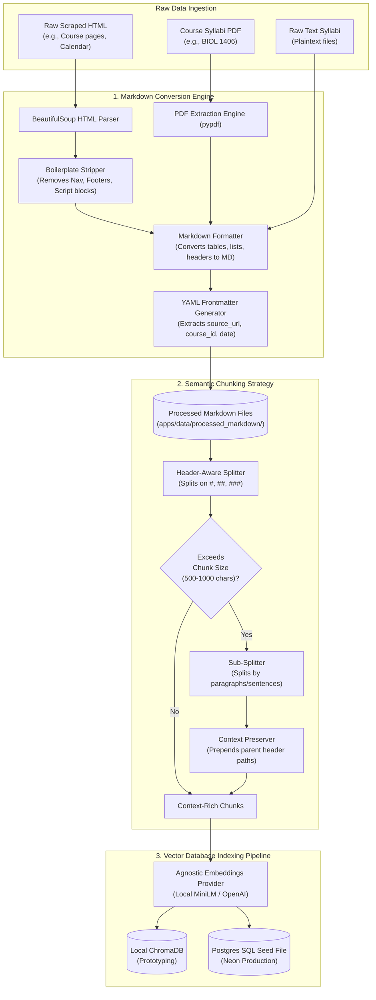

# Conceptual Explainer: Issue #35 Data Ingestion Pipeline

Welcome! This guide explains the concepts, design, and flow of the Success Coach Chatbot's **Data Ingestion Pipeline** (HTML/Text/PDF ➔ Clean Markdown ➔ Semantic Chunking ➔ Vector Store).

---

## 1. Pipeline Overview & Visualization

The pipeline is designed to run **offline** (as a background utility). It takes unstructured catalog files, website scraping results, and course syllabi, processes them into clean, structured Markdown, divides them into context-complete chunks, and indexes them into the vector database.

Here is a visual map of the data ingestion process:



---

## 2. Step 1: Markdown Conversion Engine

### Why Markdown?
Instead of passing raw, noisy HTML or plain text directly to our AI models, we convert everything to **Markdown (`.md`)**. 
1. **Reduces Token Cost**: HTML boilerplate (like `<div>`, `<script>`, `class="nav-link"`) accounts for up to 80% of a web page's size. Removing it saves thousands of tokens.
2. **Preserves Structure**: Markdown uses simple, readable structural tags (like `#` for headings, `-` for lists, and `|` for tables). LLMs are trained extensively on Markdown and understand its semantic layout much better than raw text.

### How it cleans the HTML:
The converter uses `BeautifulSoup` to:
1. Target the main content wrapper (e.g. `<td class="block_content">` on Dallas College catalog pages).
2. Decompose (delete) elements like `<script>`, `<style>`, `<header>`, `<footer>`, `<nav>`, and `<form>`.
3. Loop through remaining elements to translate:
   - `<h1>` to `<h6>` ➔ `#` to `######`
   - `<ul>`, `<ol>`, `<li>` ➔ `-` bullet lists
   - `<table>`, `<tr>`, `<td>` ➔ Markdown table syntax (`| Col 1 | Col 2 |`)

### Frontmatter Metadata:
Every processed markdown file will start with a **YAML Frontmatter** header. Frontmatter stores critical metadata about the file in a structured format:
```yaml
---
source_url: "https://catalog.dallascollege.edu/preview_course_nopop.php?coid=15128"
extracted_date: "2026-07-08T02:40:00"
document_type: "course"
course_id: "ACCT-2301"
---
```
This metadata is indexed along with our vectors, enabling the chatbot to filter search results (e.g., searching *only* inside syllabi for the course "HIST-1301").

---

## 3. Step 2: Semantic Chunking Strategy

### The Problem with Traditional Chunking
Traditional chunking splits documents strictly by character length (e.g., every 500 characters). This leads to **context starvation** or **information fragmentation**:
- If a sentence is cut in half, the meaning is lost.
- If a grading policy table is cut in half, the grading weights are separated from their categories.

### Our Solution: Header-Aware Semantic Chunking
1. **Respect Boundaries**: The splitter reads the Markdown file and splits the text into sections at every header boundary (`#`, `##`, `###`).
2. **Context Prepending**: When a section is too large (exceeding the target `chunk_size` of, say, 800 characters) and must be subdivided, the chunker automatically prepends the hierarchy of parent headers to the top of each sub-chunk:
   ```markdown
   [Context: ACCT 2301 > Syllabus > Grading Criteria]
   (Sub-chunk content here...)
   ```
   This ensures that even when a chunk is retrieved in isolation, the LLM knows *exactly* which course and section the details belong to.

---

## 4. Step 3: Embeddings & Vector Stores

### Embedding Providers
An embedding provider converts a text chunk into a list of numbers (a vector) representing its semantic meaning. We use a **provider-agnostic design**:
- **Local Provider**: Runs MiniLM on the CPU locally. It is fast, free, and runs offline (perfect for Chromebook development).
- **Cloud Provider**: Uses OpenRouter/OpenAI endpoints (e.g., `text-embedding-3-small` producing 1536-dimensional vectors) for production accuracy.

### Vector Stores
- **ChromaDB**: An embedded local database that runs in-process. We use it to immediately test and query our indexed chunks locally.
- **Neon Postgres (`pgvector`)**: Our production cloud database. We generate standard SQL seed scripts to upload vectors to Neon during deployment.

---

## 5. Real-World HTML Parsing Edge Cases Solved

When we tested the parser against a **real scraped Concourse syllabus** from Dallas College (`BIOL-1406`), we encountered and solved several real-world issues:

1. **Targeting the Right Container**: 
   Standard site pages put their main content in `class="block_content"`. However, Concourse syllabi place the syllabus in a wrapper `<div id="syllabus" class="syl">`. We updated our container lookup to detect both formats dynamically.
   
2. **Selective Boilerplate Stripping**: 
   To remove search forms and site menus, we strip tags with classes matching `header|footer|nav|sidebar`. However, Concourse uses classes like `syl-header` and `category-header` for actual syllabus content! We modified the stripping logic to **skip** class-based boilerplate stripping when processing a syllabus container, preserving the main course details.

3. **Malformed Tag Nesting (The `<br>` Bug)**: 
   Concourse's raw HTML contained an unclosed line break `<br>` tag immediately followed by the schedule table. The built-in Python `html.parser` interpreted this as the table being nested *inside* the `<br>` tag. In standard HTML, `<br>` has no children, so we previously discarded anything inside it. We fixed this by ensuring that the parser recursively crawls any children of a `<br>` tag, ensuring no data is dropped.

4. **Verification with Multiple Real Syllabi**:
   To guarantee robustness across different course formats, instructors, and departments, we tested the parser against 5 additional real-world Concourse HTML files from Dallas College:
   - Biology for Science Majors I (`BIOL-1406`)
   - Biology for Science Majors II (`BIOL-1407`)
   - Business Computer Applications (`BCIS-1305`)
   - Developmental Mathematics (`BASM-0053`)
   - Nutrition and Diet Therapy (`BIOL-1322`)
   The parser processed all HTML files cleanly, extracted correct YAML course IDs, and formatted tables properly.
