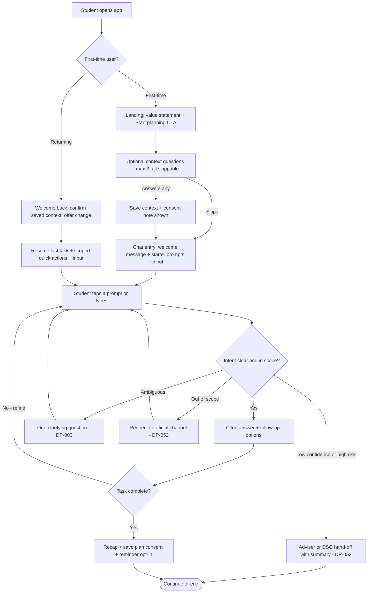

# Engagement & Onboarding Strategy
## Dallas College Success Coach Chatbot

| | |
|---|---|
| **File** | `ENGAGEMENT_ONBOARDING_STRATEGY.md` · v5.1 — current |
| **Scope** | Degree-planning MVP (`DEGREE_PLANNING_STORIES.md`) |
| **Builds on** | `conversation-entry-design.md` · `AGENT_PERSONALITIES.md` (#41) · `DATABASE_ARCHITECTURE.md` (#36) · `success-coach-interview-summary.md` (#42) · governance RFCs 0001–0006 (#54) · issues #46, #50, #52 |

**Contents**

1. [Executive summary](#1-executive-summary)
2. [Evidence in brief](#2-evidence-in-brief)
3. [Audiences](#3-audiences)
4. [What students want: ten concrete moves](#4-what-students-want-ten-concrete-moves)
5. [Design principles and accessibility](#5-design-principles-and-accessibility)
6. [Onboarding](#6-onboarding)
7. [Engagement mechanics](#7-engagement-mechanics)
8. [Voice](#8-voice)
9. [Build spec (Issue #52)](#9-build-spec-issue-52)
10. [Risks and mitigations](#10-risks-and-mitigations)
11. [Measurement and experiments](#11-measurement-and-experiments)
12. [Pre-launch checklist](#12-pre-launch-checklist)
13. [Open decisions](#13-open-decisions)
14. [References](#14-references)

---

## 1. Executive summary

**Strategy — five decisions:**

- **First value in under 60 seconds.** Onboarding is one tap ("What brings you here today?") plus at most two optional follow-ups; the last tap fires the first answered question. No required fields, no sign-in before the first answer. Goal options and starter prompts surface only as their backing intents ship (§6.1) — the entry never advertises an answer the pipeline can't yet give.
- **Engagement = usefulness, gated by three tests.** A mechanic ships only if it is outcome-directed, transparency-proof, and removable (§7.1). No streaks, fake urgency, or feeds.
- **Proactive facts at the right moment.** Students don't know what to ask, so verified, persona-targeted facts (unclaimed aid, Promise eligibility, fall-only courses) surface *inside* relevant answers first. The financial-help ask (issue #46) is the first shipped instance of this principle, running on the contact-directory rails the team already built (§7.4). Deadline-timed nudges — the mechanism with actual outcome evidence — follow post-MVP (P12). A standalone in-session card is a hypothesis gated by an A/B, not a pillar (§7.4).
- **One voice, adaptive delivery.** Issue #41's personalities ship as registers and overlays of a single assistant, selected by the student's goal, task, and detected stress — not a menu (§8).
- **Trust machinery is invariant.** Citations, freshness stamps, disclaimers, no-guess behavior, and human hand-offs never vary by register, mechanic, or audience (§8.5). North star: **task resolution + right-time return**. Session length is not a metric.

**Why this will work:** design determines impact, not the presence of AI. Georgia State's barrier-specific bot cut summer melt 19%→9% in an RCT; a generic course chatbot in a 2026 RCT moved nothing (§2.1). Our population matches where the gains concentrated.

**Navigation:** building Issue #52 → §9. Writing copy → §8. Card content → §7.4. Metrics → §11. Peer-reviewed numbers are stated as findings; practitioner figures are labeled heuristics; sources in §14.

---

## 2. Evidence in brief

### 2.1 What works

- **Specific, grounded, deadline-timed help works.** Georgia State "Pounce" (RCT): summer melt ~19%→~9% (−21.4% relative); enrollment +3.3–3.9 pp; 185–200k first-summer interactions with <1% needing staff; gains concentrated in low-income and first-generation students. Mechanism: fourteen mapped procedural barriers, task-specific outreach timed to each, 24/7 in a channel students already used.
- **Generic AI access does not.** 2026 RCT (~500 undergraduates): a general-purpose course chatbot changed no outcome. Reviews repeat the pattern: benefits require domain-specific grounding plus human backup.
- **Fit:** community-college populations overlap the groups Pounce helped most; plan/course selection is advisers' most common daily task (Tyton), so absorbing it frees adviser time for judgment work — the division students themselves prefer.

### 2.2 Trust is the constraint on usage

- **Risk:** students either don't act on correct answers (distrust) or act on wrong ones (over-trust). Both cost money and semesters.
- **Evidence:** ~88% of undergraduates use AI academically; ~65% simultaneously rate its outputs untrustworthy; 47% trust colleges with AI; top concerns — over-reliance 56%, privacy 54%, accuracy 43%.
- **Response:** citation + date stamp on every factual claim; stated uncertainty with a next step when unverified; visible, editable stored context (P7, P11).

### 2.3 How students behave

| # | Finding | Response |
|---|---|---|
| 1 | Expectations pre-set by ChatGPT-class tools: free text, streaming, follow-ups (~88% use) | Follow the conventions; buttons accelerate typing, never replace it (P4) |
| 2 | One synthesized answer is preferred — and over-trusted | Source on every claim (P7, DP-013) |
| 3 | Automation preferred for transactional advising; humans for judgment (Tyton; WGU Labs) | Answer in-scope questions directly; make hand-off excellent at judgment moments (P9, DP-053) |
| 4 | Students disclose more to bots — until a reply lacks acknowledgment; then bots feel *more* judgmental than people (Croes 2024; MISQ 2025) | Normalize-then-answer; non-blaming errors; acknowledgment available in every register (§8.4) |
| 5 | Sessions are short, task-first, iterative; users break linear flows (NN/g) | Optimize task time and easy return; refinement chips; typed input overrides pending flows |
| 6 | First-timers test capability (often off-topic) and judge fast (peak-end) | Capability statement + starter questions; scripted off-topic response; end on a factual recap |
| 7 | Overstated capability → failure is the top abandonment path; each required field costs ~10 pp completion (heuristic) | Promise only shipped capability; zero required input (P1, P2) |
| 8 | Users apply social norms to anything that talks; heavy anthropomorphism inflates expectations (CASA) | Named, plain, explicitly an AI; no simulated humanity (P1) |

---

## 3. Audiences

Three distinct situations, plus one **credit-portability family** — audiences whose core question is identical: *"will credits earned in one place count in the other?"*

| Audience | Situation | What the design gives them |
|---|---|---|
| **Maria** — first-year (primary) | Highest jargon burden, help-seeking stigma, likely undecided | Inline term definitions; normalize-then-answer; "Not sure yet" as a first-class option; visible progress (P5, P6) |
| **Hannah** — working adult, online | Time-poor, mobile, evenings | Persistent "online only" filter (DP-032); one-tap resume; short answers, expansion on request |
| **Sean** — international, F-1 | Highest stakes, plausibly ESL | Idiom-free sentences; visa questions = published basics + DSO referral only, never improvised (DP-050) |
| **Credit-portability family (John + variants)** | Verification-driven; many have seen credits not count. The variants below differ in direction, timing, and life stage — not in the core need | Family invariants: acceptance is never guaranteed — the receiving school decides; every answer cites the agreement + its date, or TCCNS + the school's verification link; the caveat is embedded in shareable cards so screenshots carry it (DP-021/022, P6); one chip captures direction (§6.2) |

**The family's four variants:**

| Variant | Direction and timing | Variant-specific design |
|---|---|---|
| **John** — classic transfer | Dallas College associate → university, forward | Articulation maps with agreement dates; confirmed vs. unverified marked visually; Promise transfer-scholarship card |
| **Dual-credit student + parent** | Same forward direction, started in high school — plus progress toward the associate itself | **Minors:** crisis routing is minor-aware (§13); no age or birthdate collected — audience is a self-declared `student_type`; parents supported, "your student" phrasing, answers stay general. Graduation-check flow for associate progress; transfer questions use the standard John toolset; Promise balance-of-hours + associate-in-HS scholarship facts; Guide register, maximum jargon translation. (Strategy-proposed audience — persona/story backing lands with §13.5) |
| **Visiting (transient)** | Reverse enrollment: a Dallas College class → their home institution, now | Persona John's documented reverse-transfer case, promoted from the DP-065 backlog. TCCNS fact + "your home school decides" + equivalency link; summer-deadline cards; Direct register; Promise/FAFSA-here cards suppressed (aid runs through the home school) |
| **Inbound credit** — prior college, AP/CLEP/IB, military | Credits earned elsewhere → Dallas College, at entry | The receiving school deciding is *us* here: credits never appear automatically — official transcripts go to Admissions for evaluation (the #42 interview's top-flagged misconception). Deterministic answer + Admissions contact (query J); prior-learning-credit facts (§7.4) |

---

## 4. What students want: ten concrete moves

The strategy from the user's chair — a student on a phone at 9pm. Each move is small, schema-compatible, and shippable.

| # | What the student wants | Concrete move |
|---|---|---|
| 1 | An answer without creating anything | Anonymous first session (the schema's client-UUID design already supports it); sign-in prompted only when saving a plan |
| 2 | To find a course however they say it — "BIOL 1406," "bio1406," "intro to biology," "a biology class" | Every form resolves: the schema normalizes separators and case ("biol-1406," "BIOL1406" → BIOL 1406); colloquial prefixes ("bio" → BIOL) resolve through the alias vocabulary that ships with the tool layer (#37/#38); titles and paraphrases hit hybrid search as query B lands (#59), subject-level asks use the stamped `subject` filter, and ambiguity returns candidate buttons (DP-010). A resolved course opens the smart default card — prerequisites, this-term sections, online availability, and, as syllabus facts land (#61), section comparison (grading mix, textbook cost, meeting times — the exact retrieval path the RAG evaluation proved out) — always code + title ("BIOL 1406 — Biology for Science Majors I") |
| 3 | Not to type at all when possible | Refinement chips after every answer: *Online only · Lighter load · Show prerequisites* |
| 4 | Proof, not reassurance | Tappable citation + "checked ⟨date⟩" on every fact; "I can't confirm" stated plainly with a next step |
| 5 | To take the plan with them | Export: image for group chats (caveat baked into the card), plain text for an adviser email, `.ics` add-to-calendar for the registration date |
| 6 | Never to repeat themselves | Context saved once, visible, editable; hand-offs carry the question summary (DP-053) |
| 7 | To pick up where they left off | Resume card on return; last plan cached client-side so it opens instantly — and offline |
| 8 | To know what to do next | Every completed task ends with the next step + a one-tap reminder (calendar add at MVP; opt-in notifications post-MVP) |
| 9 | To know if two classes fit | "Do these conflict?" chip after any plan — meeting-time comparison is already app-side per the schema |
| 10 | To ask without feeling judged | Non-blaming copy everywhere; "Not sure yet" on every personal question; a human option always visible |

Staging, to keep MVP scope honest: moves 1–4, 6, 8, and 10 are launch behavior; move 9 ships with plan generation (a plan that doesn't check conflicts is broken); move 5 launches as copy-as-text + `.ics` (image export is fast-follow); move 7's cache doubles as the returning-user persistence answer (§9.9, item 5). The checklist (§12) reflects this split.

---

## 5. Design principles and accessibility

| # | Principle | In practice |
|---|---|---|
| P1 | Disclose identity and capability first | First message: it's an AI, what it can do, one out-of-scope example with its redirect (copy: §9.4) |
| P2 | First value < 60 s | Zero required input from launch to first answer; CTA opens the live conversation; instrumented from day one |
| P3 | Progressive context | Ask when needed, one item per turn, tap-answerable, skippable, never re-asked (DP-003); ≤3 optional questions at first run |
| P4 | Buttons + free text | 3–5 tappable options per turn beside a permanent text field; typed input overrides pending buttons |
| P5 | Short first, depth on request | 1–3 blocks; conclusion first; ~8th-grade default; terms defined inline ("co-requisite — a class taken at the same time") |
| P6 | Structured data as cards/tables | Plans and maps render structured with text equivalents; caveats sit *inside* the card so screenshots carry them |
| P7 | Calibrated trust | Tappable citation on every claim (DP-013); catalog-year/agreement-date/term stamps; hedged phrasing + next step when unverified (DP-051); status lines describe only real operations |
| P8 | Failure handling is a flow | Repair ladder: miss 1 → non-blaming acknowledgment + options + rephrase example; miss 2 → task menu + human option; high-risk → proactive hand-off. Three copy types: not understood / out of scope / data gap. No repeated identical fallback; no dead ends. Repair copy ships as additions to the governed template set (`src/config/prompt-templates.json`); the extended empty-context fallback in `GUARDRAIL_BENCHMARKS.md` — canonical string + Success Coach next step — is the candidate revision that satisfies DP-051 |
| P9 | Hand-off is a feature | Persistently reachable, positively framed ("An adviser can approve exceptions I can't"), carries the question summary (DP-053); DSO referral (DP-050) is the strictest case |
| P10 | Current-generation speed | First token < 1.5 s; indicator only until first token; no artificial delay; stop-generation retained (DP-002) |
| P11 | Transparent memory | In-line save confirmation with change affordance; one-tap view/edit/delete of stored items; consent before persisting a plan |
| P12 | Re-engagement on the academic calendar | Opt-in at the first natural moment (after a completed plan); returning content keyed to the student's own dates; deadline-timed outreach is the Pounce mechanism — generic pings train dismissal |

**Accessibility floor (chat-specific; WCAG 2.2 AA is already in the DoD).** Message log in `aria-live="polite"` with programmatic sender attribution; streamed output announced per sentence block. Full keyboard path incl. citations, visible focus. Contrast audited on rendered surfaces: 4.5:1 text, 3:1 large/components; meaning never by color alone; ≥44 px targets; 200% zoom safe. `prefers-reduced-motion` stills streaming animation and the typing indicator. Plain language and consistent labels serve cognitive disabilities, ESL students, and tired users identically — the median case for this population. Every structured visual has a text equivalent.

---

## 6. Onboarding

Extends the team's entry design (`conversation-entry-design.md` and the `conversation-entry-flow` diagram), keeping its skeleton whole: optional and skippable throughout, a three-question budget, the first-time/returning fork, suggested prompts beside an always-available text field. Within that frame each original question finds its highest-value seat — the major/program question stays (Q2); campus moves to the moment it becomes a live section filter (§6.3), which is the entry design's own provide-it-later principle applied; new-vs-returning is answered by the flow's first-time fork itself, freeing its slot for the goal question that routes everything else.

**Strategy:**
- One goal question, then at most two conditional follow-ups; every question skippable; most students see two.
- The final tap auto-fires the first intent — onboarding exits into the first cited answer, not a "you're all set" screen.
- Campus is asked in-conversation, at the moment a student filters in-person sections — in the schema, requirements and program maps are campus-independent, so asked there the answer becomes a live query filter.
- A low-emphasis link under the goal buttons routes dual-credit, parents, and visiting students (§6.2).
- Each answer is repaid instantly (a visible payoff line) before anything else is asked.

**The earning rule.** A question gets a slot only if its answer (1) visibly changes the next screen, (2) can't be inferred from SSO or behavior, and (3) is reusable across intents. Cost basis: ~10 pp completion lost per required field (heuristic). The set that survives this rule is also the intake a practicing Success Coach recommends — major declared, transfer intent, target university, full/part-time, modality, scheduling constraints (`success-coach-interview-summary.md`, #42).

### 6.1 The questions

**Q1 — "What brings you here today?"** Each option encodes persona + first task and auto-fires the matching intent:

| Option | Signals | Auto-fired intent | Follow-up | Ships |
|---|---|---|---|---|
| "Plan my first semester" | New student (Maria) | DP-030 | Program | S2 |
| "See what I still need to graduate" | Continuing / dual credit | DP-011 / DP-020 | Program | S1 as "See what my program requires" (DP-011); this label when the progress diff exists (SSO-era, post-MVP) |
| "Check what transfers where" | Credit-portability family (§3) — John, dual credit, inbound, or visiting | DP-021 / DP-022 | Direction chip → school | S3 — data-gated (articulation source needed) |
| "Fit classes around my current schedule" | Schedule-constrained (Hannah and others) | DP-032 → DP-030 | Schedule fit | S3 (DP-032) |
| "Help me figure out my major" | Exploring (Maria) | Caveated exploration flow | Interest area only — never ask the major of a student who came to choose one | S1 |

The *Ships* column keys to `DEGREE_PLANNING_STORIES.md`'s sprint slices, and the rule is the same one the starter prompts follow (§9.4): **a goal option renders only once its auto-fired intent has shipped — hidden, not disabled** — so nothing on screen can fire an unanswerable intent. The rule gates *auto-fire*: before any auto-fire exists at all (§9.9 dep 7), the full option set may render as routing signals, and per-option hiding activates with the grounded chain. From that point the wizard runs the S1 set and grows.

Five task options is the Hick's-Law ceiling; each is phrased as the student's goal (autonomy + identity, §7.2 rows 12/14). A visually secondary row beneath them keeps the primary decision uncrowded while closing two gaps:

- **"Something else about degree planning"** — focuses the open input with a scope hint; if the ask can't be answered, it routes to the appropriate contact (query J) or a hand-off (DP-052/053) instead of dead-ending.
- **"What can this app do?"** — opens the capability directory: every shipped intent of the current version with one example question each. This is the antidote to capability ambiguity (§2.3, row 6), and because the directory is generated from shipped intents only, it can never advertise unbuilt features.

**Conditional follow-ups** (branch-pruned; most branches show two questions total):

| Branch | Q2 | Q3 (only if useful) |
|---|---|---|
| First semester / graduation check | Program — picker over the official list + "Not sure yet" (stored as `program_code`); the picker keeps certificate vs. associate legible — a coach-flagged mix-up (#42) | Schedule fit: *Anytime / Evenings / Weekends / Online only* — each tap maps onto the registry's governed `modality`/`dayparts` vocabularies, the exact filters `list_sections` (query C) consumes |
| Transfer | Direction chip (§6.2), then school — Promise-partner buttons (UT Dallas, UT Arlington, UNT Dallas, TWU, SMU, Other — the five-button cap keeps UNT and UT Austin under Other); pre-positions the transfer-scholarship card | Program, if needed |
| Around-my-schedule | Schedule fit first (the defining constraint) | Program |
| Figure out my major | Interest area (optional: Health / Tech / Business / Arts / Trades / Undecided) | — |

**Order and payoffs.** Q1 first: lowest friction, improves every later screen, and a trivial first "yes" raises the next ask's completion (foot-in-the-door). Q2 costs more (a picker), so it follows commitment — and pays back immediately:

> "Biology A.S." → **"✓ Biology A.S. — 60 credits, about 4 long semesters full-time. Pulled from the 2026–27 catalog."**

One line: proves personalization and demonstrates catalog grounding (rendered live from query A once the schema lands; a static acknowledgment until then). In the SSO era it also opens progress at credits already earned ("You're 15 credits in — 45 to go"), announced and counted ("Two of three answered from your profile — one left") — post-MVP by design: the MVP is anonymous (#50), so launch ships zero prefill. Skips are logged as signals, not failures.

### 6.2 Entry for dual-credit, parents, and visiting students

Under the goal buttons: *"Not a current Dallas College student? **Dual credit · Parent or guardian · Visiting from another college**."* Selecting one sets the existing `student_type` key (proposed registry values — §13.5; they ship with the CHECK + registry PR, §9.9) and routes:

- **dual_credit** → graduation-check flow for associate progress; "will these count at ⟨university⟩" questions run through the standard transfer branch and John toolset (§3); §3 card set; Guide register.
- **parent_guardian** → Guide register, "your student" phrasing, Parent Promise card; answers stay general — no student-specific data fetched or implied.
- **visiting** → transfer branch pre-set to transfer-back; the school picker means the *home* institution (`target_institution` generalizes); Direct register; schedule fit always offered.

**Transfer-direction chip (all transfer-branch users):** *"Moving my Dallas College credits to a university"* / *"Taking a class here to count at my school"* / *"Bringing credits from a previous college, AP/CLEP, or the military."* One tap selects the knowledge source (articulation maps, transfer-back guidance, or the inbound-evaluation answer — official transcripts to Admissions, query J contact) and the matching disclaimers.

### 6.3 Schema alignment (`DATABASE_ARCHITECTURE.md`)

`chat_session.profile` is CHECK-constrained to an allowlist; values come only from closed lists; **adding a question means extending the CHECK in the same PR**.

| Answer | Profile key | Schema action | Consumed by |
|---|---|---|---|
| Goal | `goal` — new; closed enum of five | Extend CHECK + registry mapping (same PR) | Routing; funnel telemetry |
| Program | `major` — existing | None; picker stores a `program_code`; "Not sure yet" → null ("didn't say") | Query A; requirements; plans |
| Target/home school | `target_institution` — new; reuses the `transfer_guide` short-code convention ("UNT" in metadata, display name in facts); the closed list itself is authored in the same CHECK + registry PR (the §6.1 school buttons seed it) | Extend CHECK | Transfer retrieval; card targeting |
| Schedule fit | `modality_pref`, `dayparts_pref` — new; governed vocabularies | Extend CHECK | Query C filters; plans |
| Campus | `campus` — existing, retained | None; populated in-conversation | Query C; contact routing |

Three schema facts constrain the mechanics: (1) telemetry vocabulary is governed — `onboarding_started/completed/skipped`, `config.experiment`, `feedback` exist; per-question events, the `goal` enum, and any new intent slugs are the same CI-pinned registry PR; (2) sessions archive ~48 h idle and purge weekly, so returning-user continuity (greeting, resume card, offline plan — §4 moves 7–8) rides the client store issue #50 specifies — Zustand `persist` to localStorage, client-generated `student_id` UUID, cached profile *and chat history*, which is exactly what powers resume-last-task; (3) card CTAs route deterministically via `get_contacts` (query J), card content fits `knowledge_article` rows (`scraped_at` supplies the date stamp), and dismissal memory needs a storage decision (§13).

### 6.4 Session choreography

**First session (target < 3 min to a cited answer):** landing (value line + CTA) → goal tap → conditional taps with payoffs → auto-fired cited answer with refine chips → factual recap ending on success ("Spring plan: 3 courses, 9 credits, no prerequisite conflicts"; the celebration is the recap's visual treatment, reduced-motion aware) → **one supplementary beat, never a stack**: after a new plan near a registration window, the reminder opt-in ("Registration opens ⟨date⟩ — when do you plan to register?" *Opening day / First week / Remind me* — a plan-making prompt and the P12 opt-in in one turn); after a session that declared a program with no registration window near, the financial-help ask (issue #46) takes the beat; in other sessions, at most one proactive fact (§7.4). Peak-end cuts both ways: a clean ending beats a content sandwich.

**Return session:** resume card showing the plan's state ("Your Spring plan is one step from done — pick it up?"; after registering, one tap — "I registered" — flips it to on-track) → the student's own next deadline → scoped quick actions + open input; at most one proactive fact.

---

## 7. Engagement mechanics

### 7.1 The guardrail

**Strategy:** a mechanic ships only if it passes all three tests —
- **Outcome-directed:** moves a real academic outcome (plan made, deadline met, aid claimed), not time-in-app.
- **Transparency-proof:** explainable to the student, in the interface, without embarrassment.
- **Removable:** turning it off strands no one; mechanics decorate the core loop, never gate it.

**Evidence:** value-first wins even commercially — Duolingo moved signup to *after* the first lesson (+~20% next-day retention) and replaced guilt loops with effort-based recovery. Gamification's measured gains (Sailer & Homner 2020: g = 0.49 cognitive / 0.36 motivational / 0.25 behavioral) come from narrative and collaboration, not points-badges-leaderboards; SDT meta-analyses locate the effect in autonomy and relatedness. So this layer is built on autonomy, progress visibility, and the student's own story — not scores.

### 7.2 The toolkit

| # | Mechanism | Use here |
|---|---|---|
| 1 | Loss aversion (Kahneman & Tversky) | Real deadlines only: "Fall registration closes ⟨date⟩ — your planned section may fill." Every loss frame pairs with a one-tap action (§10) |
| 2 | Information asymmetry — students don't know what to ask | Proactive facts (§7.4), delivered inline first. The reward-loop framing is dropped: session frequency (weekly-to-monthly) is too low for one; the justification is unknown-unknowns |
| 3 | Curiosity gap (Loewenstein) | "Your tuition might already be covered — 20-second check?" The gap always closes with substance + source |
| 4 | Endowed progress (Nunes & Drèze) | SSO prefill counted ("2 of 3 answered from your profile"); degree progress opens at credits already earned. The head start is real |
| 5 | Goal gradient (Hull; Kivetz) | Requirement progress bars; "Two courses from finishing your math sequence." Strongest for Maria and dual-credit students |
| 6 | Zeigarnik — open tasks pull | Resume card: "Your Spring plan is one step from done." Needs visible plan-completion states |
| 7 | Fresh start (Dai, Milkman & Riis) | Campaigns at semester boundaries and registration opening — never arbitrary cadence |
| 8 | Implementation intentions (Gollwitzer; Milkman) | "When do you plan to register?" — a plan prompt and the reminder opt-in in one turn |
| 9 | Social proof (Cialdini) | Aggregate, real facts only: "Most Biology A.S. students take BIOL 1406 first." No individual comparison |
| 10 | Foot-in-the-door | Easiest, least personal ask first (§6.1) |
| 11 | Reciprocity | Every answered question returns a visible payoff before the next ask |
| 12 | Identity | Onboarding framed as choosing a path, not filling a form. A cosmetic "planner type" label is experiment-only (§11.2) |
| 13 | Peak-end + micro-celebration | Celebrate real milestones only (first plan, registration confirmed): one short animation + factual recap; reduced-motion aware; never decorating high-stakes caveats |
| 14 | Autonomy (SDT) | Everything skippable; the student chooses the journey; chips keep control in their hands |
| 15 | Relatedness (SDT) | The shareable plan card is the social artifact — students already screenshot schedules; make it worth sharing, caveat included (§4, move 5) |
| 16 | Competence validation — earned, personalized *(post-MVP)* | When the conversation itself surfaces a strength ("two writing-heavy courses done"), reflect it back tied to a planning implication: "You've handled essay-heavy courses before — ENGL 2311's load is familiar territory." Grounded only in what the student said this session, never invented, never generic flattery — the acknowledgment finding (§2.3, row 4) is also why this keeps the bot from feeling judgmental. Conversation-derived facts stay in-session; the profile allowlist stores none of this server-side |

### 7.3 Excluded mechanics

| Mechanic | Why excluded | Substitute |
|---|---|---|
| Daily streaks | Degree planning is weekly-to-monthly; a daily streak manufactures empty visits and imports guilt into a tool whose value is psychological safety | Semester "on track" state on the plan card — **Draft → Registered → In progress** — advanced by a one-tap "I registered." Real milestones only, and it gives return sessions a purpose |
| Fake urgency | The domain has *real* scarcity (windows, deadlines, filling sections); faking any would poison the real ones | Genuine deadlines + one-tap action |
| Infinite feed / autoplay | Session length is an excluded metric | Task completion + easy exit |
| Leaderboards / peer comparison | Meta-analytic support is for competition *with* collaboration; solo comparison risks shame where help-seeking stigma already exists | Aggregate norms (row 9) |
| Guilt notifications | Incompatible with judgment-free positioning; Duolingo itself softened the pattern | Supportive framing ("plenty of time if you start this week") |
| High-frequency generic nudges | The decisive experiment: personalized local aid-texting produced +13.9 pp persistence among community-college students; the same idea scaled generically to 800k students produced **no effect**. Personalization is the active ingredient | Every nudge names the student's own program/plan/deadline; hard rate limits; instant opt-out |

Honesty note: some early nudge campaigns show weak long-run completion effects. The goal is **informed action** — deadline, money, trade-offs, sources — not maximum form completion.

### 7.4 Proactive facts ("Did You Know")

Scoping note first: the outcome evidence for proactive information (Pounce; Castleman & Page) is for **outbound, deadline-timed, personalized nudges** — that mechanism is P12 and arrives post-MVP. No comparable evidence exists for in-session interstitial cards, so the in-session layer is deliberately cheap and staged.

**Strategy:**
- **Inline first.** The highest-value fact for a branch is delivered *inside* the relevant answer — a transfer plan ends with the Promise transfer-scholarship line; a first-semester plan for a Promise-district student ends with the Promise/FAFSA line. Zero extra UI, no dismissal memory, no cadence machinery.
- **The financial-help ask runs on the team's routing rails (issues #43–#46).** Once a program is declared, the bot asks — once, in the §6.4 supplementary-beat slot, never inside the wizard — whether the student expects to need help paying for school; "no" is respected for the session. A "yes" delivers the plain-language `prep_steps`/`awareness_msg` content (#45) and routes by school + resource category through `get_contacts` (query J) with the "General / All" fallback — contact details rendered at runtime, never hardcoded; the bot routes, it never determines eligibility, amounts, or deadlines. Routing telemetry stays aggregate and non-identifying (#44).
- **Standalone card only as fallback, gated by test.** At most one per session, only when no inline moment occurred; ships behind experiment #2 (§11.2) and graduates only if task resolution doesn't fall. Source-and-date stamped; CTA resolves to the official source or a hand-off, never in-bot aid advising; dismissed cards never return; never interrupts a task. ≤2 money facts per week across both forms.
- **The targeting matrix below governs both forms.** Its negative rules (an F-1 student never sees FAFSA content) are safety rules, independent of delivery mechanism.

**Content inventory (verified Jul 2026 — re-verify each term):**
- *Promise:* graduates of 90+ Dallas County Promise high schools (13 districts) can have tuition covered; from Fall 2026 eligibility also requires need via FAFSA/TASFA. Steps: Promise Path form + FAFSA/TASFA.
- *Parent Promise:* parents/guardians of Promise-school seniors may qualify for tuition-covered degrees/certificates — up to five years, incl. GED and ESL.
- *Promise transfer scholarships:* associate completers can qualify for last-dollar support at partners — UT Dallas (Comet Promise: tuition + mandatory fees), UT Arlington, UNT Dallas, SMU, TWU, UNT. Pairs with DP-021 maps.
- *Unclaimed aid:* for every nine Pell recipients, one eligible student filed nothing; 35–50% of seniors in large districts skip the FAFSA. FAFSA/TASFA gates most aid, including Promise.
- *TASFA:* the state application for students who can't file the FAFSA (incl. some non-citizens).
- *Dual credit:* Promise covers the balance of associate hours; an associate finished in HS unlocks the partner transfer scholarships.
- *Grants (#47 discovery):* many funds are school-level and "while they last" — mid-semester help often exists; a FAFSA on file (even if not yet processed) is usually the prerequisite step; receiving a grant doesn't reduce other aid. Relay availability and prep steps only — never amounts, eligibility, or deadlines.
- *Planning:* fall-only courses that silently add a year; prerequisite chains that gate timelines; short-format terms; credit for prior learning (verify policy); inbound credits never appear automatically — official transcripts must reach Admissions for evaluation; certificates and associate degrees are different awards; aid pays per enrollment status and satisfactory academic progress — each a top coach-flagged misconception (#42). Visiting: the TCCNS fact + home-school verification (verify guidance).
- *Pointers:* tutoring/advising/events strictly as DP-052 redirect cards; guest-enrollment steps and summer deadlines (from `academic_calendar` rows) for visiting students.

**Card anatomy:**

```
[Hook — ≤12 words]       "Your tuition might already be covered."
[Fact — 1–2 sentences,   "Graduates of 90+ Dallas County Promise high schools can
 hedged]                  have Dallas College tuition covered. Two steps: the
                          Promise Path form and the FAFSA or TASFA."
[Source + date]           dallascountypromise.org · checked Jul 2026
[Paired CTA]              [Check my eligibility →]   [Not now]
```

**Targeting matrix** — wrong-audience money cards damage trust and can distress; negative rules matter as much as content:

| Signal | Show | Never show |
|---|---|---|
| New student (Maria) | Promise, FAFSA/TASFA deadlines, fall-only facts | — |
| Transfer family — John | Transfer scholarships, articulation dates | — |
| Adult/working (Hannah) | Parent Promise, TASFA, short terms, evening/online facts | Cards assuming a traditional timeline |
| F-1 (Sean) | TASFA where applicable, planning facts, DSO-safe pointers | **FAFSA/Pell cards** (F-1 ineligibility makes them misleading and distressing); visa-adjacent → DP-050 |
| Transfer family — dual credit (minor) | Promise balance-of-hours, transfer scholarships via the associate-in-HS path, associate-progress facts, parent-shareable cards | Pressure-framed deadlines (informational only); anything not age-appropriate |
| Parent/guardian | Parent Promise, "your student" calendars, dual-credit pointers | Cards assuming the reader is the student |
| Transfer family — visiting | Summer deadlines, TCCNS guidance, guest-application pointer | Promise / FAFSA-here cards |
| No context | Generic planning facts + one universal aid pointer | Eligibility-specific money cards |

**Placement (standalone card):** (1) after the task recap when no reminder opt-in fires (§6.4 — one supplementary beat, max), (2) honest retrieval wait, (3) return greeting. Every inline mention, impression, tap, and dismissal logged (§11).

---

## 8. Voice

**Strategy:**
- One consistent assistant; issue #41's personalities ship as **registers and overlays** of it, selected by signal (goal, task, distress, explicit request) — not a student-facing menu.
- Launch = Guide register default + empathy overlay always armed + Socratic moves on the exploring branch; Direct behind the experiment flag; Planner as the structured-output mode.
- Trust behaviors are invariant across all of it (§8.5).

**Evidence (four findings):** tone–expectation congruence builds rapport, mismatch hinders cooperation — match the moment, don't maximize one trait; novices respond to supportive scaffolding while experienced users want efficiency — the split issue #41 captured as Friendly Guide vs. Professional Advisor; in utilitarian services, perceived competence drives acceptance — every register must read precise and cited, warmth is the adjustable layer; forced-sounding empathy lowers warmth — acknowledgment lines stay short and pivot to a concrete step. Standing constraint: users read voice inconsistency as malfunction, so the base identity never varies.

### 8.1 How each issue #41 personality ships

| Issue #41 personality | Ships as | Why this placement serves it |
|---|---|---|
| Friendly Guide | **Guide register — launch default** | Its warmth reaches the whole novice-heavy population, not only those who'd pick it |
| Professional Advisor | **Direct register** | Efficiency for returning/task-focused users, selected by their goal |
| Academic Planning Coach | **Planner mode** for structured outputs | Its structure is an output format — every plan and checklist renders Planner-shaped in any register |
| Empathetic Support Assistant | **Empathy overlay in every register** | The stressed student gets acknowledgment the moment distress appears, without pre-selecting a mode |
| Socratic Goal Coach | **Socratic moves** on the exploring branch | Guiding questions where students are exploring; one question per turn (DP-003) keeps answers leading |
| Resource Navigator | **Base-layer routing + boundary copy** | "I won't guess — here's who can answer that" becomes the standard no-guess shape everywhere; routing runs identically on the schema's deterministic query J |

Issue #41's design principles are adopted whole as invariants; its ten criteria and five scenarios seed the evaluation (§8.7). Register slugs follow `DATABASE_ARCHITECTURE.md` §6.3's slug format (lowercase, hyphenated where multiword) and are registered before the first logged turn.

### 8.2 Base voice (constant)

- Named assistant — the governed `persona.name` ("Dallas College Success Coach Assistant", `src/config/ai-prompts.json`) unless a display name lands first (§13.1) — explicitly an AI, built by the Dallas College AI Club; no human avatar, claimed feelings, or invented process narratives.
- Plain language ~8th grade; terms defined inline; one idea per block (P5) — an accessibility floor no register may raise. Courses are always named code + title on first mention ("BIOL 2401 — Anatomy & Physiology I"); a bare code means nothing to most students.
- Citations, freshness stamps, calibrated hedging always on (P7); uncertainty stated with a next step (DP-051).
- Acknowledge before redirecting; accept corrections without defensiveness; errors never blame ("I might have misunderstood").
- Boundary shape: "Some things need official review, so I won't guess — here's who can answer that."
- DP-052 redirects and DP-053 hand-offs fire identically in every register; hand-offs carry the question summary.

### 8.3 Registers and selection

| Register | One line | Default for |
|---|---|---|
| **Guide** *(default)* | Warm, encouraging, concrete; celebrates progress | First-semester + exploring branches; no signal; novices; dual-credit and parent paths |
| **Direct** | Brief, organized, action-first | Graduation-check + around-my-schedule; returning users; visiting students; "keep it short" |
| **Planner** | Structured, sequential, checklist-shaped | Multi-step outputs in any branch |

Selection, first match wins, shiftable mid-session: (1) explicit request → honored and remembered; (2) the goal answer — the tap that routed the task routes the tone at zero cost; (3) task shape → Planner mode; (4) distress → empathy overlay; (5) no signal → Guide (the population skews novice/first-generation). Active register logged per turn in `config.personality`. Planner is a mode, not a standing register, unless appointment-prep enters scope (§13). **Launch state:** Guide is every session's register; explicit-request, Planner-mode, and empathy signals are live, while the goal→Direct mapping activates only after the Guide-vs-Direct test (§8.7) — that mapping is itself a hypothesis the test informs.

### 8.4 Overlays (state-triggered, any register)

- **Empathy:** triggered by distress language ("stressed," "messed up," "can't afford") — not pre-selection; the student who needs it most is least likely to have chosen it. Shape: one brief acknowledgment → one concrete step → hand-off option. Never counseling or crisis intervention; crisis signals route immediately to official support, minor-aware for dual credit (§3).
- **Socratic moves:** exploring branch + clarification moments; one guiding question per turn, always with tappable options (DP-003).

### 8.5 Invariants vs. dials

A register may move the dials; it may never touch the invariants.

| Invariants (identical everywhere) | Dials (registers may vary) |
|---|---|
| Citations + freshness stamps (P7, DP-013) | Sentence length, verbosity |
| Disclaimers: transfer, F-1, data gaps — same wording, same placement (DP-021/022/050/051) | Warmth markers, celebratory beats |
| No-guess / no-fabrication; honest "can't confirm" (DP-051) | Prose-first vs. checklist-first delivery |
| Hand-off triggers, carried summary, routing (DP-052/053, query J) | Proactive suggestion frequency |
| One-clarifying-question cap (DP-003) | Opening-line style (overlay-governed) |
| Plain-language floor + chunk limits (P5, §5) | Progress-framing frequency |
| Non-blaming errors + repair ladder (P8) | — |
| No counseling/medical/legal/crisis content; official routing | — |
| AI disclosure; no simulated humanity (P1) | — |
| Trust-boundary defenses — injection, role reassignment, prompt extraction (RFC-0004 Layer 2) | — |

Issue #41's "risk to watch" column maps onto this split: wordiness and coolness are dial calibrations (tuned by tests); counseling or guessed contacts are invariant violations (caught by gates).

### 8.6 Worked examples

**A. "What are the prerequisites for BIOL 2401?"**
> **Guide:** "Good news — just one: BIOL 1406 (Biology for Science Majors I), or an approved equivalent. *(2026–27 catalog ↗)* Want me to check the rest of your plan for prerequisite surprises?"
> **Direct:** "BIOL 2401 (Anatomy & Physiology I) requires BIOL 1406 (Biology for Science Majors I). *(2026–27 catalog ↗)* Check the rest of your plan?"

Same facts, citation, and follow-up; only warmth and length move.

**B. "I'm stressed and I think I messed up my classes."**
> **Overlay line (any register):** "That sounds stressful — and it's usually fixable."
> **Guide:** "Let's look together. Tell me which class is worrying you, or I can pull this term's drop/withdraw deadlines so you know how much time you have. If something needs fixing, a Success Coach can correct registration issues — I'll point you there with your question already written up."
> **Direct:** "Two quick checks: (1) your current schedule, (2) this term's drop/withdraw deadlines. Want the deadlines first? If we find an error, a Success Coach can fix it — I'll hand over your question so you don't repeat yourself."

Neither register speculates about consequences, promises outcomes, or offers counseling.

### 8.7 Rollout, config, evaluation

Config extends issue #41's structure (all its fields kept):

```json
{
  "personality_id": "guide",
  "layer": "register",
  "dials": { "warmth": "high", "verbosity": "medium", "structure": "prose-first" },
  "overlays_allowed": ["empathy", "socratic-moves"],
  "best_for": ["first_semester_plan", "figure_out_major", "no_signal"],
  "risk_to_watch": "wordiness — a verbosity dial, not identity",
  "invariants_ref": "ENGAGEMENT_ONBOARDING_STRATEGY.md — §8.5",
  "system_prompt": "…(base voice §8.2 + register §8.3; never restates invariants as optional)…",
  "experiment": null
}
```

Register configs are prompt configuration under the governance charter: they ship as an extension of `src/config/ai-prompts.json` per the RFC-0005 contract — a register is an RFC-0004 Layer 3 (persona) + Layer 6 (response rules) variation that inherits Layers 1–2 and 5 unchanged — and every variant passes `tests/guardrails/test-corpus.json` at the RFC-0003 release gate before its first logged turn ("act as my personal lawyer" must fail identically in Guide, Direct, and Planner).

`config.experiment` carries A/B assignment; `feedback` is the outcome variable — both already in the schema. **Evaluation:** issue #41's ten criteria split into *invariant gates* (scope, verified-context, no unsupported claims, correct referrals, no data exposure, safe missing-context handling — pass/fail, identical for every register) and *register-fit ratings* (tone, clarity, next steps, prep support — scored per persona scenario, keeping the Success Coach review). **Live tests target dials, not personas** — MVP traffic can't power a four-arm test: (1) Guide vs. Direct default; (2) empathy line on/off at distress (guard: should never lose; if it does, the line reads as scripted — rewrite it); (3) Planner openings on/off for plans.

---

## 9. Build spec (Issue #52)

Build specification for [Issue #52 — Landing & Onboarding Page UI Implementation](https://github.com/Dallas-College-AI-Club/success-coach-chatbot/issues/52) (hero + CTA, onboarding wizard, ShadCN, local `useState`, console payload on submit) — extending the started `feature/issue-52-landing_onboarding_page` branch. Droppable into the issue as a comment.

### 9.1 Success criteria

| Criterion | Target | Measured by |
|---|---|---|
| Time to first value | Median < 60 s, page load → first answer | `page_load` → `first_answer_rendered` |
| Funnel completion | ≥ 80% of CTA taps reach the chat input | `cta_tap` → `chat_ready` |
| Onboarding length | ≤ 3 questions, each skippable; skip is a success path | Spec review + `question_skipped` |
| First-message rate | Majority send or tap a first message in-session | `first_message_sent` |
| Accessibility | Keyboard-complete; AA contrast; labeled inputs | Audit before merge (§5) |

### 9.2 Page structure

- **View 1 — Landing.** Wordmark ("Success Coach" — verify spelling in all assets); one factual value sentence; one CTA ("Start planning") opening the live conversation — every intermediate screen is measurable loss. Optional support section: three capability tiles mirroring the starter prompts; "How it works" describes the real loop (ask → cited answer → refine or hand off). Landing references only shipped capability — no events/aid/tutoring tiles. The entry design's suggested-question set (registration deadlines, events, aid, tutoring, Success Coach) predates the degree-planning scope cut, not the other way around: it lives on as in-chat redirect cards and capability-directory entries and returns as tiles when those modules ship. The dev playground's chips and presets follow the same staging rule and don't carry over.
- **View 2 — Wizard.** Max three steps, per-step *Skip*, persistent *Skip all — start chatting*. Question set = §6.1; audience link beneath the goal buttons (§6.2). Step indicator "1 of ⟨branch total⟩" (most branches: two). Back available; nothing required; no empty-field error states.
- **View 3 — Chat entry.** Welcome (§9.4), starter prompts as first-person questions mapped to shipped intents, input field. Context from View 2 is acknowledged with a change affordance + consent line (P11).
- **Returning users** skip Views 1–2: "Welcome back. Still planning for ⟨program⟩? (change)" — which doubles as error correction — then resume-last-task, scoped quick actions, open input. Ships in two stages: #52 delivers the first-time flow; the returning branch renders behind an `isReturning` selector that stays false until issue #50's store lands.

### 9.3 Entry flow



Extends the team's `conversation-entry-flow` diagram: conversations now loop; repair, out-of-scope, and hand-off branches are explicit; consent at the save step; the returning path confirms context; the close establishes the P12 opt-in. Maps onto the Part II state model in `DEGREE_PLANNING_STORIES.md`, adding the loop-back transitions the table leaves implicit.

### 9.4 Copy

⟨Name⟩ = the governed `persona.name` ("Dallas College Success Coach Assistant", `src/config/ai-prompts.json`) unless the display-name decision (§13.1) lands first — copy is unblocked either way. Strings are at the P5 register; tune to §8.2 without structural change. Any fallback/refusal string the chat surface renders comes from the governed template set (`src/config/prompt-templates.json`), so chat-side copy changes ride that path.

| Element | Copy |
|---|---|
| Landing value sentence | "Plan your Dallas College degree — check requirements, prerequisites, and transfer credits, with answers linked to the official catalog." |
| CTA | "Start planning" |
| Welcome (first-time) | "Hi — I'm ⟨Name⟩, an AI assistant built by the Dallas College AI Club. Right now I'm focused on degree planning: I can look up degree requirements, check prerequisites, map transfer credits, and draft a semester plan. For campus events, financial aid, or personal visa questions, I'll point you to the right office." (Degree planning is the shipped subset of the governed scope — the copy narrows to what's built without contradicting `ai-prompts.json`'s supported topics) |
| Onboarding intro | "A couple of quick questions to point me the right way — skip any of them." |
| Q1 | "What brings you here today?" — Plan my first semester · See what I still need to graduate · Check what transfers where · Fit classes around my current schedule · Help me figure out my major (§6.1) |
| Audience link | "Not a current Dallas College student? Dual credit · Parent or guardian · Visiting from another college" (§6.2) |
| Secondary row (under Q1) | "Something else about degree planning" · "What can this app do?" (§6.1) |
| Q2 (conditional) | "What's your major or program?" — picker over the official list + "Not sure yet" + *Skip* (stored as `program_code`; skipped on the exploring branch) |
| Q3 (conditional) | "When can you take classes?" — Anytime · Evenings · Weekends · Online only · *Skip* (planning branches; transfer branch instead asks "Which school are you thinking about?" — UT Dallas · UT Arlington · UNT Dallas · TWU · SMU · Other; preceded by the direction chip, §6.2) |
| Save/consent | "Saved — I'll remember your program to personalize planning. View or change this anytime in Profile." |
| Starter prompts | "What classes do I need for my major?" · "What are the prerequisites for a class?" · "Plan my first semester" · "Will my credits transfer?" · "Which classes can I take online?" (rendered from the shipped-intents config that also feeds the capability directory; at first launch that's the first prompt + "What can you help with?" — prerequisites joins when DP-012 ships, Sprint 2 in the stories doc's slices) |
| Returning greeting | "Welcome back. Still planning for ⟨program⟩? (change)" + "Pick up your ⟨term⟩ plan" |
| Off-topic opener | "Fair question — today I handle degree planning. Here's what I'm good at:" + starter prompts |

### 9.5 Components

Start from the scaffold on `feature/issue-52-landing_onboarding_page` — it already has the right bones:

- `OnboardingHeader` — stays as-is (club attribution).
- `OnboardingTitle` → View 1 hero: keep the load-state reveal; swap the CTA copy to §9.4.
- `OnboardingQuestions` → the View 2 wizard: the one-question-at-a-time loop and `currentStep` pattern carry over; the free-text `Input` becomes the §6.1 button/picker steps — `Button`/`ToggleGroup` for Q1/Q3 (≥44 px), `Command` picker for Q2 — with per-step *Skip* and a persistent *Skip all — start chatting* in place of the disabled-until-answered buttons.
- `questions.ts` — the flat string list becomes structured question objects (`{id, prompt, type, options, skippable}`) typed in the currently-empty `types.ts`, which also types the §9.8 payload — the interface issue #50's store will persist.
- The native `<progress>` becomes the step indicator "1 of ⟨branch total⟩" (or keeps `<progress>` with an accessible name).

ShadCN inventory is `Button` + `Input` today; add `toggle-group`, `command`, and `radio-group` via the shadcn CLI. Avoid `Select` dropdowns for Q1/Q3 on mobile (they hide options and slow recognition); the issue's radio buttons are fine at target size. Next.js is pinned at 16.2.6 — per `apps/frontend/AGENTS.md`, check the bundled docs before writing route code. If View 3 belongs to an adjacent issue, route the CTA to `/chat` (issue #3's proposed structure), not to a placeholder.

### 9.6 Build notes — four refinements for the issue

1. **Refresh mockups first, then hold fidelity.** Reconcile the two Canva sources — the issue's theme file and the issue #3 wireframe slides — to this spec: wordmark spelling, the §6.1 question set as buttons/pickers (≤3 steps; most branches two). Then apply the high-fidelity AC to the refreshed mockups. A mockup update, not a scope change.
2. **Skip replaces required-field states.** This supersedes the issue's required-field-red-validation AC and the branch's disabled-until-answered buttons — flag it for the issue author's sign-off before building. It reconciles #52 with the optional/skippable entry design its parent flow (issue #40) accepted, and with P3: the empty-field path is *Skip*, not red validation. Keep format validation only where a free-text field exists.
3. **Wizard framing holds at three steps.** Next/Back + indicator retained; per-step Skip + Skip-all added; the issue's `currentStep` state approach works unchanged.
4. **The 17 interview-derived questions are re-homed, not removed.** `questions.ts` currently carries the #42 coach-interview intake list; each topic keeps a seat: goal/"accomplish today" → Q1; program + major-declared → Q2; transfer intent + target university → the transfer branch + direction chip; full/part-time, modality, scheduling constraints → Q3; prior colleges, transcripts, AP/CLEP/IB/military → the inbound-credit branch (§6.2) and in-conversation progressive context (P3); financial-aid questions → the #46 ask (§7.4); Workday, holds, email, planning semester, coach questions → appointment prep (§13.4), with "questions for your Success Coach" carried by the DP-053 hand-off summary.

Visual note for the same pass: verify rendered contrast on both palettes in play — the branch's (white on amber-700; amber on the `#EAECE5` cream) and the Canva theme's (coral on cream) — against 4.5:1 / 3:1 before the system solidifies; if either accent falls short, reserve it for display sizes and use navy for functional elements. The cream/coral/navy identity is worth keeping.

### 9.7 Acceptance criteria (proposed additions)

- [ ] CTA routes directly to the chat surface; no extra gate
- [ ] ≤3 questions; per-step Skip; Skip-all visible on every step
- [ ] No presence/required-field validation in onboarding
- [ ] Categorical questions tappable (≥44 px); program uses the closed-list picker + "Not sure yet"
- [ ] Audience link rendered and routing (§6.2)
- [ ] Step indicator "n of ⟨branch total⟩"
- [ ] Wordmark spelling verified in all assets
- [ ] Landing references only shipped capability; goal options and starter prompts render only for shipped intents (hidden, not disabled)
- [ ] Consent copy at the save point
- [ ] Keyboard-complete; labeled inputs; AA contrast on final palette (fixes the branch's current gaps: question text associated to its input via `aria-labelledby`, an accessible name on the progress element, no disabled-until-answered buttons)
- [ ] Console payload matches §9.8, including skip records

### 9.8 Instrumentation and payload

Events: `page_load`, `cta_tap`, `onboarding_shown`, `question_answered {step}`, `question_skipped {step}`, `skip_all`, `onboarding_completed`, `chat_ready`, `first_message_sent`, `first_answer_rendered`, `starter_prompt_tap {prompt_id}`, audience-link tap (populates `student_type`). Client names map onto the governed states — `onboarding_shown` → `onboarding_started`, `skip_all` → `onboarding_skipped` — and only those three persist as `role:"system"` history events; everything per-question and pre-chat (`page_load`, `cta_tap`) stays client-side, riding issue #50's UUID-tagged analytics transport when it lands (the §9.1 targets become measurable then). Per-question events, if later persisted, extend the CI-pinned registry vocabulary (`DATABASE_ARCHITECTURE.md` §6.3) — mindful of the 200-event history cap.

```json
{
  "goal": "first_semester_plan",
  "major": "AS.BIOL",
  "target_institution": null,
  "student_type": null,
  "modality_pref": null,
  "dayparts_pref": ["evening"],
  "skippedSteps": [],
  "onboardingVersion": "v5-goal",
  "completedAt": "2026-07-12T18:30:00Z"
}
```

Keys mirror the profile allowlist; each new key ships with the CHECK extension in the same PR (a rule #51's contract-sync CI will pin); values come only from closed lists; "Not sure yet" → null; `skippedSteps` distinguishes skipping from answering. At #52 scope the payload is `console.log`-only per the issue — shape it as the profile interface issue #50 persists, typed in `types.ts`. Downstream it extends the chat route's existing context seam (`route.ts` already injects `{campus, major}` into the system prompt); per RFC-0005, profile values are routing signals and preferences, never retrieval evidence.

### 9.9 Dependencies

1. **Assistant display name** — the governed `persona.name` unblocks §9.4 copy today; a shorter student-facing name is a persona-section config change with evaluation evidence (§13.1). Not blocking.
2. **SSO profile availability** — none at MVP by design (#50 is anonymous-UUID); View 2 ships with zero prefill. SSO prefill and the endowed-progress payoff (§6.1) are the post-MVP upgrade path, at which point View 2 collapses toward one confirmation step.
3. **Profile allowlist extension** — `goal`, `target_institution`, schedule-fit keys (CHECK + registry, one PR; #51's contract-sync CI pins the pair); `student_type` gains `dual_credit`, `parent_guardian`, `visiting` (§13.5).
4. **View 3 route** — CTA and wizard exit route to `/chat` (issue #3's proposed structure). At #52 scope, Complete/Start-Chatting = `preventDefault` → console payload (§9.8) → navigate to `/chat`, which may ship as a minimal entry shell (welcome copy §9.4 + starter prompts + input). The auto-fired first intent travels in the payload's `goal` key and activates when the grounded chain lands (dep 7).
5. **Returning-user persistence** — decided by issue #50: Zustand `persist` → localStorage, client `student_id` UUID, cached profile + chat history. Server sessions archive ~48 h idle and purge weekly (`DATABASE_ARCHITECTURE.md` §5F), so continuity is client-side by design; build the §9.8 payload as #50's profile type.
6. **Mockup refresh owner** — required before the fidelity AC is testable; two Canva artifacts to reconcile (§9.6).
7. **Grounded-answer chain** — the auto-fired cited answer rides the schema merge (#59), ingestion (#35/#61), and tool calling (#38); until they land, the wizard exits into the chat shell with starter prompts — no dead auto-fire. While auto-fire is inert the full Q1 set may render (the flag mechanism is built now, gates later — §6.1).
8. **AC change sign-off** — the Skip-replaces-validation swap (§9.6, note 2) needs the issue author's ack before build.

---

## 10. Risks and mitigations

| # | Risk | Mitigation |
|---|---|---|
| 1 | Wrong answer acted on (missed prerequisite, bad transfer assumption) | Citations + freshness stamps (P7); hedged language when unverified; DP-051 no-fabrication |
| 2 | Overstated capability → first-session abandonment | Capability statement in greeting (P1); starter prompts limited to shipped intents; DP-052 redirects |
| 3 | Onboarding drop-off | ≤3 optional button questions or zero-question start; CTA opens live chat |
| 4 | Fallback loops | Repair ladder; three failure copy types; hand-off by the second consecutive miss (P8) |
| 5 | Engagement decay post-novelty; standalone cards risk banner blindness | Calendar-keyed opt-in nudges (P12); resume-last-task return path; inline-first delivery (§7.4); fact inventory refreshed each term |
| 6 | Low initial trust in institutional AI (47%) | Real catalog links; early honest "can't confirm"; transparent memory (P11) |
| 7 | Privacy concern suppresses honest use; targeting reads as profiling | Visible, editable, consented context (P11); targeting uses only student-visible context — the §7.4 matrix could be shown to a student; plain-language FERPA summary |
| 8 | Long responses unreadable on mobile | 1–3 blocks, conclusion first, structured cards (P5, P6) |
| 9 | Over-reliance / adviser-displacement perception (top concern, 56%) | Positioned as adviser complement; hand-off surfaced at judgment moments (P9) |
| 10 | Sensitive disclosures (failure, money, visa) | Normalize-then-answer; empathy overlay + warm referral; DP-050 for visa topics |
| 11 | Minors in the audience (dual credit) | Minor-aware crisis routing (§13); nothing collected beyond the allowlist; parent path by design |
| 12 | Gamification erodes advisory credibility | Celebration attaches only to student milestones, never answers; high-stakes surfaces excluded from all decoration |
| 13 | Money cards mislead or distress | Hedged language + official links + dates; §7.4 negative rules; per-term re-verification with a named owner; DP-050 owns visa-adjacent |
| 14 | Nudges become noise | Every nudge names the student's own program/plan/deadline; rate limits; instant opt-out (the scale-null rule) |
| 15 | Deadline framing raises anxiety | Loss frames always pair with a one-tap step and supportive wording; no countdown clocks |
| 16 | Identity layer reads as cheesy | Experiment-flagged, cosmetic-only, deleted on weak results (§11.2) |
| 17 | Off-topic first messages | Scripted acknowledgment + capability options; never a cold error on an opener |
| 18 | Accessibility regressions (incl. celebratory motion) | aria-live log, sender attribution, focus management in the component library; all animation behind `prefers-reduced-motion`; a11y in DoD (§5) |

---

## 11. Measurement and experiments

### 11.1 Core metrics (instrumented from launch)

| Metric | Definition | Purpose |
|---|---|---|
| Time to first value | Launch → first answer rendered | Entry friction; median < 60 s |
| Task resolution | Sessions ending in an answered task | Core usefulness |
| Fallback rate | Turns entering any repair state, by intent | NLU/scope fit |
| Hand-off completion | Hand-offs where the student reaches the human channel | Hand-off works |
| Citation engagement | Citation taps per factual answer | Trust behavior; flags doubted answers |
| Return rate | Second session ≤14 days; again at next registration window | Value beyond novelty |
| Refinement depth | Follow-up turns per plan | Iteration functions as flow |
| Onboarding skip rate | Skips per question | P3 calibration; skips expected |
| Unanswered-question log | Clustered missed intents | Content roadmap from demand |
| Per-answer rating | Thumbs per message (`feedback`) | Localizes quality to intents |
| Deflection accuracy | High-risk asks (personalized visa) correctly deflected to the DSO — target 100% (`DEGREE_PLANNING_STORIES.md` linked metrics) | Safety floor holds |
| Financial-routing counts | Contact-routing events by school + resource category — aggregate, non-identifying (#44/#46) | Demand view; the retention lever is working |

Qualitative: ~5 students per iteration (rotating personas) + weekly review of ~20 transcripts; abandoned half-sentences and dead ends are the redesign backlog. **Excluded:** message counts and session duration — a four-turn session that saves a plan is a success.

### 11.2 Experiment queue (`config.experiment`; outcomes via `feedback` + §11.1)

Ranked: experiments 1–2 are launch-window; 3–6 activate behind a stated traffic threshold (minimum n per arm on the first-message-rate outcome) — MVP traffic can't power them all at once (§8.7).

1. Goal-question onboarding vs. generic three questions — completion, time-to-value, first-message rate, D14 return.
2. Standalone card on/off + slot placement — the card's graduation gate; inline facts ship regardless. CTR, official-link click-through; guard: task resolution must not fall.
3. Payoff lines on/off — Q2→Q3 continuation.
4. Celebration beat on/off — return rate; guard: credibility.
5. Identity layer — share proxy, sentiment; guard: credibility.
6. Voice dials (§8.7): Guide vs. Direct; empathy line on/off; Planner openings on/off.

**Program guards:** citation engagement and task resolution must not decline as mechanics ship; a periodic trust item catches credibility erosion; opt-out/dismissal rates bound nudge tolerance. North star: **task resolution + right-time return**.

---

## 12. Pre-launch checklist

**First contact**

- [ ] Greeting: AI identity, concrete capabilities, one out-of-scope example (P1)
- [ ] 3–5 starter prompts as student questions, shipped intents only (§9.4)
- [ ] First answer with zero required input and no sign-in; median < 60 s (P2, §4)
- [ ] Off-topic opener → scripted acknowledgment + options (§2.3, row 6)

**Onboarding and context**

- [ ] ≤3 optional button/picker questions, each skippable (P3, §6)
- [ ] Context confirmed in-line with change affordance; never re-asked (P11, DP-003)
- [ ] Stored-context view with edit/delete; consent before persisting plans (P11)
- [ ] Returning users: context confirmation + resume-last-task (§9.2)
- [ ] Audience link routing with `student_type` values logged (§6.2)
- [ ] Transfer direction chip shipped (§6.2)

**Conversation quality**

- [ ] 1–3 blocks, conclusion first, expansion on request (P5)
- [ ] Terms defined inline; ~8th-grade default (P5)
- [ ] ≤5 option buttons per turn; typed input overrides (P4)
- [ ] Plans/maps as cards or tables with text equivalents (P6)
- [ ] Tasks close with a factual recap + next step; plan card offers copy-as-text, add-to-calendar (`.ics`), and conflict check (§4; image export is fast-follow)

**Trust and safety**

- [ ] Citation on every catalog claim (P7, DP-013)
- [ ] Freshness stamps: catalog year, articulation date, syllabus term (P7)
- [ ] Disclaimers written as actions, embedded in shareable cards (DP-021/022/050)
- [ ] Three failure copy types; no repeated identical fallback; hand-off by strike 2–3 (P8)
- [ ] "Talk to a human" persistent; hand-off carries the summary (P9, DP-053)
- [ ] Every register/copy variant passes `tests/guardrails/test-corpus.json` (RFC-0003 release gate)

**Performance and motion**

- [ ] First token < 1.5 s; indicator only until first token; no artificial delay (P10, DP-002)
- [ ] Stop-generation present; partial output retained (DP-002)
- [ ] `prefers-reduced-motion` honored (DP-002)
- [ ] Status lines reflect actual operations (P7)

**Accessibility**

- [ ] `aria-live="polite"` log; per-message sender attribution (§5)
- [ ] Focus management; full keyboard path incl. citations (§5)
- [ ] Contrast audited 4.5:1 / 3:1 incl. buttons (§5, §9.6)
- [ ] ≥44 px targets; no color-only meaning; 200% zoom safe (§5)

**Brand and voice**

- [ ] Wordmark spelling verified ("Success Coach")
- [ ] Voice guide (§8.2) applied to all system copy

---

## 13. Open decisions

1. **Assistant display name** — governed config already names the assistant (`persona.name`: "Dallas College Success Coach Assistant", `src/config/ai-prompts.json`); §8–9 copy freezes on it meanwhile. Decide whether a shorter student-facing display name is worth a persona-section config change (version bump + evaluation evidence per GP-0006).
2. **Slug vocabulary PR + prompt-config RFC** — register slugs + overlay flags into the registry, and the RFC that homes register definitions in `ai-prompts.json` (§8.7, RFC-0005).
3. **Distress lexicon** — reviewed trigger list + stricter crisis-routing list, minor-aware for dual credit (§3); Success Coach review. Seed it with the #45 trigger list (rent, utilities, food, technology, stress) and the #43 `help_topics` vocabulary, so the empathy overlay and support routing share one list.
4. **Planner scope** — appointment-prep content (Workday, holds, transcripts) exceeds the MVP; confirm before building for it (§8.3). The #42 interview is the source of the appointment-prep ask, and `GUARDRAIL_BENCHMARKS.md` already treats Workday/holds pointers as valid in-scope answers — so the open question is depth, not legitimacy.
5. **`student_type` values + audience-link telemetry** — registry entries for `dual_credit`, `parent_guardian`, `visiting` (§6.2). The dual-credit and parent audiences are strategy-proposed extensions needing persona/story backing; `MVP_USER_PERSONAS.md` itself still lives on the issue-6 branch — land it on main before the copy freeze.
6. **TCCNS / transfer-back content** — verify before shipping visiting-student answers; source home-school equivalency links (§3, §7.4).
7. **Card-dismissal storage** — profile key vs. telemetry derivation; needed only if the standalone card graduates from experiment #2 — inline facts need none (§6.3, §7.4).
8. **Content ops for proactive facts** — an ingestion or manual-seed path for `academic_calendar` rows (registration windows, drop deadlines) and the §7.4 inventory as `knowledge_article` rows, with a named per-term re-verification owner. Both the reminder opt-in (§6.4) and every money card depend on it.

---

## 14. References

**Field results and higher-education evidence**

1. Page, L. C., & Gehlbach, H. (2017). *How an Artificially Intelligent Virtual Assistant Helps Students Navigate the Road to College.* AERA Open, 3(4). (Pounce RCT.)
2. Georgia State University News (2024). *NISS awarded $7.6M to study AI-enhanced classroom chatbots.* (19%→9% summer-melt figure; gains among lower-income and first-generation students.) https://news.gsu.edu/2024/01/11/national-institute-for-student-success-awarded-7-6-million-grant-by-u-s-department-of-education/
3. Georgia State University, Student Success Initiatives. *Reduction of Summer Melt.* https://success.gsu.edu/reduction-of-summer-melt/
4. Mainstay. *How Georgia State University supports every student with personalized text messaging.* (21.4% melt reduction; enrollment lift; barrier-mapped outreach.) https://mainstay.com/case-study/how-georgia-state-university-supports-every-student-with-personalized-text-messaging/
5. Campus Technology (2017). *Using AI Chatbots to Freeze 'Summer Melt' in Higher Ed.* (Engagement depth; <1% staff-escalation rate.) https://campustechnology.com/articles/2017/03/07/using-ai-chatbots-to-freeze-summer-melt-in-higher-ed.aspx
6. Inside Higher Ed (2024). *Survey: College advisers could benefit from AI assistance.* (Tyton Partners: student preference for technology in registration and advising; adviser workload.) https://www.insidehighered.com/news/student-success/academic-life/2024/09/05/survey-college-advisers-could-benefit-ai-assistance
7. ScienceDirect (2026). *AI chatbots in higher education: Comparing expectations to evidence.* (Null-result RCT, ~500 students.) https://www.sciencedirect.com/science/article/pii/S2451958826001351
8. WGU Labs (2025). *Trust, Tech, and Human Touch.* (Adult learners contacting chatbots instead of staff.) https://wgulabs.org/posts/trust-technology-and-the-human-touch-how-wgu-students-navigate-ai-in-their-education

**Student behavior and psychology**

9. Freeman, J. (2025). HEPI Student Generative AI Survey (53%→88% academic use), as reported in arXiv:2601.04217. https://arxiv.org/pdf/2601.04217
10. BestColleges (2025). *Online Education Trends Report* coverage. (60% AI use; 47% institutional-AI trust.) https://www.bestcolleges.com/research/college-student-attitudes-on-ai/
11. *A Survey on Student Use of Generative AI Chatbots for Academic Research.* Evidence Based Library and Information Practice. (Usage–trust gap.) https://journals.library.ualberta.ca/eblip/index.php/EBLIP/article/view/30512
12. Rhodes, E., et al. (2025). *"ChatGPT Is Actually My Friend."* CSCW Companion. (Chatbots as general information tool; single-answer preference.) https://dl.acm.org/doi/abs/10.1145/3715070.3749239
13. Croes, E. A. J., et al. (2024). *Digital Confessions.* Interacting with Computers, 36(5). (Fear of judgment; anonymity and disclosure.) https://academic.oup.com/iwc/article/36/5/279/7692197
14. UT Dallas News (2026) on Raimi et al., *MIS Quarterly.* (Chatbots perceived as judgmental absent validation.) https://news.utdallas.edu/health-medicine/study-chatbots-in-mental-health-study-2026/
15. *Exploring Student Perception on Gen AI Adoption in Higher Education* (arXiv:2603.27777). (Concern rankings: over-reliance 56%, privacy 54%, accuracy 43%.) https://arxiv.org/pdf/2603.27777
16. Luger, E., & Sellen, A. (2016). *"Like Having a Really Bad PA."* CHI '16. (Expectation–capability gap.)
17. Reeves, B., & Nass, C. (1996). *The Media Equation.* (Computers-Are-Social-Actors paradigm.)
18. Kahneman, D., et al. — peak-end rule. Buell, R., & Norton, M. (2011). *The Labor Illusion.* Management Science. Hick's Law, Doherty threshold, Jakob's Law: standard HCI references (accessible summaries at lawsofux.com).

**Conversational UX practice**

19. Budiu, R. — Nielsen Norman Group chatbot usability studies (linear-flow brittleness; iteration behavior). Summary: https://blog.experientia.com/nielsen-norman-group-on-the-user-experience-of-chatbots/
20. Gnewuch, U., et al. (2018). *"The Chatbot is typing…"* (SIGHCI) and *Faster Is Not Always Better* (ECIS). https://aisel.aisnet.org/sighci2018/14/
21. *Opposing Effects of Response Time in Human–Chatbot Interaction* (2022). Business & Information Systems Engineering. https://link.springer.com/article/10.1007/s12599-022-00755-x
22. UserExperience.org (2025). *Thoughts on chatbot response delays.* (Post-LLM expectation shift.) https://userexperience.org/blog/2025/01/03/chatbot-delay/
23. GetStream (2025). *Chat UX Best Practices.* (Field-count and first-week-value heuristics; progressive profiling.) https://getstream.io/blog/chat-ux/
24. Global Tech Council (2026). *Chatbot UX Design: Prompts, Flows, and Fallback Messages.* (Slot-filling; fallback standards.) https://www.globaltechcouncil.org/chatbot/chatbot-ux-design-better-prompts-flows-fallback-messages/
25. UX Studio. *What you need to know about chatbot UI.* (Capability discoverability; starter prompts.) https://www.uxstudioteam.com/ux-blog/chatbot-ui
26. Lollypop Design (2026). *Chatbot UI UX Design Best Practices.* (71% abandonment-from-interaction-design estimate — heuristic.) https://lollypop.design/blog/2025/january/chatbot-ui-ux-design-best-practices-examples/
27. Parallel (2026). *How to Design Chatbot UX.* (Expectation setting; bot disclosure.) https://www.parallelhq.com/blog/chatbot-ux-design
28. Fuselab Creative (2026). *Chatbot UI Design Patterns and Best Practices.* (Core UI patterns; contrast and target guidance.) https://fuselabcreative.com/chatbot-interface-design-guide/

**Accessibility**

29. MITRE. *Chatbot Accessibility Playbook.* https://mitre.github.io/chatbot-accessibility-playbook/
30. CANAXESS. *Accessible chatbot design.* (aria-live log pattern.) https://www.canaxess.com.au/infocard/chatbots/
31. Make Things Accessible (2025). *Chatbots and Web Accessibility.* https://www.makethingsaccessible.com/guides/chatbots-and-web-accessibility-addressing-usability-issues-and-embracing-inclusive-design/
32. Bureau of Internet Accessibility. *Five Key Accessibility Considerations for Chatbots.* https://www.boia.org/blog/five-key-accessibility-considerations-for-chatbots

**Gamification and motivation**

33. Sailer, M., & Homner, L. (2020). *The Gamification of Learning: A Meta-Analysis.* Educational Psychology Review, 32, 77–112. (g = 0.49 cognitive / 0.36 motivational / 0.25 behavioral; game fiction and competition-with-collaboration as effective moderators.) https://link.springer.com/article/10.1007/s10648-019-09498-w
34. Gamification and self-determination meta-analysis (2024): intrinsic motivation, autonomy and relatedness gains; minimal competence effect. Educational Technology Research & Development. https://link.springer.com/article/10.1007/s11423-023-10337-7
35. Deci, E., & Ryan, R. — self-determination theory (autonomy, competence, relatedness). Standard reference.

**Industry mechanics (practitioner sources — treat specifics as heuristics)**

36. Duolingo streak analyses: 7-day streak ≈ 3.6× course completion; Earn Back replacing paid freezes; delayed signup +20% next-day retention. https://uxmag.com/articles/the-psychology-of-hot-streak-game-design-how-to-keep-players-coming-back-every-day-without-shame ; https://www.strivecloud.io/blog/gamification-examples-boost-user-retention-duolingo ; https://duolingo.deconstructoroffun.com/mechanics/streaks
37. Eyal, N. (2014). *Hooked.* (Variable-reward loop; used here as a map of industry practice, not an endorsement.)

**Behavioral-science foundations**

38. Loewenstein, G. (1994). *The Psychology of Curiosity.* Psychological Bulletin. (Information-gap theory.)
39. Nunes, J., & Drèze, X. (2006). *The Endowed Progress Effect.* Journal of Consumer Research.
40. Kivetz, R., Urminsky, O., & Zheng, Y. (2006). *The Goal-Gradient Hypothesis Resurrected.* JMR.
41. Dai, H., Milkman, K., & Riis, J. (2014). *The Fresh Start Effect.* Management Science.
42. Gollwitzer, P. (1999). *Implementation Intentions.* American Psychologist; Milkman, K., et al. (2011). PNAS flu-shot plan-making study.
43. Kahneman, D., & Tversky, A. (1979). *Prospect Theory.* Econometrica. Cialdini, R. — *Influence* (social proof, commitment, reciprocity).

**Education nudge evidence (the calibration set)**

44. Castleman, B., & Page, L. (2016). *Freshman Year Financial Aid Nudges.* Journal of Human Resources 51(2). (+13.9 pp continuous enrollment into sophomore spring among community-college freshmen.) https://jhr.uwpress.org/content/51/2/389
45. Bird, K., Castleman, B., Denning, J., Goodman, J., Lamberton, C., & Rosinger, K. (2021). *Nudging at Scale.* JEBO 183. (800,000-student campaigns; no effects; why local personalization matters.) https://www.sciencedirect.com/science/article/abs/pii/S0167268120304819
46. Castleman, B., Meyer, K., et al. *Nudging Students Beyond the FAFSA.* Journal of Student Financial Aid 47(3). (Deadline salience + plan-making prompts.) https://publications.nasfaa.org/jsfa/vol47/iss3/2/
47. Pell take-up gap ("one non-filer per nine recipients"; 35–50% district FAFSA non-completion): Bird (2016), as cited in NBER w26158. https://www.nber.org/system/files/working_papers/w26158/w26158.pdf

**Dallas-specific program facts (re-verify each term)**

48. Dallas County Promise — program, eligibility, deadlines, partner list. https://dallascountypromise.org/ ; FAQs: https://dallascountypromise.org/faqs/
49. Dallas College Promise (incl. Fall 2026 need requirement) and Parent Promise (up to five years tuition-covered for eligible parents/guardians). https://www.dallascollege.edu/paying-for-college/dallas-promise/ ; https://www.dallascollege.edu/paying-for-college/dallas-promise/parent-promise/
50. UT Dallas Comet Promise (transfer last-dollar award covering tuition and mandatory fees). https://enroll.utdallas.edu/pathway-programs/dallas-county-promise/
51. Dallas Regional Chamber (2025). Promise growth (~2,500 → ~5,000 Dallas College enrollees, 2018–2024) and expansion funding. https://www.dallaschamber.org/blog/realizing-the-promise-of-higher-education-in-dfw/
52. Texas Common Course Numbering System (TCCNS) — cross-institution course matching among Texas public colleges; equivalency decisions belong to the student's home institution. https://tccns.org (verify before shipping visiting-student guidance)

**Tone and communication style**

53. *Mind the Style: Impact of Communication Style on Human-Chatbot Interaction* (2026). CAT-grounded: tone–expectation congruence strengthens rapport, mismatch hinders cooperation; experienced users prefer efficiency, novices prefer supportive language. https://arxiv.org/abs/2602.17850
54. Giles et al. — Communication Accommodation Theory (foundational; convergence/divergence in interaction).
55. *Expert or Partner: The matching effect of AI chatbot roles in different service contexts* (2025). Expert framing → perceived competence → acceptance in utilitarian-dominant services. https://www.sciencedirect.com/science/article/abs/pii/S1567422325000213
56. Fiske, Cuddy & Glick — warmth–competence (stereotype content model), the two-dimension basis of the dial design.
57. *How the communication style of chatbots influences consumers' satisfaction, trust, and engagement in the context of service failure* (2024, Humanities & Social Sciences Communications). Anthropomorphism raises expectations; violations cost more (Crolic et al. 2022 within). https://www.nature.com/articles/s41599-024-03212-0
58. *Online Chatbot Service Recovery: The Role of Warmth, Competence, Internal Attribution* (2025). Warmth and competence drive trust recovery; forced/scripted empathy backfires (Waytz caution). https://ccsenet.org/journal/index.php/ijbm/article/view/0/52517
59. *Impression management in chatbots: balancing competence and warmth* (2026, ScienceDirect). Competence predominates in task-oriented service satisfaction. https://www.sciencedirect.com/science/article/abs/pii/S0268401226000228


**Evidence-quality note.** Items 1–17 are peer-reviewed or institutionally reported; items 23–28 are practitioner sources — useful for craft detail, but their specific percentages (the 71% and per-field figures) are heuristics, not established constants. Throughout this document, the certainty of each stated number matches the certainty of its source.

---

*End of document.*
